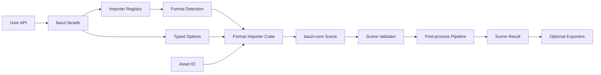
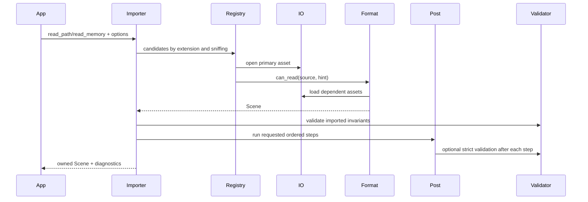

# ADR 0001: Assimp-Compatible Architecture for Baozi

## Context

Baozi aims to become a Rust library for loading many 3D model formats with an Assimp-like capability surface.
The repository is currently an empty Rust crate, while `repo-ref/assimp` provides a mature C++ reference implementation.

Assimp's strength is not only the number of parsers. Its durable architecture is:

- A shared scene graph and asset model rooted at `aiScene`.
- A format importer registry with per-format capability metadata.
- An IO abstraction for paths, memory buffers, archives, and external assets.
- A typed-ish property/configuration channel used by importers and post-processing.
- A post-processing pipeline that normalizes, validates, and optimizes imported scenes.
- Export, round-trip, test asset, and fuzz infrastructure that exercise the same canonical scene model.

References:

- Assimp public goal and format breadth: [Readme.md](../../repo-ref/assimp/Readme.md)
- Importer API and lifetime model: [Importer.hpp](../../repo-ref/assimp/include/assimp/Importer.hpp)
- Importer plug-in contract: [BaseImporter.h](../../repo-ref/assimp/include/assimp/BaseImporter.h)
- Importer registry: [ImporterRegistry.cpp](../../repo-ref/assimp/code/Common/ImporterRegistry.cpp)
- Post-process contract: [BaseProcess.h](../../repo-ref/assimp/code/Common/BaseProcess.h)
- Post-process registry: [PostStepRegistry.cpp](../../repo-ref/assimp/code/Common/PostStepRegistry.cpp)
- Canonical scene structures: [scene.h](../../repo-ref/assimp/include/assimp/scene.h), [mesh.h](../../repo-ref/assimp/include/assimp/mesh.h)
- Format list: [Fileformats.md](../../repo-ref/assimp/doc/Fileformats.md)

Related Baozi decisions:

- [ADR 0002: Runtime, Concurrency, SIMD, Errors, and Observability Contracts](0002-runtime-concurrency-observability.md)
- [ADR 0003: Core Scene IR and Material Model](0003-core-scene-ir-and-material-model.md)
- [ADR 0004: Parser Backend and Format Coverage Policy](0004-parser-backend-and-format-coverage-policy.md)
- [ADR 0005: Testing, Fuzzing, and Differential Oracle Strategy](0005-testing-fuzzing-and-differential-oracle-strategy.md)
- [ADR 0006: Public API, Versioning, and Crate Stability Policy](0006-public-api-versioning-and-crate-stability-policy.md)
- [ADR 0007: Workspace Crate Graph, Feature Flags, MSRV, and CI Gates](0007-workspace-crate-graph-feature-flags-msrv-and-ci-gates.md)
- [ADR 0008: Math Types, Coordinate Systems, Units, and Numeric Policy](0008-math-coordinate-units-and-numeric-policy.md)
- [ADR 0009: Data Ownership, Zero-Copy, Lifetimes, and Memory Layout](0009-data-ownership-zero-copy-lifetimes-and-memory-layout.md)
- [ADR 0010: Asset IO, Virtual Filesystem, URI, Archive, and Path Security](0010-asset-io-virtual-filesystem-uri-archive-and-path-security.md)
- [ADR 0011: Format Support Tiers and Compatibility Charter](0011-format-support-tiers-and-compatibility-charter.md)
- [ADR 0012: Material, Texture, Image, and Color-Space Policy](0012-material-texture-image-and-color-space-policy.md)
- [ADR 0013: Post-Process Pipeline Semantics, Presets, and Mutation Model](0013-post-process-pipeline-semantics-presets-and-mutation-model.md)
- [ADR 0014: Parser Security, Unsafe, FFI, and Panic Boundary Policy](0014-parser-security-unsafe-ffi-and-panic-boundary-policy.md)

## License and Clean-Room Boundary

Assimp is distributed under a modified BSD / BSD-3-Clause style license. Baozi can study Assimp, compare behavior, and port implementation ideas when the required copyright notices and license text are preserved. The practical boundary for this project is:

- Treat Assimp as an architectural and behavioral oracle by default.
- Prefer independent Rust implementations for parsers, scene builders, and post-processing.
- If a file or algorithm is translated from Assimp source, mark the derived file clearly and preserve Assimp's license notice in a third-party notices document.
- Do not use Assimp's name or contributors to endorse Baozi.
- Do not copy Assimp test assets wholesale. `repo-ref/assimp/test/models-nonbsd` has additional asset-specific licensing, and even BSD-compatible fixtures should be curated with attribution.

This is an engineering policy, not legal advice. The safe default is to cite Assimp as reference material and keep Baozi-owned code independently authored.

## Project License Recommendation

Baozi-owned clean-room code can be licensed as `MIT OR Apache-2.0`. A Rust-native reimplementation of Assimp's public behavior, data concepts, and architecture does not by itself force Baozi users to accept Assimp's BSD-3-Clause terms.

If Baozi includes translated, copied, or mechanically derived Assimp source, that derived portion must keep Assimp's BSD-3-Clause-style notices and disclaimer. In that case:

- Baozi's original code may still be `MIT OR Apache-2.0`.
- The package or affected crate becomes a mixed-license distribution for practical purposes.
- Use an SPDX expression such as `(MIT OR Apache-2.0) AND BSD-3-Clause` for crates that always include BSD-derived code.
- Keep `THIRD_PARTY_NOTICES.md` with Assimp attribution and license text.
- Prefer isolating any derived code in a clearly named crate or module so downstream users can understand what terms apply.

Recommendation: make the default Baozi crates clean-room `MIT OR Apache-2.0`. Add BSD-3-Clause only to crates/files that actually contain Assimp-derived implementation or bundled Assimp assets.

## Decision

Baozi will use a Rust workspace with a Rust-native canonical scene model, explicit format registry, typed import/export options, and ordered post-processing pipeline.

The initial workspace shape should be:

```text
baozi/
├── Cargo.toml
├── crates/
│   ├── baozi/                 # public facade: load APIs, default feature set
│   ├── baozi-core/            # scene model, math aliases, errors, IO traits, metadata
│   ├── baozi-import/          # registry, detection, import context, diagnostics
│   ├── baozi-postprocess/     # validation, triangulation, normals, transforms
│   ├── baozi-export/          # optional exporters and round-trip support
│   ├── baozi-format-obj/      # first text importer
│   ├── baozi-format-stl/      # first simple binary/text importer
│   ├── baozi-format-ply/      # compact mesh-focused importer
│   └── baozi-format-gltf/     # first modern scene/material importer
├── tests/
│   ├── assets/
│   ├── golden/
│   ├── formats/
│   └── roundtrip/
├── fuzz/
└── docs/
```

The public facade should expose simple APIs first:

```rust
let scene = baozi::load("model.gltf")?;

let scene = baozi::Importer::new()
    .with_postprocess(PostProcess::target_realtime_quality())
    .read_path("model.obj")?;
```

The internal architecture should preserve Assimp's proven separations without copying its C ABI shape:



The import flow should be:



## Dependency and Parser Ownership Policy

Baozi may use ecosystem crates to accelerate specific format support or algorithms, but public APIs must remain Baozi-owned. No third-party parser crate may define `Scene`, `Mesh`, `Material`, importer traits, diagnostics, or post-process semantics.

Current ecosystem observations from `cargo search` / `cargo info` on 2026-07-08:

| Area | Candidate crates | Observed license | Recommended use |
| --- | --- | --- | --- |
| Assimp bindings | `assimp`, `russimp-ng` | varies by crate | Test oracle or migration bridge only; bindings are not Baozi architecture input |
| glTF2 | `gltf` 1.4.1 | MIT OR Apache-2.0 | Acceptable early backend or reference parser; normalize into Baozi IR |
| OBJ | `tobj` 4.0.4 | MIT | Useful reference or optional backend; self-written parser is also reasonable |
| STL | `stl_io` 0.11.0 | MIT | Good accelerator for basic STL; keep Baozi validation and diagnostics |
| PLY | `ply-rs` 0.1.3, `ply-rs-bw` | MIT / crate-specific | Evaluate before adoption; PLY is small enough to self-write |
| Collada | `collada` 0.17.0, `dae-parser` | MIT / crate-specific | Reference or temporary backend; likely needs Baozi-owned normalization |
| FBX | `fbxcel`, `fbx`, `fbx_direct` | MIT OR Apache-2.0 | Low-level references only; Assimp-like FBX needs a dedicated Baozi parser/converter |
| USD | `rust-usd`, `usd`, `oxideav-usdz` | mostly Apache-2.0 / crate-specific | Defer; use backend abstraction before choosing OpenUSD FFI or pure Rust |
| 3MF | `lib3mf-core`, `threemf` | BSD-2-Clause / crate-specific | Evaluate; 3MF can also be implemented with `zip` + XML |
| XML/containers | `quick-xml`, `zip` | MIT / crate-specific | Good infrastructure for Collada, 3MF, X3D, and zipped assets |
| Binary parsing | `binrw`, `byteorder`, `nom` | MIT | Good implementation tools, not public model dependencies |
| Tangents and optimization | `mikktspace`, `meshopt`, `draco-core` | MIT/Apache-2.0, Apache-2.0 | Optional post-process or codec backends behind feature flags |

Adoption rule:

1. Prefer self-written parser when the format is small, diagnostics matter, or existing crates are immature.
2. Use a crate when it is mature, well-licensed, actively useful, and can be wrapped behind Baozi-owned traits.
3. Keep every importer responsible for converting third-party data into Baozi IR immediately.
4. Record per-format dependency decisions in `docs/formats/<format>.md` before adding a parser backend.

## Core Contracts

### Scene Model

`baozi-core` owns the canonical scene model. It should be Rust-native, index-based, and stable enough for all importers:

- `Scene`: root node, meshes, materials, textures, animations, cameras, lights, skeletons, metadata, diagnostics.
- `Node`: name, transform, children, mesh references, metadata.
- `Mesh`: primitive topology, positions, normals, tangents, colors, texture coordinates, faces/indices, bones, material reference, bounding box.
- `Material`: typed common PBR/Phong fields plus an extension property map for format-specific keys.
- `Texture`: embedded bytes or external asset reference.
- `Animation`: node, mesh, morph, and skeletal channels.
- `Metadata`: typed values keyed by stable strings, used for IFC-like and format-specific data.

Use index handles (`MeshId`, `MaterialId`, `NodeId`) instead of raw references. This matches Assimp's array-reference pattern while keeping Rust ownership simple.

### Importers

Each format crate implements a trait similar to:

```rust
pub trait FormatImporter: Send + Sync + 'static {
    fn info(&self) -> FormatInfo;
    fn can_read(&self, input: &mut dyn ReadSeek, hint: &ReadHint) -> Result<ReadConfidence>;
    fn read(&self, ctx: &mut ImportContext<'_>) -> Result<Scene>;
}
```

`FormatInfo` must include id, display name, extensions, text/binary/compressed support, maturity, and known limitations. This is the Rust equivalent of Assimp's `aiImporterDesc`.

### IO

Baozi should expose an `AssetIo` abstraction rather than only `Path` APIs:

- `open(&self, path: &AssetPath) -> Result<Box<dyn ReadSeek>>`
- `exists(&self, path: &AssetPath) -> bool`
- `resolve(&self, base: &AssetPath, relative: &str) -> AssetPath`

Default implementations should cover filesystem and memory bundles. Archive/container support can be added behind the same trait.

### Options

Baozi should not mirror Assimp's string macro property table directly. Instead:

- Public options are typed Rust structs and builders.
- Format-specific options live in each format crate and can be inserted into an `Options` bag by type.
- Low-level extension options can use a namespaced key/value map only as an escape hatch.

### Post-Processing

Post-processing is a first-class crate, not ad hoc helper code inside importers. Initial steps:

- `ValidateScene`
- `Triangulate`
- `JoinIdenticalVertices`
- `GenerateNormals`
- `GenerateTangents`
- `FlipUvs`
- `MakeLeftHanded`
- `SortByPrimitiveType`
- `FindDegenerates`
- `FindInvalidData`
- `GenerateBoundingBoxes`
- `GlobalScale`

Steps run in a deterministic order. Presets can mirror Assimp-style `target_realtime_fast`, `target_realtime_quality`, and `target_realtime_max_quality`, but the public API should use Rust `bitflags` or typed step lists.

## Alternatives Considered

### Option A: Rust-native scene model and modular workspace (recommended)

Pros:

- Fits Rust ownership and type safety.
- Keeps the public API clean while preserving Assimp's importer/postprocess separation.
- Lets format crates evolve independently.
- Allows `no_std` or WASM-friendly subsets later if the core stays disciplined.

Cons:

- Requires an explicit compatibility mapping from Assimp concepts to Baozi concepts.
- Some advanced Assimp behavior cannot be copied mechanically.

Decision: chosen as the long-term architecture.

### Option B: Directly mirror Assimp's C structs and flags

Pros:

- Easier to compare against Assimp behavior line by line.
- Simplifies future FFI compatibility if we expose C ABI.
- Test golden data can be closer to Assimp's layout.

Cons:

- Imports C++ pointer-array lifetime patterns into Rust.
- Makes safe APIs harder.
- Encourages compatibility hacks before Baozi has its own domain model.

Decision: rejected for the internal model. A compatibility layer can be added later if needed.

### Option C: One crate with parsers and no registry/postprocess split

Pros:

- Fastest way to load one or two formats.
- Fewer crates and less initial boilerplate.

Cons:

- Does not scale to Assimp-level breadth.
- Makes feature flags, testing, and format ownership messy.
- Pushes normalization into parsers, causing duplicated behavior.

Decision: rejected because it conflicts with the project goal.

### Option D: Thin Rust wrapper around Assimp

Pros:

- Immediate format coverage.
- Mature behavior and fuzz history.

Cons:

- Not a Rust-native reimplementation.
- Inherits C++ build, ABI, dependency, and safety concerns.
- Does not create Baozi's own architecture.

Decision: rejected for Baozi core. It can remain useful as an oracle in compatibility tests.

## Success Metrics

| Metric | Initial Target | Measurement |
| --- | --- | --- |
| Workspace structure | Public facade plus core/import/postprocess and 2 format crates | `cargo metadata` and crate graph review |
| Test runner | All Rust tests run through nextest where available | `cargo nextest run` |
| Core invariants | Scene validator covers mesh, node, material, texture, animation, and index integrity | Validator unit tests and malformed fixtures |
| Format milestone 1 | OBJ and STL load simple mesh fixtures into the same `Scene` model | Golden scene snapshots |
| Format milestone 2 | PLY and glTF2/GLB load representative materials, textures, and hierarchy | Format integration tests |
| Fuzzing | Parser fuzz targets exist for every public importer crate | `cargo fuzz list` and CI job |
| Round-trip | Export-enabled formats compare through a scene differ, not byte equality | Round-trip tests |
| Documentation | Each supported format documents coverage and limitations | `docs/formats/*.md` |

## Risks and Mitigations

| Risk | Severity | Likelihood | Mitigation |
| --- | --- | --- | --- |
| Scope explodes before the core stabilizes | High | High | Freeze the core scene model and importer trait before adding many formats |
| Rust model misses features needed by FBX/IFC/animation-heavy formats | High | Medium | Study complex Assimp importers before finalizing animation, metadata, and skeleton APIs |
| Test assets have unclear licenses | High | Medium | Keep imported samples quarantined with attribution and avoid copying non-BSD assets blindly |
| Third-party parser crate becomes Baozi's de facto public model | High | Medium | Wrap dependencies inside format crates and convert immediately into Baozi IR |
| Post-process behavior diverges silently between formats | Medium | High | Run validators before and after postprocess; add golden snapshots at each stage |
| Dynamic plugin ambitions slow down first implementation | Medium | Medium | Use compile-time feature crates first; revisit dynamic plugins after stable traits |
| Performance regressions from over-normalized data | Medium | Medium | Benchmark large meshes and keep zero-copy parsing paths where feasible |
| API becomes Assimp-shaped instead of Rust-shaped | Medium | Medium | Keep compatibility in adapters; keep core model idiomatic |

## Implementation Plan

### Phase 0: Architecture and Safety Rails

- Convert root to a Cargo workspace.
- Create `baozi-core`, `baozi-import`, `baozi-postprocess`, and `baozi` facade crates.
- Define `Scene`, index handles, `AssetIo`, `Options`, `Diagnostics`, and `Error`.
- Add a strict `ValidateScene` implementation.
- Add nextest configuration and initial unit/property tests.

### Phase 1: Minimal Import Loop

- Implement explicit registry with built-in format registration.
- Implement filesystem and in-memory IO.
- Add OBJ importer as the first text importer.
- Add STL importer as the first simple binary/text importer.
- Add golden fixtures and scene snapshots.

### Phase 2: Normalization Pipeline

- Add triangulation, normals, bounding boxes, left-handed conversion, UV flip, and degeneracy checks.
- Add Assimp-style presets as typed Baozi presets.
- Add stage snapshots: raw import, validated import, postprocessed output.

### Phase 3: Modern Scene Formats

- Add PLY for mesh coverage.
- Add glTF2/GLB for hierarchy, PBR materials, buffers, textures, skins, and animation.
- Add round-trip only after the import model is stable.

### Phase 4: Broad Compatibility

- Add Collada, FBX, 3MF, USD, IFC, and legacy game formats by priority.
- Use Assimp as a behavioral oracle where license and build constraints allow.
- Maintain `docs/formats/<format>.md` with support matrix and known limitations.

## Consequences

Positive:

- Format importers stay small and focused.
- The core model can be tested independently from parsing.
- Post-processing becomes reusable across all formats.
- Baozi can grow toward Assimp-level breadth without making the facade unstable.

Negative:

- More upfront crate and trait design than a minimal loader.
- Some early examples require more wiring.
- Compatibility tests need normalization rules because Baozi will not mirror `aiScene` memory layout.

## Open Questions

1. Which math backend should `baozi-core` expose: custom lightweight types, `glam`, or `nalgebra`?
   Recommendation: start with small public newtypes or re-exported aliases, and avoid leaking a heavy dependency until benchmarks and API ergonomics are clearer.
2. Should `repo-ref/assimp/test/models` assets be copied into Baozi tests?
   Recommendation: do not copy wholesale. Curate fixtures by license and create Baozi-owned minimal fixtures first.
3. Should Baozi support exporters in the first milestone?
   Recommendation: keep exporter traits designed, but implement export after import and validation are stable.
4. Should importers be dynamically loadable plugins?
   Recommendation: no for now. Use compile-time features and static registration first.
5. Should Baozi rely on ecosystem parser crates?
   Recommendation: allow them as internal backends when useful, but design every format crate so replacing the backend does not change Baozi's public API.

## Traceability

| Requirement | Design Element | Evidence |
| --- | --- | --- |
| Load many formats | Format crates and registry | [ImporterRegistry.cpp](../../repo-ref/assimp/code/Common/ImporterRegistry.cpp), [Fileformats.md](../../repo-ref/assimp/doc/Fileformats.md) |
| Normalize imported data | Post-process pipeline | [BaseProcess.h](../../repo-ref/assimp/code/Common/BaseProcess.h), [PostStepRegistry.cpp](../../repo-ref/assimp/code/Common/PostStepRegistry.cpp) |
| Support custom IO | `AssetIo` trait | [IOSystem.hpp](../../repo-ref/assimp/include/assimp/IOSystem.hpp), [IOStream.hpp](../../repo-ref/assimp/include/assimp/IOStream.hpp) |
| Support importer-specific settings | Typed options bag | [config.h.in](../../repo-ref/assimp/include/assimp/config.h.in), [Importer.hpp](../../repo-ref/assimp/include/assimp/Importer.hpp) |
| Validate shared scene invariants | `ValidateScene` | [ValidateDataStructure.cpp](../../repo-ref/assimp/code/PostProcessing/ValidateDataStructure.cpp), [utValidateDataStructure.cpp](../../repo-ref/assimp/test/unit/utValidateDataStructure.cpp) |
| Scale test coverage with formats | Golden, round-trip, fuzz, property tests | [test/unit](../../repo-ref/assimp/test/unit), [test/models](../../repo-ref/assimp/test/models), [fuzz](../../repo-ref/assimp/fuzz) |
