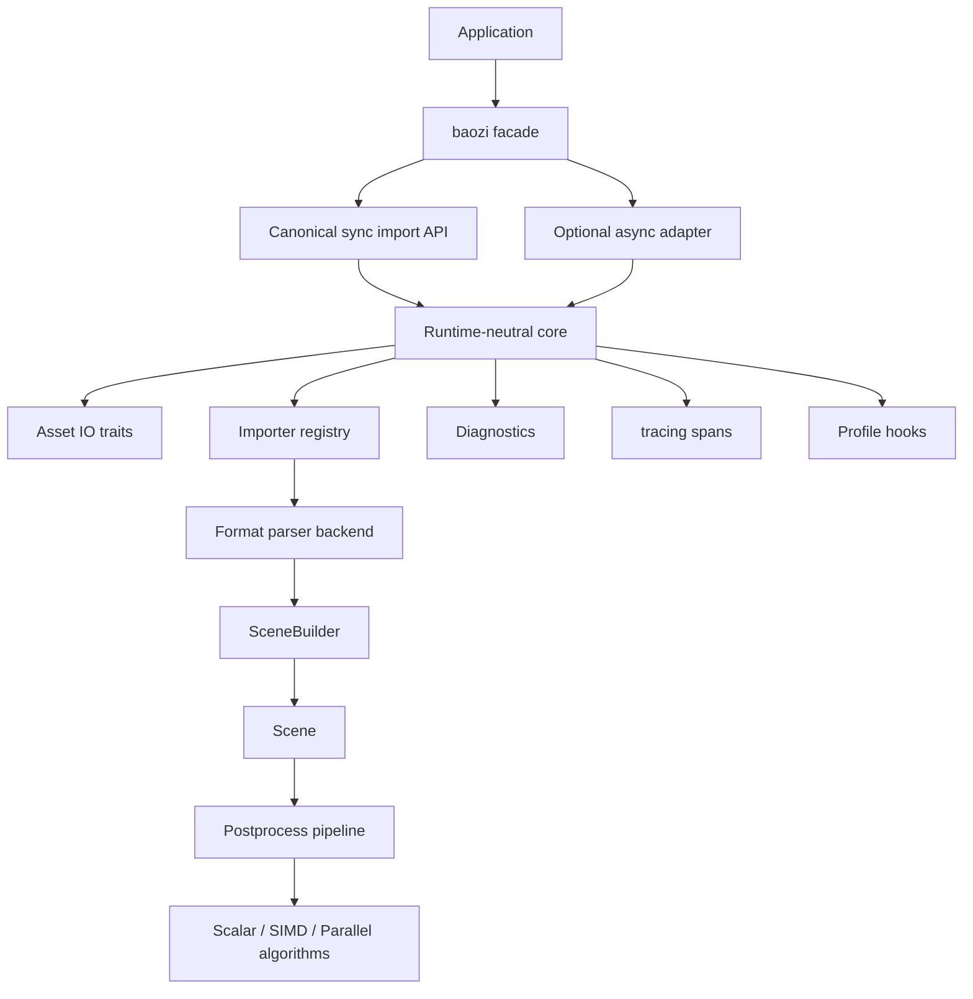
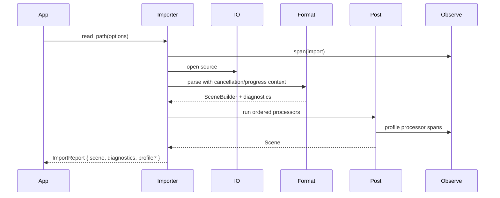

# ADR 0002: Runtime, Concurrency, SIMD, Errors, and Observability Contracts

## Context

Baozi aims to become an Assimp-class Rust asset import library. The first architecture ADR defines the scene IR, importer registry, IO abstraction, and post-processing pipeline. The next architectural risk is not one file format; it is the set of cross-cutting choices that can force large rewrites later:

- asynchronous loading
- multi-threaded parsing and post-processing
- SIMD acceleration
- structured errors and recoverable diagnostics
- logging and tracing
- profiling and benchmarks
- cancellation and progress reporting

These concerns must be designed before the first importer traits are stabilized. They should not force every Baozi user to accept a runtime, thread pool, profiler, or CPU-specific backend.

## Decision

Baozi will keep its public core synchronous, runtime-neutral, instrumentable, and data-parallel-ready. Async, parallelism, SIMD, profiling, and heavyweight telemetry will be opt-in layers or feature-gated backends over the same core contracts.

The stable direction is:

- `baozi-core` remains runtime-free and thread-safe by design.
- `baozi-io` defines synchronous IO first, plus optional async adapters later.
- `baozi-import` exposes a synchronous import path as the canonical path.
- Async APIs are adapters, not the only implementation path.
- Parallelism is explicit through import/postprocess options and internal executors, not hidden global state.
- SIMD is isolated behind algorithm backends and CPU feature detection.
- Errors are precise and structured; warnings are diagnostics, not string logs.
- `tracing` spans are allowed inside library code, but subscriber setup belongs to applications and CLI tools.
- Profiling hooks use a small Baozi-owned abstraction; concrete profilers are feature-gated.

## Architecture





## Core Contracts

### Runtime Neutrality

The primary public API should stay synchronous:

```rust
let report = baozi::Importer::new()
    .with_postprocess(PostProcessPreset::RealtimeQuality)
    .read_path("model.gltf")?;
```

Async support should be layered:

```rust
let report = baozi::AsyncImporter::new()
    .read_path("model.gltf")
    .await?;
```

The async facade may use `tokio` behind a feature, but `baozi-core`, `baozi-import`, and format crates should not require Tokio types in their public contracts.

### IO

Use sync IO as the canonical trait:

```rust
pub trait AssetIo: Send + Sync {
    fn open(&self, path: &AssetPath) -> Result<Box<dyn ReadSeek + Send>, BaoziError>;
    fn exists(&self, path: &AssetPath) -> bool;
    fn resolve(&self, base: &AssetPath, relative: &str) -> AssetPath;
}
```

Async IO should be a separate adapter trait:

```rust
pub trait AsyncAssetIo: Send + Sync {
    async fn open(&self, path: &AssetPath) -> Result<Box<dyn AsyncReadSeek + Send + Unpin>, BaoziError>;
}
```

Do not make every importer async by default. Many parsers are CPU-bound after bytes are available.

### Concurrency

Baozi should separate thread safety from parallel execution:

- Core data types should be `Send + Sync` when practical.
- Importer implementations should be stateless or use per-import context.
- `Importer` sessions may own mutable options and diagnostics and are not required to be `Sync`.
- Parser and post-process algorithms can use scoped parallelism internally only when enabled.
- No global thread pool should be mandatory.

Recommended default:

- single-threaded deterministic import
- optional `parallel` feature using Rayon-like data parallelism for large meshes and post-process passes
- explicit `ParallelPolicy` in options:

```rust
pub enum ParallelPolicy {
    Off,
    Auto,
    MaxThreads(usize),
}
```

### SIMD

SIMD must be an implementation detail. Public math and scene types should not expose CPU-specific vector types.

Recommended design:

- scalar implementation is always present and tested
- optimized algorithms use feature gates and runtime CPU detection where needed
- algorithm traits are internal, for example `NormalGeneratorBackend` or `TransformBackend`
- SIMD backends must produce results within documented floating-point tolerance

Candidate SIMD-sensitive areas:

- transform application
- normal and tangent generation
- bounding boxes
- vertex dedup hashing support
- skinning-weight normalization
- mesh optimization

### Errors and Diagnostics

Use typed errors for failed operations and diagnostics for recoverable issues.

```rust
#[derive(Debug, thiserror::Error)]
pub enum BaoziError {
    #[error("io error while reading {source}: {kind}")]
    Io { source: AssetPath, kind: IoErrorKind },

    #[error("unsupported format: {hint}")]
    UnsupportedFormat { hint: String },

    #[error("parse error in {source} at {location}: {message}")]
    Parse {
        source: AssetPath,
        location: SourceLocation,
        message: String,
    },

    #[error("invalid scene: {message}")]
    InvalidScene { message: String },

    #[error("postprocess {step} failed: {message}")]
    PostProcess { step: &'static str, message: String },

    #[error("feature unsupported by {format}: {feature}")]
    FeatureUnsupported { format: &'static str, feature: String },

    #[error("configured limit exceeded: {limit}")]
    LimitExceeded { limit: &'static str },
}
```

Diagnostics should carry severity, source, format, location, and machine-readable codes:

```rust
pub struct Diagnostic {
    pub severity: DiagnosticSeverity,
    pub code: DiagnosticCode,
    pub source: Option<AssetPath>,
    pub location: Option<SourceLocation>,
    pub message: String,
}
```

Do not use logs as the only way to surface importer warnings. Logs are for operators; diagnostics are for callers.

### Tracing

Library code may emit `tracing` spans and events, but must never install a global subscriber.

Minimum span conventions:

- `baozi.import`
- `baozi.probe`
- `baozi.parse`
- `baozi.asset_io`
- `baozi.postprocess`
- `baozi.export`

Fields should avoid high-cardinality full paths by default. Use file names, format ids, byte sizes, mesh counts, and diagnostic counts. Full source paths can be exposed in diagnostics and debug-level events when users opt in.

### Profiling

Profiling should be explicit and cheap when disabled:

```rust
pub trait Profiler {
    fn begin(&mut self, name: &'static str, fields: ProfileFields) -> ProfileScope;
}
```

The default profiler is a no-op. Optional backends can support:

- `tracing` timing layers
- Chrome trace export
- Tracy integration
- Criterion benchmarks for development

Import results can expose coarse timings only when profiling is enabled:

```rust
pub struct ImportReport {
    pub scene: Scene,
    pub diagnostics: Vec<Diagnostic>,
    pub stats: ImportStats,
}
```

### Cancellation and Progress

Long-running importers need cancellation and progress without binding to async runtimes:

```rust
pub trait CancellationToken: Send + Sync {
    fn is_cancelled(&self) -> bool;
}

pub trait ProgressSink: Send {
    fn report(&mut self, event: ProgressEvent);
}
```

Every parser loop and expensive post-process pass should check cancellation at bounded intervals.

## Crate Implications

| Crate | Required policy |
| --- | --- |
| `baozi-core` | No runtime, no profiler backend, no global logging setup, no SIMD-specific public types |
| `baozi-io` | Sync IO first; async IO behind feature or separate crate |
| `baozi-import` | Canonical sync importer; optional async facade delegates to sync or async IO adapters |
| `baozi-postprocess` | Scalar baseline; optional `parallel`, `simd`, `meshopt`, `mikktspace` features |
| `baozi-format-*` | Stateless importers where possible; no global mutable parser state |
| `baozi-cli` | Owns `tracing-subscriber`, CLI formatting, profiling output, and async runtime if needed |
| `baozi-test-support` | Scene differ, snapshot helpers, fuzz harness support, benchmark fixtures |

## Alternatives Considered

### Option A: Async-first API everywhere

Pros:

- Natural for applications that load many remote or virtual assets.
- Good fit for game/editor asset pipelines with concurrent loading.
- Avoids adding async later.

Cons:

- Forces a runtime story before most parsers need it.
- Makes simple CPU-bound parsing more complex.
- Leaks async trait complexity into every format crate.
- Risks tying Baozi to Tokio or boxed futures too early.

Decision: rejected for the core. Provide async adapters over runtime-neutral contracts.

### Option B: Hidden global thread pool and automatic parallelism

Pros:

- Faster on large assets without user setup.
- Simple API.

Cons:

- Can fight host engines, editors, and build systems that already manage threads.
- Reduces reproducibility for tests and profiling.
- Makes cancellation and resource limits harder.

Decision: rejected as default. Parallelism must be explicit and configurable.

### Option C: Runtime-neutral sync core with opt-in async/parallel/SIMD layers

Pros:

- Keeps core API stable.
- Works in CLI, game engine, build tool, server, WASM, and embedded-ish environments.
- Lets high-performance backends evolve without breaking public contracts.
- Makes deterministic tests easier.

Cons:

- More upfront design.
- Some adapters duplicate glue code.
- Users must opt into performance features.

Decision: chosen.

## Success Metrics

| Metric | Target | Measurement |
| --- | --- | --- |
| Runtime independence | `baozi-core` and first import crates compile without Tokio/Rayon/tracing-subscriber | `cargo tree -p baozi-core` and feature audit |
| Thread safety | `Scene`, importer registry, and post-process configs satisfy expected `Send + Sync` bounds | compile-time trait assertion tests |
| Determinism | Single-threaded and parallel postprocess output match within documented epsilon | snapshot/property tests |
| Error quality | Parser failures include source identity and location when format supports it | error snapshot tests |
| Diagnostics | Recoverable importer issues are visible without enabling logs | integration tests over malformed fixtures |
| Observability | Import and postprocess spans appear when caller installs a tracing subscriber | tracing capture tests |
| Profiling overhead | No-op profiling adds negligible overhead to representative import | benchmark threshold |
| Cancellation | Large parser/postprocess loops can stop within bounded work after cancellation | cancellation tests |
| SIMD safety | Scalar and SIMD backends pass the same conformance fixtures | backend equivalence tests |

## Risks and Mitigations

| Risk | Severity | Likelihood | Mitigation |
| --- | --- | --- | --- |
| Async added later breaks importer traits | High | Medium | Define async as adapter now and keep sync core canonical |
| Parallel mutation corrupts scene invariants | High | Medium | Use stage-local buffers, validate after parallel passes, and avoid shared mutable scene access |
| SIMD causes platform-specific output drift | Medium | Medium | Keep scalar oracle and epsilon-based backend equivalence tests |
| Logging becomes the only diagnostics channel | High | Medium | Require diagnostics for user-visible warnings and keep logs operational |
| Profiling hooks add overhead | Medium | Medium | No-op profiler by default; benchmark with and without profiling |
| Public API leaks backend crates | High | Medium | Keep backend crates behind feature-gated modules and convert into Baozi-owned types |
| Thread pool fights host application | Medium | Medium | Use explicit `ParallelPolicy`; do not create mandatory global pools |
| Error enum becomes too broad or stringly | Medium | Medium | Keep top-level categories stable and format-specific detail in structured fields |

## Implementation Plan

### Phase 0: Contract Types

- Add `BaoziError`, `Diagnostic`, `SourceLocation`, `ImportStats`, `ImportReport`.
- Add `CancellationToken`, `ProgressSink`, `ParallelPolicy`, and no-op profiler traits.
- Add compile-time trait assertions for key core types.

### Phase 1: Runtime-Neutral Core

- Keep `AssetIo` sync-first.
- Implement filesystem and memory IO.
- Add tracing spans in importer and postprocess code without subscriber setup.
- Add deterministic validator and scalar postprocess baseline.

### Phase 2: Optional Performance Features

- Add `parallel` feature for large postprocess passes.
- Add `mikktspace` feature for tangent generation.
- Add `meshopt` feature for cache optimization.
- Add SIMD backends only after scalar algorithms and conformance tests are stable.

### Phase 3: Async and Profiling Adapters

- Add async facade only after sync importer contracts are proven.
- Add CLI-owned `tracing-subscriber` setup.
- Add Chrome trace or Tracy integration behind feature gates.
- Add Criterion benchmarks for representative fixtures.

## Consequences

Positive:

- Baozi can grow into async/multi-threaded/profilable usage without redesigning core types.
- Format parsers stay simple while CPU-heavy algorithms can still become fast.
- Users keep control over runtimes, thread pools, and observability setup.
- Diagnostics remain testable and user-facing.

Negative:

- More explicit options and context types in early APIs.
- Async support is not the first implementation path.
- Some performance features require feature flags and backend-specific tests.

## Open Questions

1. Should `tracing` be an unconditional lightweight dependency or feature-gated?
   Recommendation: allow `tracing` in library crates, but keep subscriber and formatting in CLI/application crates.
2. Should async IO live in `baozi-io` behind a feature or in `baozi-io-async`?
   Recommendation: start with a feature while APIs are unstable; split later if dependency pressure becomes real.
3. Should Rayon be the first parallel backend?
   Recommendation: likely yes for CPU-bound postprocess, but hide it behind `ParallelPolicy` and a `parallel` feature.
4. Should SIMD start with `std::simd` or backend crates?
   Recommendation: defer until scalar correctness and benchmarks identify hotspots.
5. Should importers return `Scene` directly or `ImportReport`?
   Recommendation: public facade should return `ImportReport`, with `baozi::load_scene()` convenience returning only `Scene`.
