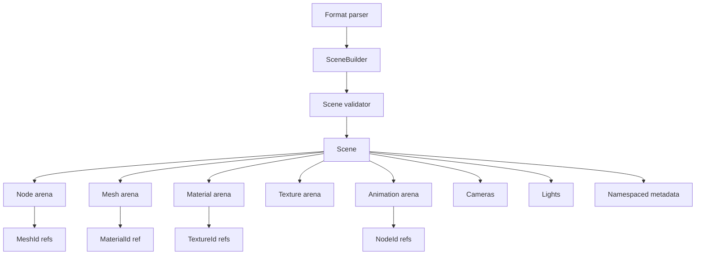
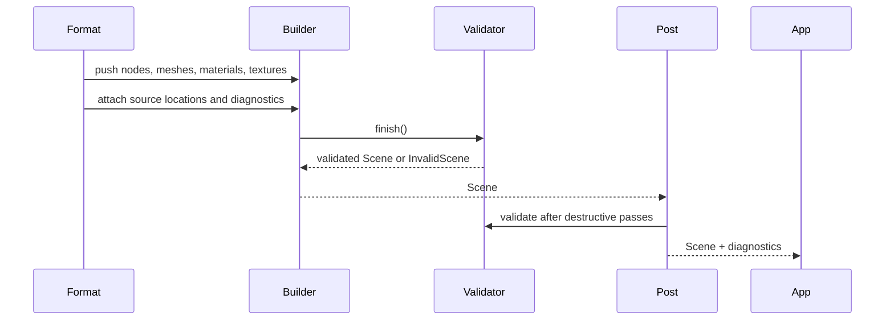

# ADR 0003: Core Scene IR and Material Model

## Context

Baozi's central risk is not only parser count. It is whether all importers can converge into one
loss-aware, Rust-native intermediate representation (IR) without repeatedly changing the public
scene API. Assimp succeeds because many importers target the same `aiScene` family of structures,
then post-processing can operate across formats.

Baozi should learn from that shape without copying Assimp's C/C++ pointer-array ABI. The scene IR
must support simple triangle meshes, modern PBR assets, skeletal animation, morph targets, metadata
heavy formats, embedded textures, and importer diagnostics. It also must remain ergonomic for Rust
users.

Assimp reference points:

- `aiScene`: [scene.h](../../repo-ref/assimp/include/assimp/scene.h)
- `aiMesh`: [mesh.h](../../repo-ref/assimp/include/assimp/mesh.h)
- `aiMaterial`: [material.h](../../repo-ref/assimp/include/assimp/material.h)
- validation behavior: [ValidateDataStructure.cpp](../../repo-ref/assimp/code/PostProcessing/ValidateDataStructure.cpp)

## Decision

`baozi-core` will own a canonical scene IR. Format crates must convert into this IR immediately.
Third-party parser types, Assimp types, and file-format-specific object models must not become public
Baozi scene types.

The IR will use:

- index handles instead of references for cross-object links
- a `SceneBuilder` for importer mutation and a validated `Scene` for results
- typed common material fields plus an extension property bag
- source locations and diagnostics attached outside the core object identity
- explicit slots for animation, skeletons, morph targets, cameras, lights, and metadata from day one
- stable numeric tolerances and normalization rules for testing

The initial public model should look conceptually like this:

```rust
pub struct Scene {
    pub root: NodeId,
    pub nodes: Arena<Node>,
    pub meshes: Arena<Mesh>,
    pub materials: Arena<Material>,
    pub textures: Arena<Texture>,
    pub animations: Arena<Animation>,
    pub cameras: Arena<Camera>,
    pub lights: Arena<Light>,
    pub metadata: MetadataMap,
}
```

The actual arena implementation is not part of this ADR. The important contract is stable IDs and
validated references.

## Architecture





## Core Object Contracts

### Scene and Node

`Scene` is the immutable import result returned to users. It may use internal `Vec` or arena storage,
but callers should interact through stable ID newtypes:

- `NodeId`
- `MeshId`
- `MaterialId`
- `TextureId`
- `AnimationId`
- `CameraId`
- `LightId`

`Node` contains:

- name
- local transform
- parent link or root-only invariant
- child `NodeId` list
- mesh references
- metadata

The validator must enforce that the graph is a tree unless a later ADR explicitly introduces shared
node graphs.

### Mesh

`Mesh` contains:

- primitive topology: points, lines, triangles, polygons before triangulation, or patches if needed
- positions
- normals
- tangents and bitangents
- colors
- texture coordinates
- indices or face lists
- bone weights
- morph targets
- material reference
- bounding box cache, generated by validator or post-process
- metadata

The core IR must support non-triangulated faces so importers can preserve raw data before
post-processing. Triangulation is a post-process step, not a hidden importer requirement.

### Material

Material design must avoid two extremes: a string-only property table that is hard to use, and a
glTF-only PBR model that cannot represent older formats.

Use a layered material:

```text
Material
├── name
├── shading model
├── pbr metallic-roughness fields
├── legacy Phong/Blinn fields
├── texture slots
├── alpha and two-sided policy
├── normal, occlusion, emissive, displacement, lightmap slots
└── extension property bag
```

Common fields should be typed. Format-specific or rarely used fields go into a namespaced property
bag:

```text
gltf:alpha_cutoff
obj:illum
fbx:layered_texture_blend_mode
collada:effect_profile
```

The property bag is not a replacement for typed fields. It is an escape hatch for loss awareness and
round-trip support.

### Texture and Asset References

`Texture` supports:

- embedded bytes
- external asset path resolved through `AssetIo`
- decoded image metadata when available
- raw MIME or format hint
- source location and original URI where safe to expose

Baozi should not require decoding image bytes during model import. Decoding is an optional
post-import operation or helper layer.

### Animation, Skeleton, and Morph Targets

Even if first milestones focus on mesh formats, the IR reserves:

- node animation channels
- skeletal bones and inverse bind matrices
- mesh morph targets
- animation timing units
- interpolation type

Deferring these fields entirely would make glTF, FBX, Collada, and game formats force a later IR
rewrite.

### Math Types

Do not expose CPU-specific SIMD vector types in the public IR.

Initial recommendation:

- use small Baozi-owned math structs for public fields, or
- use thin aliases behind a controlled compatibility module

If Baozi later chooses `glam` or `nalgebra` as a public dependency, that should be a separate ADR.
For now, public IR stability matters more than adopting a large math API.

## Validation Invariants

The validator must check at least:

- every ID reference points to an existing object
- root node exists and is reachable
- no cycles in the node hierarchy
- mesh attribute lengths are compatible
- face indices are in range
- material and texture references are valid
- bone weights reference valid bones or node bindings
- animation channels target existing nodes or meshes
- numeric values are finite unless a field explicitly allows sentinel values
- resource limits have not been exceeded

Invalid import data should usually become diagnostics plus repair when possible. A structurally
unsafe scene must become `BaoziError::InvalidScene`.

## Alternatives Considered

### Option A: Mirror Assimp's `aiScene` layout

Pros:

- Easier one-to-one comparison against Assimp.
- Easier future C ABI compatibility.
- Familiar to users who already know Assimp.

Cons:

- Imports raw pointer and ownership assumptions into Rust.
- Pushes Baozi toward C-compatible representation before Rust ergonomics are understood.
- Makes safe mutation and validation harder.

Decision: rejected for the core IR. A compatibility adapter can be added later.

### Option B: Make glTF2 the canonical IR

Pros:

- Modern PBR, animation, buffers, and images are well specified.
- Good fit for web and engine pipelines.
- Existing Rust glTF ecosystem is usable.

Cons:

- OBJ, STL, PLY, FBX, Collada, IFC, and CAD-like metadata do not map cleanly.
- Turns a file format into Baozi's domain model.
- Makes Assimp-level breadth harder.

Decision: rejected. glTF should be a high-priority format, not the core model.

### Option C: Rust-native broad IR with typed common fields and extension bags

Pros:

- Fits Rust ownership.
- Supports both old and modern formats.
- Keeps loss awareness without exposing every format as a public type.
- Allows post-processing to be format-independent.

Cons:

- Requires careful validation and documentation.
- Some fields will remain unused by simple formats.
- Extension bag discipline must be enforced.

Decision: chosen.

## Success Metrics

| Metric | Target | Measurement |
| --- | --- | --- |
| ID integrity | All cross-object references are validated | validator unit tests |
| Simple mesh coverage | STL, OBJ, and PLY can map without format-specific public types | importer integration tests |
| Modern scene coverage | glTF hierarchy, materials, textures, skins, and animation have IR slots | glTF fixture tests |
| Loss awareness | Unsupported but parsed properties can be preserved in namespaced metadata | snapshot tests |
| Public type independence | Public `Scene` API exposes no third-party parser model | `cargo public-api` or API review |
| Deterministic snapshots | Normalized scenes produce stable text snapshots with epsilon rules | golden tests |

## Risks and Mitigations

| Risk | Severity | Likelihood | Mitigation |
| --- | --- | --- | --- |
| IR becomes too broad and hard to use | Medium | Medium | Keep simple convenience iterators and facade APIs |
| Extension bag becomes untyped junk drawer | High | Medium | Require namespace prefixes and promote repeated fields into typed fields |
| Animation model is underspecified | High | Medium | Study glTF, FBX, and Collada before stabilizing animation APIs |
| Material model loses format details | High | Medium | Preserve original keys in metadata and document conversion rules per format |
| Math dependency choice causes API churn | Medium | Medium | Use Baozi-owned public math types until a dedicated ADR chooses otherwise |
| Validator is too strict for real-world assets | Medium | High | Support strict and permissive validation modes with diagnostics |

## Implementation Plan

### Phase 0: IR Skeleton

- Define ID newtypes.
- Define `SceneBuilder` and validated `Scene`.
- Add node, mesh, material, texture, metadata, and diagnostic containers.
- Add validator with structural checks.

### Phase 1: Mesh and Material Baseline

- Implement STL, OBJ, and PLY mapping against the same mesh model.
- Add typed PBR and legacy material fields.
- Add texture references without requiring image decoding.

### Phase 2: Complex Scene Readiness

- Add skeleton, animation, camera, light, and morph target structures.
- Prove the model against representative glTF fixtures.
- Add scene differ and normalized snapshot format.

### Phase 3: Stabilization

- Document IR conversion rules in `docs/model/scene-ir.md`.
- Add public API tests for core types.
- Freeze only the facade and stable core fields after importer experience.

## Consequences

Positive:

- Baozi owns its domain model.
- Format crates remain replaceable.
- Post-processing can operate uniformly across imported assets.
- Users get typed access to common fields without losing unknown data.

Negative:

- More core design work before the first parser feels complete.
- Simple mesh formats carry unused scene fields.
- Material conversion will need careful per-format documentation.

## Open Questions

1. Should `Scene` be fully immutable after validation, or should advanced users get controlled mutable
   access?
   Recommendation: make `SceneBuilder` mutable and `Scene` mostly immutable, with explicit edit APIs
   later.
2. Should metadata values support arbitrary binary blobs?
   Recommendation: allow bytes only when attached to a typed source and size-limited.
3. Should Baozi expose both face lists and index buffers?
   Recommendation: yes internally; facade helpers can present common triangle views.
