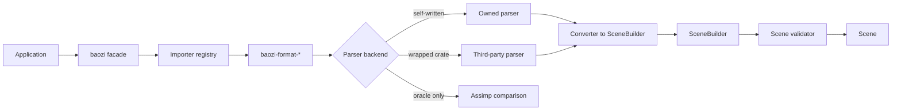
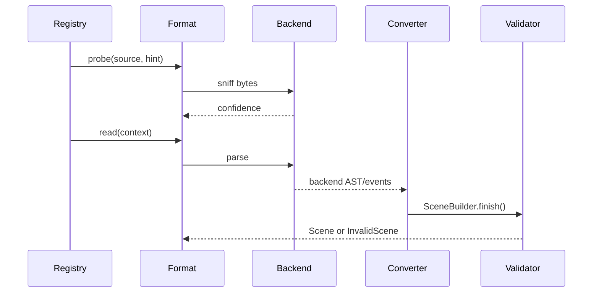

# ADR 0004: Parser Backend and Format Coverage Policy

## Context

Baozi wants Assimp-class format breadth. The Rust ecosystem has useful crates for some formats and
almost no mature coverage for others. A rigid "always wrap crates" policy would make Baozi inherit
third-party API and maintenance risk. A rigid "always write parsers from scratch" policy would slow
the project and ignore good existing work.

The architecture needs a format policy before importers are added. Otherwise early parser choices
will accidentally define public API, feature layout, error behavior, and support promises.

## Decision

Baozi will use a hybrid parser strategy:

- self-write parsers when the format is small, diagnostics matter, or ecosystem crates are immature
- wrap ecosystem crates when they are well licensed, useful, and replaceable behind Baozi traits
- use parser tooling such as parser combinators, binary parsers, lexers, or parser generators only
  behind the format-owned parser boundary defined in ADR 0018
- use Assimp only as a behavioral or migration oracle, not as Baozi's architecture source
- expose only Baozi-owned `Scene`, options, diagnostics, and importer traits
- document coverage and limitations per format before marking a format stable

Every format crate must have a backend boundary:

```text
bytes / AssetIo
  -> parser backend
  -> format converter
  -> SceneBuilder
  -> validator
  -> Scene
```

The parser backend may be:

- Baozi-owned
- a third-party Rust crate
- a temporary compatibility backend
- an FFI backend in an optional crate

The public API must look the same either way.

## Architecture





## Format Maturity Levels

Each format crate must publish a maturity level in `FormatInfo`.

| Level | Meaning | Public promise |
| --- | --- | --- |
| Experimental | Loads selected fixtures; API and behavior may change | disabled by default or clearly documented |
| Beta | Handles common files; known limitations documented | enabled only by feature or facade preset decision |
| Stable | Coverage, diagnostics, fuzzing, and compatibility tests meet Baozi criteria | included in default format set if dependency cost is acceptable |
| Deprecated | Kept for compatibility but not actively expanded | documented migration or replacement path |

Maturity is per format, not per crate version. A mature core crate can contain an experimental
format feature.

## Initial Format Roadmap

| Phase | Formats | Parser policy | Rationale |
| --- | --- | --- | --- |
| P0 | Core registry and validation | Baozi-owned | Needed before parser count matters |
| P1 | STL | Baozi-owned or `stl_io` backend | Small format, good first binary/text importer |
| P1 | OBJ/MTL | Baozi-owned parser, `tobj` as reference or optional backend | Common, diagnostics and MTL quirks matter |
| P1 | PLY | Baozi-owned parser preferred | Small enough; property model tests metadata discipline |
| P2 | glTF2/GLB | wrap `gltf` first, convert immediately into Baozi IR | Modern baseline with hierarchy, materials, buffers |
| P3 | 3MF | evaluate `lib3mf-core` or implement with zip/XML | Good container and units exercise |
| P3 | Collada | evaluate crate backend, likely Baozi converter heavy | XML scene and animation coverage |
| P4 | FBX | dedicated long-term parser/converter | Complex binary/text format; ecosystem crates are low-level |
| P4 | USD/USDZ | defer backend choice | OpenUSD ecosystem and FFI trade-offs need separate ADR |
| P4 | IFC/CAD-like metadata | defer until metadata model is proven | High semantic complexity |
| P4 | Blender native | defer or avoid | Assimp itself treats direct Blender support as fragile/deprecated |

This roadmap is about architectural learning order, not market priority.

## Dependency Adoption Rules

A format dependency may be adopted only when all checks pass:

1. license is compatible with Baozi distribution
2. dependency does not force public API exposure
3. backend output can be converted to `SceneBuilder`
4. diagnostics can map to `BaoziError` and `Diagnostic`
5. parser can run under resource limits
6. replacement test exists so swapping backend preserves public behavior
7. format coverage document records limitations

Each format should get a document:

```text
docs/formats/obj.md
docs/formats/stl.md
docs/formats/ply.md
docs/formats/gltf.md
```

Minimum sections:

- supported versions
- supported features
- unsupported features
- parser backend
- dependencies and licenses
- resource limits
- security notes
- fixture and oracle coverage
- known deviations from Assimp, if any

## Security and Resource Limits

Parser policy must include adversarial input from the beginning. Import options should include:

- maximum file size
- maximum included file count
- maximum archive decompressed size
- maximum recursion depth
- maximum node count
- maximum mesh count
- maximum vertex count
- maximum face/index count
- maximum material/texture count
- maximum string length
- maximum warning count before truncation

Format crates must reject:

- path traversal through external references
- archive entries escaping the virtual asset root
- zip bombs and decompression bombs
- integer overflows in buffer size calculations
- unbounded recursion in scene hierarchy or XML
- invalid UTF-8 where the format requires UTF-8

These checks belong in Baozi's import context and format crates, not only in application code.

## Feature Flag Policy

Feature flags should express capability, not implementation trivia:

- `format-obj`
- `format-stl`
- `format-ply`
- `format-gltf`
- `format-3mf`
- `format-collada`
- `format-fbx`
- `default-formats`
- `all-formats`

`default-formats` must stay conservative: it includes only implemented, CI-gated, low-surprise
formats. Planned parser shells can be compiled through their explicit `format-*` features, but they
must not enter the default set until they import real assets and their support document is accurate.

Backend-specific features may exist inside format crates, but the facade should avoid exposing them
unless users need explicit control:

- `baozi-format-gltf/gltf-backend`
- `baozi-format-stl/stl-io-backend`

No feature should silently change public scene semantics.

## Alternatives Considered

### Option A: All parsers self-written from day one

Pros:

- Maximum control over diagnostics and resource limits.
- No third-party parser model leakage.
- Cleaner licensing story.

Cons:

- Slower path to broad coverage.
- Reimplements mature code where good crates exist.
- Delays learning from complex formats such as glTF.

Decision: rejected as a universal rule. Use it for small or immature areas.

### Option B: Wrap ecosystem crates wherever possible

Pros:

- Fast initial coverage.
- Leverages existing maintenance.
- Reduces parser implementation effort.

Cons:

- Ecosystem maturity is uneven.
- Backends can leak through API and behavior.
- Diagnostics, limits, and fuzzing may be insufficient.

Decision: rejected as a universal rule. Wrapping is allowed only behind Baozi-owned contracts.

### Option C: Hybrid backend boundary with per-format policy

Pros:

- Balances speed and control.
- Keeps public API stable when backends change.
- Lets Baozi self-write critical parsers later without breaking users.
- Supports clean-room implementation while still using Assimp as behavior reference.

Cons:

- Requires more documentation per format.
- Needs conformance tests to prove backend replacement.
- Some duplicate work exists between backend ASTs and Baozi IR conversion.

Decision: chosen.

## Success Metrics

| Metric | Target | Measurement |
| --- | --- | --- |
| Backend isolation | No public Baozi facade API exposes parser crate types | public API review |
| Format documentation | Each non-experimental format has `docs/formats/<format>.md` | documentation check |
| Replacement safety | At least one backend replacement or mock test per wrapped parser | conformance test |
| Security limits | Every parser reads limits from `ImportOptions` | malformed fixture tests |
| Diagnostics quality | Parse errors include source and location where format supports it | snapshot tests |
| Feature clarity | `cargo tree` for default features is explainable and minimal | dependency audit |
| License clarity | Each format doc lists dependency licenses | docs review |

## Risks and Mitigations

| Risk | Severity | Likelihood | Mitigation |
| --- | --- | --- | --- |
| Third-party backend becomes a permanent hidden dependency | Medium | Medium | Require replacement tests and backend docs |
| Format count grows before quality does | High | High | Gate stable maturity on tests, fuzzing, and docs |
| Security limits are inconsistent across formats | High | Medium | Centralize limits in `ImportContext` and test malformed assets |
| Licensing is unclear for parser dependencies or assets | High | Medium | Record license in each format doc and keep third-party notices |
| glTF backend shapes the whole IR | High | Medium | Convert immediately into Baozi IR and keep glTF-specific data namespaced |
| FBX scope consumes project capacity | Medium | High | Defer until core, tests, and simpler formats are stable |

## Implementation Plan

### Phase 0: Format Contract

- Define `FormatInfo`, `FormatMaturity`, `ReadConfidence`, and `ImportContext`.
- Add feature flag naming convention.
- Add `docs/formats/_template.md`.

### Phase 1: Small Parsers

- Implement STL and OBJ/MTL with strict diagnostics.
- Implement PLY or a PLY prototype to prove flexible vertex properties.
- Add resource limit tests.

### Phase 2: Wrapped Backend

- Add glTF2/GLB through a wrapped backend.
- Convert all backend structures to Baozi IR immediately.
- Add backend replacement conformance tests.

### Phase 3: Coverage Expansion

- Add 3MF and Collada after core material and animation fields are proven.
- Start FBX research only after the importer pipeline has fuzzing and diagnostics discipline.

## Consequences

Positive:

- Baozi can move quickly where ecosystem crates help.
- Public API remains Baozi-owned and stable.
- Parser maturity becomes visible to users.
- Security and licensing checks become part of format onboarding.

Negative:

- More per-format documentation and test burden.
- Some wrappers may be replaced later.
- Format crates need explicit converter layers even when a parser already has a nice API.

## Open Questions

1. Should default features include only stable formats or also beta formats?
   Recommendation: default only stable formats once the project has stable releases.
2. Should each format crate be published independently?
   Recommendation: yes eventually, but use workspace-internal crates until API patterns settle.
3. Should FFI-based importers ever be part of `all-formats`?
   Recommendation: no by default. Keep FFI importers opt-in because build and license cost differs.
