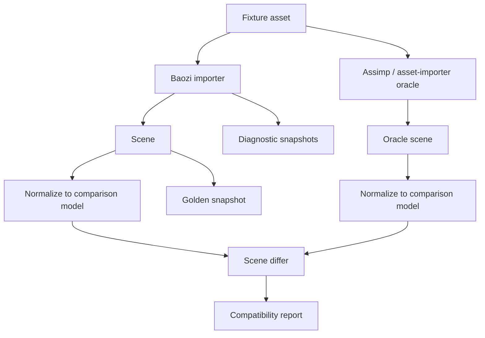
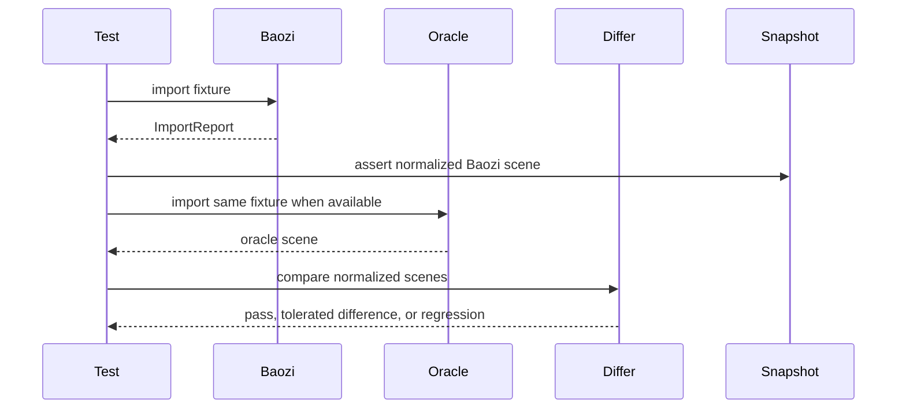

# ADR 0005: Testing, Fuzzing, and Differential Oracle Strategy

## Context

Asset importers fail in more ways than normal libraries. Real files are malformed, exported by buggy
tools, truncated, huge, or depend on sidecar files. A Baozi parser can be memory safe and still be
wrong: wrong units, wrong coordinate system, wrong material mapping, wrong hierarchy, or silent data
loss.

Assimp's value comes partly from its large fixture corpus and years of compatibility behavior.
Baozi needs a test strategy that uses Assimp as a behavioral oracle where useful, while keeping
Baozi's implementation and asset corpus license-clean.

Assimp reference points:

- unit tests: [test/unit](../../repo-ref/assimp/test/unit)
- model fixtures: [test/models](../../repo-ref/assimp/test/models)
- non-BSD model fixtures: [test/models-nonbsd](../../repo-ref/assimp/test/models-nonbsd)
- fuzzing setup: [fuzz](../../repo-ref/assimp/fuzz)

## Decision

Baozi will use layered verification:

- unit tests for core invariants and algorithms
- property tests for scene builders, validators, and post-process passes
- golden scene snapshots for representative fixtures
- malformed fixture tests for errors and diagnostics
- fuzz targets for every public parser
- round-trip tests only where exporters are intentionally supported
- differential tests against Assimp or the user's existing `asset-importer` binding when available
- benchmark tests for large assets and post-process algorithms

The oracle is used to find behavior differences, not to force Baozi to copy Assimp's memory layout or
every compatibility quirk.

## Architecture





## Test Layers

### Unit Tests

Unit tests cover:

- ID handle creation and lookup
- `SceneBuilder` invariants
- validator failures and repairable diagnostics
- material conversion helpers
- path resolution
- resource limit enforcement
- individual post-process algorithms
- error formatting without losing structured data

### Property Tests

Property tests cover:

- generated valid scenes remain valid after builder round-trip
- invalid references are always rejected
- triangulation preserves area within tolerance for valid polygons
- transform composition stays finite
- bounding boxes contain all transformed vertices
- parallel and scalar post-process paths match within tolerance

Candidate crates: `proptest` or `quickcheck`. The exact choice can be made during implementation.

### Golden Snapshots

Golden snapshots compare normalized scene summaries, not raw binary output.

Snapshot rules:

- stable ordering for maps and metadata
- floating-point epsilon and formatting rules
- explicit omission of volatile fields such as source absolute paths
- separate snapshots for raw import and post-processed result when useful
- review workflow for intentional changes

Suggested layout:

```text
tests/
├── assets/
│   ├── owned/
│   ├── third-party/
│   └── nonredistributable/
├── golden/
│   ├── obj/
│   ├── stl/
│   ├── ply/
│   └── gltf/
└── formats/
```

`nonredistributable` is for local-only fixtures referenced by environment variable or ignored path,
not committed assets.

### Malformed Fixture Tests

Every parser must include invalid inputs:

- truncated files
- wrong magic bytes
- invalid indices
- invalid string encodings
- recursive includes
- missing sidecar files
- oversized declared counts
- archive path traversal
- unsupported but valid feature use

Expected diagnostics should be snapshot-tested so error quality does not regress.

### Fuzzing

Each parser crate should add at least one fuzz target:

```text
fuzz/fuzz_targets/fuzz_obj.rs
fuzz/fuzz_targets/fuzz_stl.rs
fuzz/fuzz_targets/fuzz_ply.rs
fuzz/fuzz_targets/fuzz_gltf.rs
```

Fuzz goals:

- no panics
- no unbounded allocation
- no infinite loops
- no unsafe memory bugs if unsafe is ever introduced
- parser errors remain structured

Fuzzing should run in CI on a time budget and locally for deeper campaigns.

### Differential Oracle Tests

Differential tests normalize Baozi and oracle output into a comparison model:

```text
ComparisonScene
├── node count and hierarchy
├── mesh primitive counts
├── vertex/index counts
├── material summary
├── texture reference summary
├── animation channel summary
└── diagnostics / unsupported feature notes
```

Allowed differences must be explicit:

- triangulation order
- floating-point tolerance
- coordinate handedness when post-process differs
- material approximation between legacy and PBR fields
- unsupported feature diagnostics

Oracle failures are not automatically Baozi failures. Some real assets may expose Assimp bugs or
intentional Baozi deviations. The differ report should classify:

- match
- tolerated difference
- Baozi regression
- oracle limitation
- unsupported feature

### Performance and Benchmark Tests

Baozi should benchmark:

- parser throughput by file size
- allocation count or peak memory where practical
- post-process passes on large meshes
- scalar versus parallel output and timing
- no-op profiling overhead
- common import presets

Use Criterion for development benchmarks. CI should run only cheap smoke benchmarks unless a
dedicated performance workflow exists.

## Asset Licensing Policy

Test assets are source material, not disposable data. Every committed third-party fixture needs:

- origin URL or local source citation
- license
- allowed redistribution status
- modifications, if any
- attribution text when required

Assimp's `test/models-nonbsd` must not be copied into Baozi. BSD-compatible Assimp fixtures still
need attribution if copied, and the safer default is to create Baozi-owned minimal fixtures for core
behavior.

Recommended asset metadata:

```text
tests/assets/<group>/LICENSES.md
tests/assets/<group>/<fixture>.license.md
```

## Tooling Policy

Rust tests should prefer nextest when available:

```powershell
cargo nextest run
```

Fallback:

```powershell
cargo test
```

Suggested tools:

- `insta` for snapshots
- `proptest` for property tests
- `cargo-fuzz` for fuzzing
- `criterion` for benchmarks
- `cargo-deny` for license and advisory checks
- `cargo-semver-checks` once public APIs start stabilizing

## Alternatives Considered

### Option A: Fixture-only tests

Pros:

- Simple to implement.
- Easy to understand.
- Good for early parsers.

Cons:

- Misses malformed edge cases.
- Does not protect against panics from arbitrary input.
- Does not reveal compatibility differences with Assimp.

Decision: rejected as insufficient.

### Option B: Differential tests only

Pros:

- Quickly exposes behavior gaps against Assimp.
- Useful for broad compatibility work.
- Helps prioritize real-world differences.

Cons:

- Can copy oracle bugs.
- Requires external native dependencies or bindings.
- Does not define Baozi-owned invariants.

Decision: rejected as the only strategy. Use differential testing as one layer.

### Option C: Layered tests with snapshots, fuzzing, properties, and oracles

Pros:

- Separates correctness, compatibility, robustness, and performance.
- Keeps Baozi-owned behavior explicit.
- Scales as format coverage grows.

Cons:

- More infrastructure up front.
- Requires asset license discipline.
- Snapshot updates need review hygiene.

Decision: chosen.

## Success Metrics

| Metric | Target | Measurement |
| --- | --- | --- |
| Parser test baseline | Every stable format has valid and malformed fixtures | test inventory |
| Fuzz coverage | Every public parser crate has a fuzz target | `cargo fuzz list` |
| Snapshot stability | Golden snapshots are deterministic across platforms | CI matrix |
| Oracle usefulness | Differential reports classify differences, not only pass/fail | oracle test output |
| Asset license clarity | Every committed third-party fixture has license metadata | docs check |
| Validator confidence | Invalid scenes cannot be produced by public builders without error | unit/property tests |
| Performance awareness | Large mesh and common preset benchmarks exist | Criterion benchmark list |

## Risks and Mitigations

| Risk | Severity | Likelihood | Mitigation |
| --- | --- | --- | --- |
| Snapshot churn hides regressions | Medium | Medium | Normalize snapshots and require review for updates |
| Oracle dependency is hard to build in CI | Medium | Medium | Make oracle tests optional and keep Baozi-owned tests mandatory |
| Fixture licenses are unclear | High | Medium | Require asset metadata before committing fixtures |
| Fuzzing finds many bugs but no one triages | Medium | Medium | Keep corpus small at first and add regression tests for crashes |
| Performance benchmarks become flaky | Medium | Medium | Use benchmarks for trends, not strict CI gates initially |
| Tests overfit Assimp behavior | Medium | Medium | Classify tolerated differences and keep Baozi invariants primary |

## Implementation Plan

### Phase 0: Test Infrastructure

- Add nextest configuration if needed.
- Add test support crate for scene normalization and differ helpers.
- Add asset license metadata template.
- Add first validator unit tests.

### Phase 1: First Format Tests

- Add owned STL, OBJ, and PLY fixtures.
- Add malformed fixtures for each parser.
- Add golden snapshots for raw and post-processed imports.

### Phase 2: Fuzz and Property Tests

- Add cargo-fuzz harnesses for first parser crates.
- Add property tests for `SceneBuilder`, validator, and post-process algorithms.
- Convert any fuzz crash into a regression fixture.

### Phase 3: Differential Compatibility

- Add optional Assimp or `asset-importer` oracle test feature.
- Define normalized comparison model.
- Start with STL/OBJ/PLY/glTF compatibility reports.

## Consequences

Positive:

- Parser quality scales with format count.
- Baozi can use Assimp as an oracle without copying its internals.
- Asset licensing remains auditable.
- Diagnostics and error quality become testable contracts.

Negative:

- More work before marking formats stable.
- Oracle tests may be optional on some developer machines.
- Snapshot review process must be maintained.

## Open Questions

1. Which snapshot crate should Baozi use?
   Recommendation: `insta`, unless workspace policy prefers plain files with a custom differ.
2. Should oracle tests run in default CI?
   Recommendation: no at first. Run them in an optional workflow because native setup may be heavy.
3. Should fuzzing be in the main workspace or separate package?
   Recommendation: keep a top-level `fuzz/` workspace-adjacent setup.
