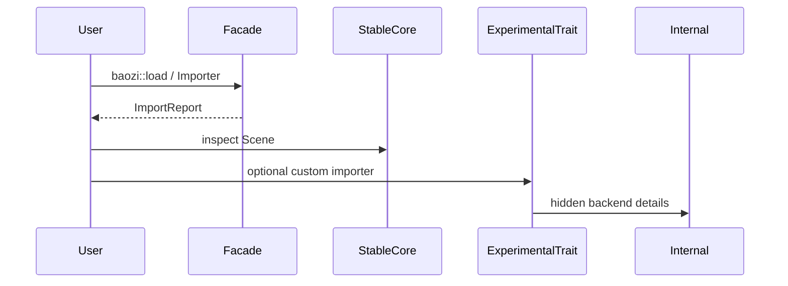

# ADR 0006: Public API, Versioning, and Crate Stability Policy

## Context

Baozi is starting from an empty Rust crate but aims for an Assimp-class capability surface. That goal
creates pressure to expose many APIs early: scene structs, importer traits, format crates,
post-process flags, async adapters, parser options, metadata, exporters, and test helpers.

If all APIs are treated as stable too early, Baozi will be forced to preserve mistakes. If everything
is unstable forever, users cannot build on it. The project needs an explicit stability policy before
workspace crates and public traits are created.

## Decision

Baozi will use tiered API stability:

- public facade APIs are the most stable surface
- core data structures are reviewed carefully but may evolve during `0.x`
- importer and post-process extension traits are initially sealed or marked experimental
- format crates expose only Baozi-owned options and `FormatInfo`
- internal crates and modules may change freely before `1.0`
- feature flags are treated as part of the user contract once documented

Pre-`1.0`, Baozi does not promise full SemVer stability, but breaking changes must still be
intentional, documented, and motivated by ADRs or changelog entries.

After `1.0`, public facade APIs, stable core scene fields, stable feature names, and stable format
contracts follow SemVer.

## Architecture

```mermaid
flowchart TD
    User[User code] --> Facade[baozi facade]
    User --> CoreStable[Stable core types]
    Advanced[Advanced users] --> Experimental[Experimental extension APIs]

    Facade --> Import[baozi-import]
    Facade --> Core[baozi-core]
    Facade --> Post[baozi-postprocess]
    Import --> Formats[baozi-format-*]
    Formats --> Internal[backend modules]

    CoreStable -. reviewed changes .-> Core
    Experimental -. may break in 0.x .-> Import
    Internal -. no stability promise .-> Formats
```



## Stability Tiers

| Tier | Examples | Stability promise before `1.0` | Stability promise after `1.0` |
| --- | --- | --- | --- |
| Facade | `baozi::load`, `Importer`, `ImportReport` | avoid churn, document breaks | SemVer stable |
| Core stable | IDs, `Scene`, common mesh/material fields | reviewed changes only | SemVer stable |
| Core experimental | animation details, metadata extensions, edit APIs | may change with changelog | SemVer stable only when promoted |
| Extension traits | custom importer, custom post-process | sealed or experimental | SemVer stable when unsealed |
| Format options | `ObjOptions`, `GltfOptions` | may evolve by format maturity | SemVer stable for stable formats |
| Internal backend | parser ASTs, converter helpers | no promise | no promise |
| Test support | scene differ, snapshot helpers | may change | versioned separately if public |

## Public API Rules

### Facade First

The facade should optimize common use:

```rust
let scene = baozi::load_scene("asset.gltf")?;
let report = baozi::Importer::new().read_path("asset.obj")?;
```

Advanced APIs should be reachable but not required for the first user experience.

### Sealed Traits First

Traits that define extension contracts should be sealed until the project has enough real format
implementations:

- `FormatImporter`
- `PostProcessStep`
- `AssetIo` may need to be public earlier, but should have conservative method shape

Unsealing a trait is a stability commitment. Adding required trait methods after unsealing is a
breaking change.

### No Backend Type Leakage

Public APIs must not expose:

- parser crate AST types
- Assimp C/C++ types
- native FFI handles
- Rayon/Tokio types in core APIs
- SIMD-specific vector types

Optional adapters can expose integration types in integration crates, not in `baozi-core`.

### Feature Flag Stability

Documented user-facing feature names are API:

- renaming a feature is a breaking change after `1.0`
- changing a feature to pull large new dependencies needs changelog entry
- default feature changes require release notes and migration guidance

Feature flags should be additive when possible.

### Error and Diagnostic Stability

`BaoziError` categories should be stable earlier than message strings. Tests should avoid asserting
full English messages unless they are user-facing snapshots.

Stable fields:

- category
- source path identity where available
- source location
- diagnostic code
- severity

Message text may evolve before `1.0`.

## Crate Publishing Policy

Initial workspace can contain many crates, but publication should be conservative.

Recommended publish order:

1. `baozi-core`
2. `baozi-import`
3. `baozi-postprocess`
4. `baozi`
5. stable `baozi-format-*` crates
6. optional `baozi-cli`
7. optional `baozi-test-support`

Crates that are purely internal can remain unpublished until their API earns a reason to exist
outside the workspace.

## Versioning Policy

Pre-`1.0`:

- breaking changes are allowed
- every breaking change should be listed in `CHANGELOG.md`
- major architecture changes should cite an ADR
- avoid long deprecation windows; fix the API while the project is young
- keep migration notes for user-visible changes

Post-`1.0`:

- SemVer applies to public APIs and documented features
- deprecate before removing when practical
- use compile-time deprecation attributes for Rust APIs
- provide migration examples for common changes

## Documentation Policy

Each public API family needs:

- crate-level docs
- quick start examples
- error and diagnostic examples
- feature flag table
- supported format table
- stability note for experimental APIs

Each ADR should answer "why", not restate every function signature.

## Alternatives Considered

### Option A: Stabilize public traits immediately

Pros:

- Friendly to early plugin authors.
- Clear extension story.
- Avoids changing user code later.

Cons:

- Freezes importer and post-process contracts before Baozi understands enough formats.
- Makes async, diagnostics, and resource limits harder to add.
- Requires compatibility burden too early.

Decision: rejected. Seal extension traits first.

### Option B: Keep everything internal until `1.0`

Pros:

- Maximum freedom to refactor.
- No early compatibility burden.
- Simple release messaging.

Cons:

- Users cannot integrate custom IO, custom formats, or post-process steps.
- Less feedback on real extension needs.
- Does not fit a library intended to become ecosystem infrastructure.

Decision: rejected as too closed.

### Option C: Tiered stability with facade-first public API

Pros:

- Gives normal users a usable API early.
- Preserves design freedom for advanced extension traits.
- Makes stability promises explicit per surface.
- Fits Rust workspace publication strategy.

Cons:

- Requires documentation discipline.
- Users must understand experimental API labels.
- Some APIs may need promotion work before `1.0`.

Decision: chosen.

## Success Metrics

| Metric | Target | Measurement |
| --- | --- | --- |
| Facade clarity | Loading a file needs one or two obvious calls | crate docs and examples |
| API boundary | Public API has no backend parser, runtime, or SIMD leakage | public API review |
| Stability docs | Each public crate documents stability tier and feature flags | docs check |
| Breaking changes | Every breaking change before `1.0` has changelog entry | release checklist |
| Trait discipline | Extension traits remain sealed until at least three real implementations prove shape | API review |
| Error stability | Tests assert structured fields, not only string messages | test review |
| SemVer readiness | `cargo-semver-checks` can run once APIs approach `1.0` | CI job |

## Risks and Mitigations

| Risk | Severity | Likelihood | Mitigation |
| --- | --- | --- | --- |
| Users depend on experimental APIs anyway | Medium | High | Label docs clearly and use module names like `experimental` |
| Sealed traits block legitimate use cases | Medium | Medium | Provide controlled extension points and promote after real examples |
| Public facade is too small for advanced users | Medium | Medium | Expose advanced builders behind explicit modules |
| Feature flags become chaotic | High | Medium | Keep a documented feature matrix and avoid backend names in facade features |
| Pre-`1.0` breaking changes feel surprising | Medium | Medium | Maintain changelog and migration notes even before `1.0` |
| Internal crates become accidentally public | Medium | Medium | Set `publish = false` until publication is intentional |

## Implementation Plan

### Phase 0: Workspace Metadata

- Add crate-level stability notes.
- Add `publish = false` for internal crates until publication is intentional.
- Add feature flag matrix to the facade docs.

### Phase 1: Facade and Core API

- Implement `baozi::load_scene` and `baozi::Importer`.
- Keep `SceneBuilder` advanced but documented.
- Add public API review in CI or release checklist.

### Phase 2: Extension API Hardening

- Keep `FormatImporter` sealed while STL, OBJ, PLY, and glTF prove the trait.
- Keep `PostProcessStep` sealed while initial steps prove ordering and diagnostics.
- Promote extension APIs only with examples and tests.

### Phase 3: Release Discipline

- Add `CHANGELOG.md`.
- Add migration notes for breaking changes.
- Add `cargo-semver-checks` before `1.0` stabilization.

## Consequences

Positive:

- Baozi can be useful before `1.0` without freezing every internal decision.
- Core API boundaries remain intentional.
- Users can tell which APIs are safe to build on.
- Future crate publication is less likely to expose accidental internals.

Negative:

- More documentation and release process.
- Plugin authors may need to wait for unsealed traits.
- Some pre-`1.0` migrations are still expected.

## Open Questions

1. Should `baozi-core` expose all fields publicly or use accessor methods?
   Recommendation: prefer public read-only fields only when invariants cannot be broken, otherwise use
   constructors/accessors.
2. Should `baozi-test-support` be published?
   Recommendation: keep it internal until external format authors appear.
3. Should custom importers be supported before `1.0`?
   Recommendation: yes experimentally, but sealed stable traits should wait.
