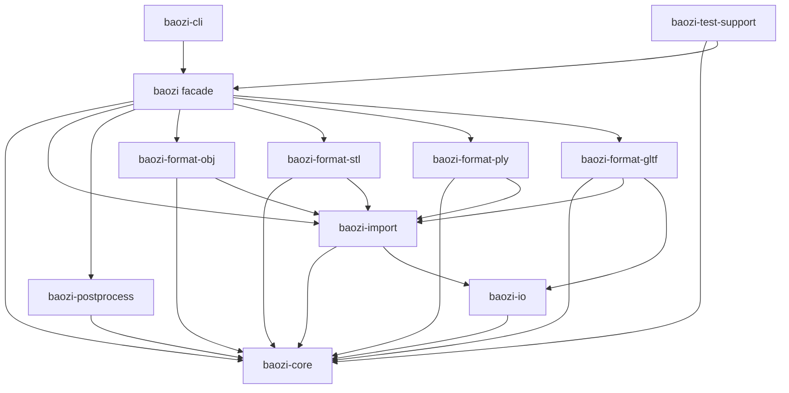

# ADR 0007: Workspace Crate Graph, Feature Flags, MSRV, and CI Gates

## Context

Baozi is currently an empty Rust crate, but the architecture already calls for a multi-crate
workspace with a public facade, core IR, import registry, post-processing, format crates, tests, and
optional tools. If the crate graph and feature policy are left implicit, early implementation will
create accidental dependencies that are hard to undo.

The workspace must also preserve Baozi's project goals:

- Rust-native public API
- clean-room default licensing
- replaceable parser backends
- sync core with optional async/parallel layers
- deterministic tests with nextest where possible
- format support that can grow without pulling every dependency into every user build

## Decision

Baozi will be a Cargo workspace with explicit dependency direction, stable feature naming, a documented
minimum supported Rust version (MSRV), and CI gates that protect crate boundaries before format count
grows.

The workspace root will use:

- Cargo resolver `3`
- Rust edition `2024`
- workspace-inherited package metadata
- `MIT OR Apache-2.0` for clean-room Baozi crates
- MSRV `1.85` initially, because edition 2024 requires Rust 1.85 or newer

Before `1.0`, MSRV may be raised in minor releases when the benefit is meaningful and documented in
the changelog. After `1.0`, MSRV changes are release-noted compatibility changes.

## Architecture




## Workspace Layout

The initial workspace should be:

```text
baozi/
├── Cargo.toml
├── crates/
│   ├── baozi/                 # public facade
│   ├── baozi-core/            # scene IR, math, errors, diagnostics, metadata
│   ├── baozi-io/              # AssetIo, virtual filesystem, URI/archive adapters
│   ├── baozi-import/          # registry, detection, import context, options
│   ├── baozi-postprocess/     # validation and post-process pipeline
│   ├── baozi-format-obj/
│   ├── baozi-format-stl/
│   ├── baozi-format-ply/
│   ├── baozi-format-gltf/
│   ├── baozi-test-support/    # scene differ, snapshots, fixtures
│   └── baozi-cli/             # optional developer/user CLI
├── tests/
├── fuzz/
├── benches/
└── docs/
```

`baozi-export` should not be created until an exporter ADR is accepted or an exporter milestone is
active. The import-first architecture may reserve exporter traits, but it should not publish an empty
crate.

## Dependency Direction Rules

Hard rules:

- `baozi-core` must not depend on `baozi-import`, format crates, CLI, async runtimes, Rayon, or parser
  crates.
- `baozi-io` may depend on `baozi-core`, but not on format crates.
- `baozi-import` may depend on `baozi-core` and `baozi-io`.
- `baozi-postprocess` may depend on `baozi-core`; optional algorithm backends are feature-gated.
- format crates may depend on `baozi-core`, `baozi-import`, and `baozi-io` only as needed.
- the facade crate depends on stable format crates through features.
- `baozi-cli` owns `tracing-subscriber`, terminal output, and any async runtime setup.
- `baozi-test-support` may depend widely but must not become a production dependency of core crates.

There must be no dependency cycle between workspace crates.

## Feature Flag Policy

Feature names are part of the user contract. Use capability names, not backend implementation names,
in the facade crate.

Recommended facade features:

```text
default = ["std", "default-formats"]
std
native-fs
default-formats
all-formats
format-obj
format-stl
format-ply
format-gltf
format-3mf
format-collada
format-fbx
format-usd
parallel
simd
async
serde
tracing
```

Rules:

- `default-formats` includes only stable, low-surprise formats.
- `all-formats` includes supported pure-Rust non-FFI formats, not experimental or heavyweight native
  dependencies by default.
- FFI-backed importers must be opt-in with explicit feature names.
- Backend-specific feature names can exist inside format crates, but the facade should avoid exposing
  them unless users need control.
- Feature flags must not silently change public scene semantics.
- `std` is default. `no_std` is not promised yet; avoid unnecessary `std` use in `baozi-core` when it
  costs little, but do not design around `no_std` prematurely.
- Filesystem convenience APIs are controlled by `native-fs` in the facade. The feature should expand
  to `std` plus the underlying `baozi-io/fs` filesystem adapter feature; browser-oriented builds can
  use bytes and memory IO with `--no-default-features --features format-stl`.
- WASM support starts as byte-buffer import on `wasm32-unknown-unknown`. `wasm32-wasip1` may use
  `native-fs` when the target runtime provides filesystem capabilities.

## MSRV Policy

Initial MSRV:

```text
Rust 1.85
Edition 2024
```

Policy:

- Before `1.0`, MSRV may be raised with a changelog note.
- After `1.0`, MSRV raises require release notes and should be tied to a concrete benefit.
- CI should test stable Rust and the documented MSRV when practical.
- Dependencies should not be allowed to raise MSRV accidentally without review.

## CI and Local Verification Gates

Required early gates:

```powershell
cargo fmt --all -- --check
cargo check --workspace --all-targets
cargo clippy --workspace --all-targets -- -D warnings
cargo nextest run --workspace
```

Additional gates once dependencies and features exist:

```powershell
cargo check --workspace --no-default-features
cargo check -p baozi --features default-formats
cargo check -p baozi --features all-formats
cargo check -p baozi --target wasm32-unknown-unknown --no-default-features --features format-stl
cargo check -p baozi --target wasm32-wasip1 --no-default-features --features format-stl,native-fs
cargo deny check
cargo test --doc --workspace
```

Optional maturity gates:

- feature powerset smoke tests for facade features
- `cargo-semver-checks` once APIs approach stabilization
- fuzz smoke run for parser crates
- Criterion benchmarks for parser/post-process hotspots

## Alternatives Considered

### Option A: Single crate until format count grows

Pros:

- Fastest initial setup.
- Fewer manifests and less boilerplate.
- Easy local examples.

Cons:

- Parser dependencies leak into all users.
- Core/postprocess/import boundaries become informal.
- Feature flags become harder to reason about later.
- Refactoring into crates after users depend on the API is expensive.

Decision: rejected because Baozi's goal is Assimp-class breadth.

### Option B: Many crates immediately, including empty future crates

Pros:

- Shows the full intended architecture.
- Makes future ownership areas visible.
- Encourages modular design.

Cons:

- Empty crates create maintenance noise.
- Public package names can become premature commitments.
- Encourages architecture theater before behavior exists.

Decision: rejected in its extreme form. Create crates needed by the first import pipeline; reserve
future crates in docs.

### Option C: Focused workspace with explicit dependency direction and feature policy

Pros:

- Preserves modularity without publishing empty promises.
- Keeps parser dependencies isolated.
- Gives CI enforceable boundaries from the start.
- Fits Cargo's workspace and feature model.

Cons:

- More setup than a single crate.
- Requires feature documentation discipline.
- CI matrix grows with format count.

Decision: chosen.

## Success Metrics

| Metric | Target | Measurement |
| --- | --- | --- |
| Workspace shape | Initial crates match this ADR or explicitly supersede it | `cargo metadata` review |
| Dependency direction | No core-to-format or core-to-runtime dependency | `cargo tree` and CI audit |
| Feature clarity | Facade features are documented and capability-oriented | crate docs feature table |
| MSRV visibility | MSRV is declared in manifests and docs | manifest review |
| CI baseline | fmt, check, clippy, and nextest pass | CI run |
| License hygiene | dependency licenses are reviewed | `cargo deny check` |
| Parser isolation | disabling a format removes its parser dependencies | `cargo tree -e features` |

## Risks and Mitigations

| Risk | Severity | Likelihood | Mitigation |
| --- | --- | --- | --- |
| Feature matrix becomes too expensive | Medium | Medium | Run full matrix nightly and smoke matrix on PRs |
| `baozi-core` accidentally pulls heavy dependencies | High | Medium | Audit `cargo tree -p baozi-core` in CI/release checklist |
| MSRV is raised by transitive dependencies | Medium | Medium | Use `cargo deny`/metadata review and changelog MSRV policy |
| Empty crates confuse users | Low | Medium | Create crates only when implementation is active |
| Clippy `-D warnings` blocks early experimentation | Low | Medium | Allow targeted lints with comments; do not disable globally |
| Default features pull too much | Medium | Medium | Keep `default-formats` conservative and document dependency cost |

## Implementation Plan

### Phase 0: Workspace Scaffold

- Convert root manifest to a workspace manifest.
- Create core, IO, import, postprocess, facade, and first format crates.
- Add workspace package metadata and shared dependencies.
- Add MSRV metadata.

### Phase 1: CI Baseline

- Add fmt, check, clippy, and nextest commands.
- Add cargo-deny configuration.
- Add feature smoke checks once features exist.

### Phase 2: Publication Readiness

- Mark internal crates `publish = false` until publishing is intentional.
- Add crate-level docs with stability tiers.
- Add public feature matrix to facade docs.

## Consequences

Positive:

- Crate boundaries match the architecture before code grows.
- Users can opt into formats and performance features intentionally.
- CI protects against dependency and feature drift.

Negative:

- More manifests and CI configuration.
- Feature naming must be maintained as part of the public contract.
- MSRV decisions become explicit project policy.

## Open Questions

1. Should `baozi-cli` be in the first scaffold?
   Recommendation: yes if it helps manual verification, but mark it unpublished.
2. Should `serde` be a core feature immediately?
   Recommendation: no. Add only when scene serialization policy is defined.
3. Should `no_std` be a supported goal?
   Recommendation: not yet. Keep `baozi-core` disciplined, but do not promise `no_std`.
