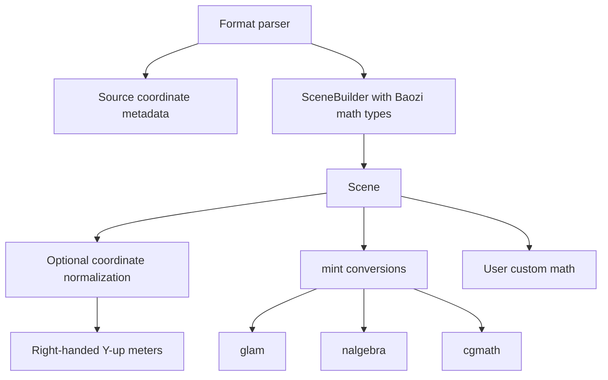
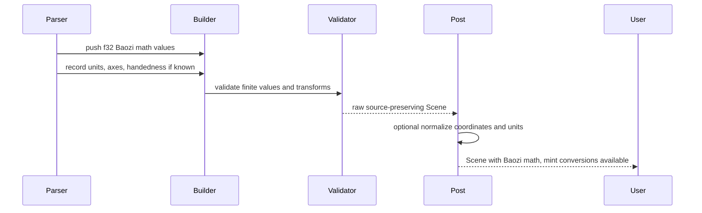

# ADR 0008: Math Types, Coordinate Systems, Units, and Numeric Policy

## Context

Model importers are math-heavy. A seemingly small decision such as using `glam::Vec3` in public
fields or silently converting every import to one coordinate system can force large API churn later.

Baozi needs to interoperate with common Rust math libraries while keeping its core IR independent.
Users should be able to load assets into applications that use `glam`, `nalgebra`, `cgmath`, game
engine math types, or custom types. Baozi also needs deterministic post-processing and snapshot
tests across platforms.

## Decision

Baozi will expose Baozi-owned lightweight math types in `baozi-core`, with optional `mint`
interoperability as the primary bridge to ecosystem math libraries.

The public IR will not expose `glam`, `nalgebra`, `cgmath`, SIMD vector types, or parser backend math
types.

Core numeric policy:

- canonical geometry scalar is `f32`
- no generic scalar parameter in the public scene IR
- parser backends may use `f64` internally when needed, then convert with diagnostics if precision
  loss is material
- floating-point equality in tests uses documented epsilon rules
- SIMD acceleration must be behaviorally equivalent to scalar backends within tolerance

Coordinate policy:

- raw imports preserve source coordinate data by default
- `Scene` records source coordinate metadata when known
- normalization is an explicit post-process step
- the default normalized target is right-handed, Y-up, meters
- transforms use column-vector math and local-to-parent matrices

## Architecture





## Public Math Types

`baozi-core` should define small types such as:

```text
Vec2
Vec3
Vec4
Quat
Mat4
Transform
Aabb
Color
```

Design rules:

- types are plain, copyable where appropriate, and documented
- no public dependency on a large math crate
- no promise of stable ABI or binary layout unless explicitly marked in a later FFI ADR
- conversion helpers are cheap and explicit
- constructors validate or document finite-value expectations

`mint` support should be optional:

```text
feature = "mint"
```

When enabled, Baozi math types implement conversions to and from compatible `mint` types. Users can
then bridge into `glam`, `nalgebra`, `cgmath`, or engine math crates through existing ecosystem
support.

Direct integration features may be added later only if user demand justifies the dependency:

```text
glam-interop
nalgebra-interop
cgmath-interop
```

These must stay adapters, not core IR dependencies.

## Coordinate and Transform Conventions

Baozi uses these internal conventions for math APIs and post-processing:

| Topic | Decision |
| --- | --- |
| Vector convention | column vectors |
| Matrix application | `p_world = M * p_local` |
| Node transform | local-to-parent |
| Matrix storage documentation | column-major semantic order |
| Quaternion | unit quaternion for rotation |
| Normal transform | inverse-transpose of model matrix when non-uniform scale exists |
| Default normalized target | right-handed, Y-up, meters |
| Raw import default | preserve source coordinates |

The raw imported `Scene` should include metadata:

```text
SceneSpace
├── handedness: known/unknown/right/left
├── up_axis: known/unknown/x/y/z/-x/-y/-z
├── front_axis: known/unknown/x/y/z/-x/-y/-z
├── unit_scale_to_meters: known/unknown/f32
└── source_format_notes
```

Importers must not silently normalize unless the import options request it. Baozi deliberately does
not make the raw unified IR always Y-up, right-handed, and meters. That target is the normalized
post-process output, not the default parser output.

## Units Policy

Unit handling:

- store source unit metadata when known
- expose `GlobalScale` / `NormalizeUnits` post-process
- default normalized unit is meter
- do not guess units for formats that do not specify them
- emit diagnostics for ambiguous or conflicting unit declarations

Examples:

- glTF: meters by convention
- STL: unitless unless caller supplies an option
- OBJ: unitless unless side metadata or caller option exists
- 3MF: unit metadata exists and should be preserved
- FBX/Collada/USD: preserve declared unit metadata and normalize only on request

## Numeric Policy

Canonical scene geometry uses `f32`, matching common real-time graphics pipelines and Assimp-like
behavior. Baozi is an asset importer, not an exact CAD kernel.

Rules:

- reject or diagnose NaN and infinity in scene data unless a field explicitly allows sentinel values
- clamp only in documented post-process steps, not silently during parsing
- preserve original scalar strings or high-precision metadata only when a format needs loss-aware
  round-trip support
- use deterministic ordering before floating-point snapshot output
- document epsilon per comparison type

Suggested tolerances:

| Comparison | Initial tolerance |
| --- | --- |
| positions after import | exact parsed f32 or format-specific |
| transformed positions | `1e-5` relative/absolute baseline |
| normals/tangents | angular tolerance |
| bounding boxes | contains all vertices plus epsilon |
| SIMD vs scalar | same tolerance as scalar algorithm tests |

## Alternatives Considered

### Option A: Expose `glam` in public IR

Pros:

- Excellent performance and ergonomics for game/graphics users.
- Widely used in Rust graphics stacks.
- Good SIMD story.

Cons:

- Forces all Baozi users onto one math crate.
- Makes `nalgebra` and engine-specific integrations second-class.
- Future `glam` API or feature changes become Baozi API concerns.

Decision: rejected for core public IR. Direct `glam` adapters can be added later.

### Option B: Expose `nalgebra` in public IR

Pros:

- Strong general linear algebra model.
- Useful for robotics, CAD-like, and scientific users.
- Mature ecosystem.

Cons:

- Heavier API than Baozi needs for common asset import.
- Generic dimensions and scalar patterns can complicate public scene types.
- Less ideal as the default for game/editor loading.

Decision: rejected for core public IR. Adapters can be added later.

### Option C: Baozi-owned math types plus `mint` interoperability

Pros:

- Keeps core IR stable and lightweight.
- Lets users bridge to common math crates.
- Avoids locking public scene model to one ecosystem.
- Keeps SIMD and backend math internal.

Cons:

- Baozi must maintain small math types and conversions.
- Users may write one extra conversion step.
- `mint` does not cover every advanced math operation.

Decision: chosen.

### Option D: Always normalize during parsing

Pros:

- Renderer-oriented users get consistently oriented assets by default.
- Simple examples have fewer visible options.

Cons:

- Tooling, conversion, and diagnostics lose the source-authored coordinate data.
- STL, OBJ, and other unitless formats require guesses that can be wrong.
- Cameras, lights, skins, animations, tangents, normal maps, and winding must be converted together;
  doing this format-by-format inside parsers risks inconsistent behavior.
- Users cannot compare raw importer output against source files or external oracles cleanly.

Decision: rejected as the default. Keep raw import source-preserving; provide explicit coordinate and
unit normalization post-process steps targeting right-handed, Y-up, meters.

## Success Metrics

| Metric | Target | Measurement |
| --- | --- | --- |
| Core independence | `baozi-core` public API exposes no `glam`, `nalgebra`, or `cgmath` types | public API review |
| Interop | Users can convert common vector/matrix values through `mint` | compile tests |
| Coordinate clarity | Raw import and normalized output conventions are documented | docs and snapshot tests |
| Unit correctness | Known unit formats preserve unit metadata | format integration tests |
| Determinism | scalar and SIMD/parallel math outputs match within tolerance | backend equivalence tests |
| Error quality | NaN, infinity, and precision-loss cases produce diagnostics | malformed fixture tests |

## Risks and Mitigations

| Risk | Severity | Likelihood | Mitigation |
| --- | --- | --- | --- |
| Baozi math types become underpowered | Medium | Medium | Keep them small and add adapters, not full algebra APIs |
| Users dislike conversion overhead | Medium | Medium | Provide `mint` conversions and optional direct adapters later |
| `f32` loses CAD/BIM precision | High | Medium | Document scope, preserve unit/metadata, and revisit precision crate if CAD becomes priority |
| Coordinate normalization surprises users | High | Medium | Preserve raw coordinates by default; normalize only when requested |
| Matrix convention mismatch causes bugs | High | Medium | Add explicit tests and examples for transform composition |
| SIMD output differs across platforms | Medium | Medium | Keep scalar oracle and tolerance-based equivalence tests |

## Implementation Plan

### Phase 0: Core Types

- Define Baozi-owned vector, quaternion, matrix, transform, color, and AABB types.
- Add finite-value validation helpers.
- Add `SceneSpace` metadata.

### Phase 1: Interop

- Add optional `mint` feature.
- Add compile tests for conversions with representative ecosystem math types.
- Keep direct math crate adapters outside core until needed.

### Phase 2: Coordinate Processing

- Implement coordinate metadata in importers.
- Add explicit coordinate and unit normalization post-process steps.
- Add snapshot tests for raw versus normalized scenes.

## Consequences

Positive:

- Baozi remains math-library neutral.
- Users can integrate with common Rust math ecosystems.
- Coordinate and unit conversion becomes explicit and testable.

Negative:

- Baozi owns a small math surface.
- Users may need conversions at API boundaries.
- Exact high-precision CAD workflows are not the initial canonical target.

## Open Questions

1. Should direct `glam` adapters be part of the first release?
   Recommendation: not initially. Start with `mint`; add direct adapters when examples show friction.
2. Should `f64` mesh buffers be supported in core?
   Recommendation: no for the initial Assimp-like importer. Revisit with a CAD/BIM-specific ADR.
3. Should matrix memory layout be ABI-stable?
   Recommendation: no until an FFI ADR exists.
