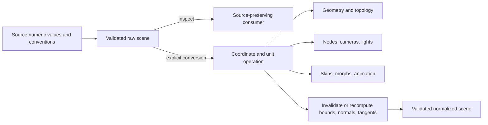

# ADR 0008: Math Types, Scene Space, Units, and Numeric Policy

## Context

Coordinate conventions are part of the asset's meaning. A model can have numerically valid
positions and still render incorrectly when handedness, front-face winding, UV origin, tangent
basis, units, or matrix conventions are implicit. Animation time also needs more precision than
renderer-oriented geometry buffers.

## Decision

Baozi exposes small Baozi-owned math types. Public IR types do not expose a parser backend, SIMD
type, `glam`, `nalgebra`, or `cgmath`. Optional ecosystem adapters are conversions, not IR owners.

Public math semantics are fixed independently from memory layout:

| Topic | Canonical meaning |
| --- | --- |
| vectors | right/left handedness comes from `SceneSpace`, not the vector type |
| matrices | column vectors; indexed accessors name row and column; a matrix's domain defines its source and destination spaces |
| authored node transforms | local-to-parent; `p_parent = M_local_to_parent * p_local`; TRS composes as `T * R * S` |
| quaternion | `(x, y, z, w)` component meaning, finite unit rotation within documented tolerance; named constructors avoid positional ambiguity |
| angles | radians |
| normals | inverse-transpose under non-uniform scale |
| bounds | closed axis-aligned minimum/maximum in the declared owner space |

No `repr(C)`, SIMD alignment, column-major byte storage, or binary ABI follows from these semantic
rules; ADR 0009 keeps memory layout private.

Numeric storage is deliberate:

| Value class | Canonical scalar | Rule |
| --- | --- | --- |
| positions, normals, tangents, transforms, and material/color factors | `f32` | reject non-finite values; diagnose material narrowing during import |
| encoded UV, color, and custom attribute storage | ADR 0030 `ComponentType` | preserve admitted width/normalization; built-in evaluated UV/color views use `f32` |
| animation key time and clip duration | `f64` | preserve authored time domain; do not silently resample |
| animation TRS samples, morph weights, and morph deltas | `f32` | retain renderer-independent values while keeping source time in `f64` |
| source unit scale and timing rates | `f64` | finite and positive when known |
| metadata numeric value | typed `i64`, `u64`, or `f64` | no string coercion |

The raw scene preserves source numbers and records a complete `SceneSpace`:

- handedness
- signed up and front axes
- unit scale to meters
- clockwise or counter-clockwise front-face winding
- upper-left or lower-left UV origin, or unknown
- tangent basis convention and handedness encoding, or unknown

Column vectors and local-to-parent authored node transforms are fixed canonical API semantics,
not source facts or target options. `SceneSpace` does not carry a duplicate transform-convention
tag. Inverse bind, correction, and other matrices retain their domain-specific source/destination
spaces; their meaning is not redefined as a node transform. Removing the redundant tag changes the
deterministic snapshot schema to revision 4.

Unknown is an explicit value, never a guessed default. The standard spatial target is right-handed,
positive Y up, negative Z front, meters, and counter-clockwise front faces. `TargetSpace` requires
these five known spatial facts together. Coordinate conversion preserves UV origin and tangent
basis declarations. A separate implemented operation is required to change those conventions;
generated tangents use the documented Baozi basis. Reaching any target requires an explicit
postprocess operation.

Validation rejects signed up/front axes on the same underlying axis. When both are known, they and
the declared handedness must derive one finite orthonormal side axis; a complete-space claim cannot
retain `Unknown`. Front-face winding remains an explicit independent convention, while tangent-basis
orientation must agree with its declared normal/UV axes and handedness encoding. Every Baozi
quaternion field, including future static TRS fields, obeys the same finite-unit rule; normalization
outside tolerance is an explicit diagnosed recovery, not a constructor side effect.

The canonical node base transform preserves one of two authored forms:

- `Matrix`: a finite affine local-to-parent matrix in the convention above; and
- `Trs`: finite translation, finite unit rotation, and finite scale, with format-defined omitted
  components materialized as translation zero, rotation identity, and scale one.

For `Trs`, the canonical local matrix is derived as `T * R * S` under the column-vector convention.
For a conforming `Matrix`, it is the preserved authored matrix. Neither form is silently rewritten
into the other: format rules decide whether a source matrix must be decomposable or exclude shear,
and a conversion from matrix to TRS requires an explicit format contract plus provenance and
authorized representation loss. A derived matrix view never changes which form the source authored.

The canonical `Matrix` invariant is format-independent: every cell is finite and the affine bottom
row compares exactly to `[0, 0, 0, 1]` under the convention above. Signed zero compares equal to zero
and its authored bit remains preserved. Canonical construction never stores a near-affine bottom row.
Format-owned numeric predicates may impose stricter decomposition, orthogonality, singular-scale,
reflection, or reconstruction rules, but their tolerances cannot relax this canonical affine
invariant.

A non-glTF format may define an explicit recovery that accepts a near-affine source value only when
it normalizes the bottom row before canonical construction and records the original source values,
recovery provenance, and policy-authorized loss. Such output is a recovered canonical matrix, not a
bit-preserved authored matrix. A conforming admission path never clamps, rewrites, or changes the
stored authored matrix bits. ADR 0027 rejects the corresponding invalid glTF input instead of
recovering it.

The unit-quaternion rule applies to rotation sample values, not cubic interpolation derivatives.
Rotation cubic tangents are finite `Vec4<f32>` derivatives in authored component order and are not
normalized or interpreted as rotations. ADR 0031 owns channel cardinality and tangent layout.

```mermaid
flowchart LR
    Source[Source numeric values and conventions] --> Raw[Validated raw scene]
    Raw -->|inspect| Caller[Source-preserving consumer]
    Raw -->|explicit conversion| Plan[Coordinate and unit operation]
    Plan --> Geometry[Geometry and topology]
    Plan --> Hierarchy[Nodes, cameras, lights]
    Plan --> Deform[Skins, morphs, animation]
    Plan --> Derived[Invalidate or recompute bounds, normals, tangents]
    Derived --> Normalized[Validated normalized scene]
```

Coordinate conversion is atomic across every affected domain. It updates base positions, normals,
tangents, morph position/normal/tangent deltas, spatial mesh-instance attributes, winding, node
transforms, inverse bind and correction matrices, cameras, lights, animation values, material
displacement strengths, material thickness factors, every other explicitly Scene-unit material or
binding parameter, and scene-space metadata together. The conversion preserves each value's physical
meaning before and after the unit-scale change and invalidates derived data it cannot recompute. An
operation that cannot convert a present semantic fails or reports policy-approved loss; it never
returns a scene whose metadata claims a conversion that only base geometry received.

A basis transform with negative determinant reverses topology winding when required to preserve the
declared front face and updates tangent handedness consistently. The operation validates the output
space descriptor and geometric orientation together before commit.

For signed cardinal axes, define the basis columns as `(side, up, front)`, where
`side = handedness_sign * cross(front, up)`. Conversion from source to target uses the signed
permutation `Q = B_target * transpose(B_source)` and positive unit ratio
`s = source_units / target_units`. Positions and translations use `s * Q`, normals and tangent
directions use `Q`, tangent `w` uses `det(Q)`, and a local-to-parent matrix uses
`H * M * inverse(H)` with `H = diag(s * Q, 1)`. TRS scale components are permuted without the
basis signs or unit factor; quaternion vector components use `det(Q) * Q` and retain `w`.
Matrix/TRS authored form is preserved, including shear and singular affine matrices.

Inverse binds and optional skin corrections use the same `H * M * inverse(H)` map without
changing their declared source/destination spaces. Position morph deltas use `s * Q`; Normal
and Tangent morph deltas use `Q`. Sparse omissions and explicit entries keep their representation.
Animation values and cubic derivatives use the linear map of their target: `s * Q` for translation,
unsigned axis permutation for scale, and `(det(Q) * Q * xyz, w)` for quaternion components.
Quaternion derivatives remain arbitrary finite Vec4 values, including zero/nonunit derivatives;
neither samples nor derivatives receive sign canonicalization or normalization. Key times and
time-domain rates are unchanged.

Triangle lanes reverse exactly when `(det(Q) < 0) XOR (source_winding != target_winding)`.
Index and every Corner tuple follow the same `[0, 2, 1]` permutation. A winding-only change does
not multiply tangent `w` again. Transported normals retain their physical direction; independently
generating normals from index-order cross products follows that operation's numeric-basis contract.

Unknown source facts require explicit source assumptions. A complete assumption may fill unknown
fields and repeat matching known fields, but cannot override any known field. The target never
supplies implicit source facts. A changed conversion reports exactly which fields were assumed.
Numeric conversion uses F64 intermediates for the uniform scale and one final F32 rounding;
non-finite output or a nonzero component rounding to zero rejects the transaction.

Floating-point snapshots use deterministic ordering and per-field documented absolute/relative or
angular tolerances. Tolerances are test comparison policy, not permission to clamp imported data.

When a format contract uses a numeric predicate beyond the exact canonical affine check, that format
ADR must freeze the predicate, promotion precision, operation order, inclusive/exclusive
comparisons, absolute/relative tolerances, zero-scale behavior, and reflection/negative-scale
behavior. The predicate is Baozi-owned and runs before canonical construction. A backend
decomposition routine or its test epsilon is not normative. A conforming predicate never rewrites or
clamps the authored matrix; an explicit recovery follows the separate loss/provenance rule above.
ADR 0027 supplies the concrete glTF predicate.

### High-Precision CAD Scope

High-precision computer-aided design (CAD) and engineering geometry are explicitly excluded from
Baozi's long-term product scope under this accepted decision. “Assimp-class format breadth” means
broad source ingestion for the canonical graphics/asset IR; it does not imply STEP/IGES/B-rep,
manufacturing tolerance, exact topology, or source-coordinate precision beyond the declared `f32`
geometry contract. A format path that requires those guarantees must be rejected or report explicit
policy-governed precision loss; it cannot claim source-preserving support by storing narrowed values.

That exclusion may change only by reopening this ADR before admitting or implementing a CAD-oriented
format or workflow. The review must define and provide evidence for all of the following together:

- target domains and formats, dimensional/unit semantics, model extents, and an explicit absolute,
  relative, and topology-sensitive error budget;
- one canonical scalar/storage strategy (`f64`, a distinct CAD IR, or another reviewed model) and the
  compatibility/migration boundary with the graphics IR;
- robust-predicate and tolerance semantics for validation, topology, triangulation, transforms,
  derived data, snapshot/digest, serialization, and postprocess;
- measured memory, throughput, and cross-platform determinism costs; and
- independent precision, round-trip, adversarial, and large-coordinate fixtures proving that values
  which matter to the declared CAD contract do not collapse or change topology.

Adding a generic scalar parameter, silently widening selected fields, or relying on parser-backend
`f64` values does not satisfy this gate. Until an accepted amendment lands, roadmap, format maturity,
facade, and release claims must treat high-precision CAD as out of scope.

## Considered Options

### Option A: Expose one ecosystem math crate

This gives rich operators and SIMD quickly, but turns that crate's versions and feature choices into
Baozi's public compatibility burden. Rejected.

### Option B: Normalize every format while parsing

This simplifies renderer examples, but loses source truth and duplicates conversion logic across
importers, especially for skins and tangent bases. Rejected.

### Option C: Baozi math, explicit source space, explicit conversion

This keeps parser output auditable and lets tools choose source-preserving or normalized workflows.
Chosen.

## Consequences

- Geometry remains efficient for common graphics consumers while animation retains `f64` timing.
- Importers must populate known space fields and leave unknown fields explicit.
- Matrix and tangent conventions become normative and tested rather than comments on individual
  importers.
- High-precision CAD geometry is outside this canonical IR; supporting it requires a separate
  reopening of this decision and complete precision evidence, not a generic scalar parameter.

## Risks and Mitigations

| Risk | Severity | Mitigation |
| --- | --- | --- |
| `f32` narrows large or precise source geometry | High | Check conversion range/precision, diagnose material loss, and reject non-finite results. |
| Partial coordinate conversion corrupts animation or skinning | High | Use operation read/write sets and integration fixtures containing all spatial domains. |
| Unknown source conventions invite caller guesses | Medium | Preserve `Unknown`, allow explicit caller-supplied source overrides, and record them in provenance. |
| Platform float behavior changes snapshots | Medium | Use scalar reference tests, deterministic ordering, and field-specific tolerances. |
| Format breadth language silently expands into CAD guarantees | Critical | Keep CAD explicitly excluded from roadmap/maturity/release claims until this ADR is reopened with scalar, tolerance, topology, migration, and conformance evidence. |

## Success Metrics

| Metric | Target | Measurement |
| --- | --- | --- |
| Time fidelity | Distinct authored `f64` times never collapse through `f32` conversion | long-time and close-key fixtures |
| Space completeness | A complete-space claim has no unknown or contradictory convention | exact/excess field validation tests |
| Conversion completeness | Every declared spatial domain is converted or the transaction fails | all-domain coordinate fixture and invalidation report |
| Scope truthfulness | No support or release claim implies high-precision CAD under the `f32` canonical geometry contract | roadmap, format-matrix, facade-doc, and release-doc checks |

## Acceptance Criteria

- Public API inspection finds no third-party math types.
- Raw fixtures preserve declared handedness, axes, units, winding, UV origin, and tangent basis.
- Coordinate conversion fixtures cover nodes, geometry, topology, skins, animation, cameras, lights,
  material/binding Scene-unit parameters, and derived-data invalidation in one transaction, proving
  equal physical meaning before and after the unit-scale change.
- Animation times that differ below `f32` precision remain distinct after import.
- NaN, infinity, invalid unit scales, and invalid quaternions fail validation deterministically.
- Matrix-authored and TRS-authored nodes retain distinct authored forms while producing the same
  documented local-matrix view where their numeric transforms are equivalent.
- Every canonical Matrix has an exact affine bottom row; format-owned stricter admission publishes
  one backend-independent numeric predicate with fixed orthogonality/decomposition, zero-scale, and
  reflection fixtures, while explicit non-glTF recovery records normalized source loss/provenance.
- CAD-oriented format/workflow admission fails governance review unless an accepted update to this
  ADR supplies the complete precision and migration evidence above.
