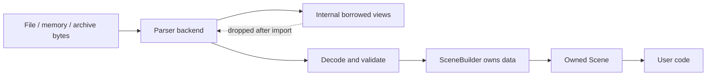
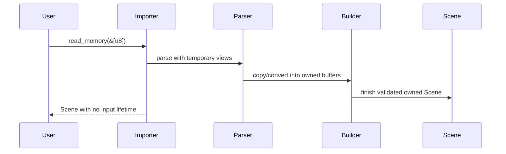

# ADR 0009: Data Ownership, Zero-Copy, Lifetimes, and Memory Layout

## Context

Asset importers often parse large binary buffers, sidecar files, archives, embedded images, and mesh
attribute arrays. It is tempting to expose borrowed slices into the original input for speed.
However, borrowed public scenes would push lifetimes through the entire API, make async and archive
loading harder, and complicate post-processing.

Baozi needs a memory model that allows parser-level optimization without making users manage input
buffer lifetimes.

## Decision

Baozi's public `Scene` will be fully owned. Parser implementations may use borrowed views and
zero-copy decoding internally during one import operation, but the returned `Scene` must not borrow
from user input, temporary archives, parser ASTs, or third-party backend objects.

The public API will not expose lifetime-parameterized scene types such as `Scene<'a>` in the main
facade.

Core policy:

- returned scenes own their nodes, meshes, materials, textures, animations, and metadata
- mesh attribute buffers are contiguous owned buffers
- large byte payloads may use shared ownership such as `Arc<[u8]>`
- IDs and arenas provide stable references inside a scene
- public memory layout is not an ABI promise
- zero-copy is an internal optimization boundary, not a public contract

## Architecture





## Public Ownership Rules

### Scene

`Scene` owns:

- node storage
- mesh storage
- material storage
- texture descriptors and embedded bytes
- animation data
- camera and light data
- metadata

The scene may be cheap to move but is not required to be cheap to clone. Cloning large scenes should
be explicit.

### Mesh Buffers

Mesh attributes should use owned contiguous storage:

```text
positions: Vec<Vec3>
normals: Vec<Vec3>
tangents: Vec<Vec4>
texcoords: Vec<Vec2>
colors: Vec<Color>
indices: Vec<u32>
```

This exact field shape may evolve, but the invariant is owned contiguous buffers suitable for
validation, post-processing, and eventual parallel iteration.

Use `u32` indices by default. Reject or split meshes that exceed index limits unless a later ADR
introduces `u64` index buffers.

### Byte Payloads

Embedded textures, compressed buffers, and raw sidecar data can use:

```text
Arc<[u8]>
```

Rationale:

- avoids lifetime propagation
- allows cheap sharing between texture objects and metadata
- makes memory ownership explicit
- works across sync and async import paths

### Names and Strings

Names and metadata strings should be owned `String` values in the public scene. String interning may
be added internally later, but it must not change public semantics.

### SceneBuilder

`SceneBuilder` is the mutable construction surface. It can accept borrowed parser data and convert it
into owned storage.

Rules:

- builder methods may copy, validate, and normalize
- builder should record source locations separately from core object identity
- builder finish returns either validated `Scene` or structured errors
- builder internals are not stable public memory layout

## Zero-Copy Policy

Allowed:

- parser borrows from an input buffer during parsing
- binary parser creates temporary typed views after validating alignment and length
- archive reader shares decompressed bytes through `Arc<[u8]>`
- image payloads are carried as `Arc<[u8]>` without decoding
- format backend AST borrows internally before conversion

Not allowed in the main public API:

- `Scene<'a>` borrowing from input
- mesh attributes referencing parser buffers
- material strings borrowing from a temporary file buffer
- texture bytes borrowing from a closed archive
- third-party parser AST nodes reachable from `Scene`

## Memory Layout and ABI Policy

Baozi does not promise stable memory layout for scene structs before an explicit FFI ADR.

Rules:

- avoid `repr(C)` unless there is a concrete FFI or bytemuck-style reason
- do not expose raw struct layout as serialization format
- keep binary cache design separate from in-memory layout
- use typed accessors or documented fields based on invariants, not layout concerns

SIMD backends may use internal aligned buffers or structure-of-arrays transformations. These must not
change public `Scene` semantics.

## Mutation Policy

Initial public flow:

```text
SceneBuilder -> validated Scene -> post-process returns Scene
```

Post-processing may mutate internal buffers when it owns the `Scene`, but user-visible APIs should
make ownership clear.

Possible future APIs:

- `SceneEdit` for controlled mutation
- copy-on-write large buffers
- streaming import for extremely large assets

These are not part of the first stable surface.

## Alternatives Considered

### Option A: Public borrowed scene model

Pros:

- Avoids copying some input data.
- Can be faster for simple inspection.
- Fits memory-mapped file use cases.

Cons:

- Infects the API with lifetimes.
- Makes archive, async, and sidecar asset lifetimes difficult.
- Makes post-processing and validation harder.
- Third-party parser backends can leak into public model.

Decision: rejected for the main facade.

### Option B: Fully owned public scene with internal zero-copy parsing

Pros:

- Simple user API.
- Works across file, memory, archive, and async adapters.
- Keeps parser backends replaceable.
- Allows internal optimization without public lifetime churn.

Cons:

- Some data must be copied.
- Very large assets may need streaming or chunking later.
- Requires careful allocation profiling.

Decision: chosen.

### Option C: Two public scene models: borrowed and owned

Pros:

- Gives advanced users maximum control.
- Supports low-copy inspection paths.
- Can be useful for tooling.

Cons:

- Doubles API and test surface.
- Hard to keep post-process behavior consistent.
- Premature before first stable importers exist.

Decision: deferred. A borrowed inspection API can be reconsidered after the owned model is stable.

## Success Metrics

| Metric | Target | Measurement |
| --- | --- | --- |
| Lifetime simplicity | Public facade returns `Scene`, not `Scene<'a>` | public API review |
| Backend isolation | Scene does not expose parser AST or borrowed backend data | public API review |
| Post-process usability | Post-process steps can own and transform scene buffers | integration tests |
| Large payload sharing | Embedded bytes can be shared without copies after import | tests over embedded textures |
| Memory visibility | allocations and peak memory are benchmarked for large fixtures | Criterion benchmarks |
| Safety | parser temporary views cannot outlive import context | compile-time API shape |

## Risks and Mitigations

| Risk | Severity | Likelihood | Mitigation |
| --- | --- | --- | --- |
| Copying hurts very large assets | Medium | Medium | Benchmark early; use `Arc<[u8]>` for payloads and optimize hot conversions |
| Owned model blocks streaming workflows | Medium | Medium | Add streaming reader later as separate API, not main scene facade |
| Mesh buffers need different layouts for SIMD | Medium | Medium | Keep SIMD layout internal and convert at algorithm boundaries |
| Public fields expose layout too early | Medium | Medium | Use accessors where invariants matter and reserve ABI promises |
| `u32` indices are insufficient for huge meshes | Medium | Low | Enforce limits, split meshes, or revisit with an index-width ADR |
| Cloning scenes is expensive | Low | High | Document clone cost and expose shared byte buffers where useful |

## Implementation Plan

### Phase 0: Owned Core Storage

- Define owned `Scene`, `SceneBuilder`, arenas, IDs, and mesh buffers.
- Use owned strings and metadata.
- Use shared byte payloads for embedded assets.

### Phase 1: Parser Boundary

- Allow parsers to use borrowed views internally.
- Convert parser output to owned scene data at builder boundaries.
- Add tests that imported scenes outlive input buffers.

### Phase 2: Performance Visibility

- Add allocation and throughput benchmarks.
- Optimize hot copies only after measurements.
- Keep zero-copy parser optimizations behind internal modules.

## Consequences

Positive:

- User API is simple and runtime-neutral.
- Format backends remain replaceable.
- Post-processing and validation operate on stable owned data.

Negative:

- Some zero-copy opportunities are intentionally not public.
- Huge asset workflows may need specialized future APIs.
- Baozi must measure allocation cost instead of assuming it is fine.

## Open Questions

1. Should mesh indices support `u64`?
   Recommendation: not initially. Use `u32`, enforce limits, and split if needed.
2. Should `Scene` implement `Clone`?
   Recommendation: only if clone cost is explicit and large buffers share storage where appropriate.
3. Should a borrowed inspection API exist later?
   Recommendation: defer until stable importers reveal real demand.
