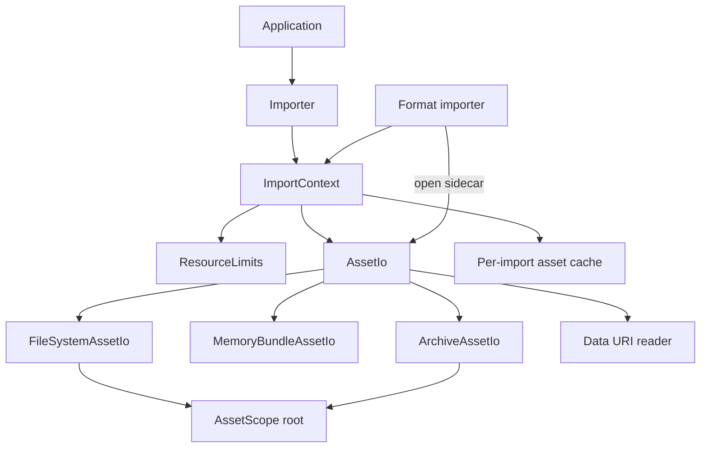
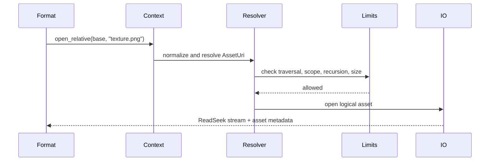

# ADR 0010: Asset IO, Virtual Filesystem, URI, Archive, and Path Security

## Context

Model files rarely stand alone. OBJ loads MTL files and textures. glTF references buffers, images,
data URIs, and external files. 3MF and USDZ are archive-based. Collada and FBX can reference external
assets. A path bug can become a security issue when importers process untrusted files.

Baozi needs an IO model that supports filesystem assets, memory bundles, archives, URI-like
references, resource limits, and secure path resolution without binding the core importer to one host
environment.

Assimp has `IOSystem` and `IOStream` abstractions. Baozi should keep the same separation in Rust, but
with explicit path security and resource accounting.

## Decision

Baozi will introduce a root-scoped virtual asset IO layer in `baozi-io`. Importers must access
dependent assets through this layer rather than opening raw paths directly.

Core decisions:

- `AssetIo` is the sync-first canonical IO trait
- async IO is an adapter layer, not the core importer contract
- asset references use logical `AssetUri` / `AssetPath` values, not raw `PathBuf` everywhere
- every import has an `AssetScope` root and `ResourceLimits`
- external references are denied or constrained by default unless explicitly allowed
- archive access is represented as another IO layer with its own limits
- per-import asset cache is allowed; no global cache by default

## Architecture





## Asset Identity

Baozi distinguishes:

- raw user input such as `PathBuf`, `&[u8]`, or URL-like strings
- normalized logical asset identity: `AssetUri`
- scope-aware path inside a filesystem, memory bundle, or archive: `AssetPath`
- source location inside a file: `SourceLocation`

Examples:

```text
file:///project/assets/model.obj
memory://scene/model.gltf
archive://model.3mf/3D/3dmodel.model
data:application/octet-stream;base64,...
```

The exact URI syntax can evolve, but importers must not concatenate raw strings and open filesystem
paths directly.

## Asset Scope and Path Security

`AssetScope` defines what an import is allowed to read.

Default behavior for `read_path("dir/model.obj")`:

- primary asset is allowed
- sibling and child paths under the primary asset directory are allowed
- path traversal outside the scope is denied
- symlink traversal outside the scope is denied by default
- absolute sidecar paths are denied unless caller opts in

For `read_memory`, no filesystem sidecars are available unless caller provides a memory bundle or
custom `AssetIo`.

Import options can relax policy intentionally:

```text
ExternalReferencePolicy
├── Deny
├── WithinScope
├── AllowListedRoots
└── CustomResolver
```

The default should be `WithinScope` for filesystem reads and `Deny` for memory reads without a
bundle.

## Target and Feature Boundary

Baozi's portable import path is bytes-first:

- `read_bytes` and memory-backed `AssetIo` must compile for `wasm32-unknown-unknown`
- bytes import must not imply filesystem, sidecar, URI, archive, or remote-fetch access
- native filesystem helpers are facade conveniences behind `native-fs`
- `baozi-io` gates filesystem adapters behind its narrower `fs` feature
- format crates must resolve every dependency through `ImportContext` and `AssetIo`, never through
  direct `std::fs` calls

This keeps browser WASM support mechanical instead of aspirational: if a format can parse a byte
buffer without sidecars, it should remain buildable without native IO features.

## Resource Limits

Every import should carry resource limits:

```text
ResourceLimits
├── max_primary_asset_bytes
├── max_sidecar_asset_bytes
├── max_total_asset_bytes
├── max_open_assets
├── max_include_depth
├── max_archive_entries
├── max_archive_uncompressed_bytes
├── max_data_uri_bytes
├── max_path_length
├── max_string_bytes
└── max_diagnostics
```

Limit violations produce `BaoziError::LimitExceeded` or structured diagnostics when recoverable.

## Archive Policy

Archive formats such as 3MF and USDZ should be handled by an IO adapter:

```text
ArchiveAssetIo(base_io, archive_asset)
```

Rules:

- archive entries are logical paths inside the archive
- `..` and absolute archive paths are rejected
- decompressed size is limited
- entry count is limited
- nested archive recursion is limited
- archive readers must not extract files to arbitrary filesystem paths
- archive CRC/checksum failures are errors when the format provides them

This keeps archive-specific security outside individual format parsers where possible.

## URI and Data URI Policy

URI handling must be format-aware but centralized.

Rules:

- percent decoding must reject invalid encodings where the format requires valid URI syntax
- data URIs are allowed only within size limits
- remote HTTP(S) fetching is not part of core Baozi
- applications can provide custom `AssetIo` for remote or database-backed assets
- diagnostics should preserve the original reference string when useful and safe

Remote fetching is deliberately excluded from the core library because it creates security, timeout,
caching, and async-runtime policy questions that belong to host applications.

## Cache Policy

Baozi may use a per-import cache:

- normalized asset identity to loaded bytes or metadata
- decoded archive directory table
- parsed sidecar files such as MTL if format crate chooses

No global cache by default.

Rationale:

- avoids cross-import stale data
- keeps memory lifetime clear
- avoids global locks
- lets applications provide caching at their layer

## Importer Rules

Format crates must:

- use `ImportContext` / `AssetIo` for sidecars
- pass base asset identity when resolving relatives
- respect resource limits
- produce source-aware errors
- not call `std::fs::read` directly except inside approved IO implementations
- document external reference behavior in `docs/formats/<format>.md`

## Alternatives Considered

### Option A: Let importers open filesystem paths directly

Pros:

- Very simple for first OBJ/MTL implementation.
- Less abstraction.
- Familiar to small scripts.

Cons:

- Does not work for memory bundles or archives.
- Makes path traversal prevention inconsistent.
- Makes testing and virtual filesystems harder.
- Forces every importer to reinvent sidecar resolution.

Decision: rejected.

### Option B: Core library fetches filesystem and remote URLs

Pros:

- Convenient for users with remote assets.
- Handles more URI schemes out of the box.
- Similar to some asset pipeline tools.

Cons:

- Pulls async/runtime, timeout, TLS, proxy, and security policy into core.
- Hard to make deterministic in tests.
- Host applications usually need custom auth/cache behavior.

Decision: rejected for core. Applications can implement custom `AssetIo`.

### Option C: Root-scoped virtual asset IO with explicit limits

Pros:

- Supports filesystem, memory, archives, and custom backends.
- Centralizes security and resource policy.
- Keeps importers testable and runtime-neutral.
- Avoids hidden remote fetching.

Cons:

- More design up front.
- Some simple importers need context plumbing.
- Users must opt in for complex external reference policies.

Decision: chosen.

## Success Metrics

| Metric | Target | Measurement |
| --- | --- | --- |
| IO abstraction | Format crates do not open raw filesystem paths directly | code review / lint review |
| Path security | traversal and out-of-scope sidecars are rejected | malformed fixture tests |
| Memory import | `read_memory` works with memory bundle sidecars | integration tests |
| Archive support | archive paths cannot escape logical archive root | archive fixture tests |
| Resource limits | oversized assets and data URIs fail predictably | limit tests |
| Runtime neutrality | core IO traits do not require Tokio or remote clients | dependency audit |
| Diagnostics | missing sidecars and denied paths produce source-aware diagnostics | snapshot tests |

## Risks and Mitigations

| Risk | Severity | Likelihood | Mitigation |
| --- | --- | --- | --- |
| IO abstraction slows first parser work | Low | Medium | Implement simple filesystem and memory IO first |
| Security policy blocks legitimate assets | Medium | Medium | Provide explicit allow-listed roots and custom resolver options |
| URI syntax becomes overdesigned | Medium | Medium | Keep `AssetUri` minimal and format-driven |
| Archive decompression consumes too much memory | High | Medium | Enforce decompressed byte and entry limits |
| Remote assets are requested by users | Medium | Medium | Document custom `AssetIo`; keep remote support outside core |
| Symlink behavior differs by platform | Medium | Medium | Canonicalize when possible and add platform tests |

## Implementation Plan

### Phase 0: Core IO Types

- Add `baozi-io` crate.
- Define `AssetUri`, `AssetPath`, `AssetScope`, `AssetIo`, and `ResourceLimits`.
- Implement filesystem and memory-bundle IO.

### Phase 1: Import Integration

- Route importer sidecar access through `ImportContext`.
- Add path traversal and missing-sidecar tests.
- Add diagnostics for denied external references.

### Phase 2: Archive and Data URI Support

- Add archive IO adapter for zip-like containers.
- Add data URI parser with size limits.
- Use the adapter for 3MF/USDZ-style formats when implemented.

### Phase 3: Custom Backends

- Document custom `AssetIo` examples.
- Add optional async adapter after sync IO is proven.
- Add cache hooks only after real repeated-asset cases appear.

## Consequences

Positive:

- Sidecar loading works consistently across formats.
- Security-sensitive path handling is centralized.
- Memory, archive, and custom application storage are first-class.

Negative:

- Importers need IO context from the start.
- Remote fetching is not built in.
- Some users must configure external reference policies explicitly.

## Open Questions

1. Should symlinks inside the asset scope be followed by default?
   Recommendation: yes only if the resolved path stays inside scope.
2. Should Baozi include HTTP(S) IO behind a feature?
   Recommendation: not in core. Consider a separate adapter crate later.
3. Should per-import cache expose eviction controls?
   Recommendation: no initially. Keep cache local and simple.
