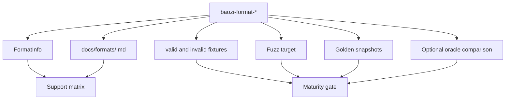
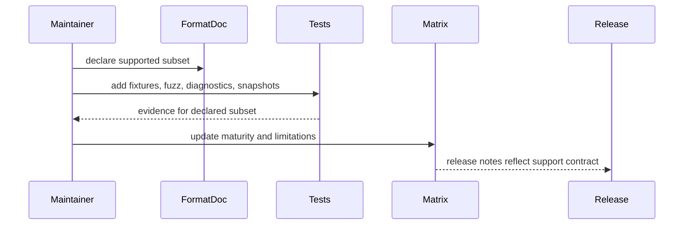

# ADR 0011: Format Support Tiers and Compatibility Charter

## Context

Baozi aims for Assimp-class model loading. The phrase "supports OBJ" or "supports glTF" is not precise enough for a serious importer. A format can parse one mesh but fail materials, sidecar files, encodings, animation, diagnostics, post-processing, or malformed input. Without a support charter, format crates will drift into different quality bars.

ADR 0004 defines format maturity labels. This ADR defines what those labels mean in tests, docs, and user promises.

## Decision

Baozi will treat format support as a documented contract with tiers, capability matrices, known limitations, and test evidence. A format is not "stable" because it opens a sample file; it is stable when the supported subset is documented, validated, fuzzed, and covered by compatibility checks.

Every format crate must publish:

- `FormatInfo` with maturity, extensions, media types, and known limitations
- `docs/formats/<format>.md` using the format template
- valid and invalid fixtures
- golden normalized scene snapshots
- resource-limit tests
- fuzz targets for public parsers
- optional oracle comparison against Assimp where practical

## Architecture

## Support Tiers

| Tier | Meaning | Required evidence |
| --- | --- | --- |
| Experimental | Parser exists for selected files and may change behavior | at least one valid fixture, documented limits |
| Beta | Common assets work, diagnostics are usable, known gaps are documented | valid/invalid fixtures, snapshots, resource limits |
| Stable | Supported subset is reliable and compatibility-tested | beta evidence plus fuzz, support matrix, oracle/differential where useful |
| Deprecated | Still present but no longer recommended | migration or replacement note |

The tier applies to a supported subset, not to the entire file format specification. A stable OBJ importer can still document unsupported vendor extensions.

## Capability Dimensions

Each format document must classify support by capability:

- geometry
- hierarchy and transforms
- materials
- textures and sidecars
- cameras and lights
- animation
- skinning
- morph targets
- metadata
- compression or containers
- coordinate and unit metadata
- malformed input diagnostics
- resource limits

Use these statuses:

| Status | Meaning |
| --- | --- |
| Supported | Intended to work and covered by tests |
| Partial | Some features work, limitations documented |
| ParsedLossy | Accepted but converted with known data loss |
| IgnoredWithDiagnostic | Ignored and surfaced to caller |
| Unsupported | Expected to fail or be unavailable |
| Unknown | Not investigated yet; allowed only for experimental formats |

## Compatibility Charter

Baozi does not promise byte-for-byte or memory-layout compatibility with Assimp. Compatibility means:

- equivalent scene semantics for declared supported features
- documented differences for normalization, material approximation, triangulation, coordinate conversion, and diagnostics
- no silent data loss for known unsupported features
- importer behavior is stable enough for snapshots and downstream tests

Oracle comparison should classify differences:

- match
- tolerated difference
- Baozi bug
- oracle limitation
- unsupported feature
- out of declared support scope

## Stable Format Gate

A format can become stable only when:

1. `docs/formats/<format>.md` is complete.
2. Support matrix lists every capability dimension.
3. Valid fixtures cover the declared supported subset.
4. Invalid fixtures cover malformed headers, truncated data, invalid references, oversized counts, and sidecar failures where applicable.
5. Fuzz target exists and has at least smoke CI coverage.
6. Diagnostics include source identity and location when the format can provide them.
7. Resource limits are enforced.
8. Public parser behavior is independent of backend crate types.
9. Differential comparison exists or the format doc explains why it is not useful yet.

## Alternatives Considered

### Option A: Treat extension presence as support

Pros:

- Easy marketing and README table.
- Minimal process overhead.
- Fast to add many formats.

Cons:

- Misleads users.
- Encourages shallow parsers.
- Makes testing and release notes meaningless.

Decision: rejected.

### Option B: Require full specification coverage before stable

Pros:

- Very high quality bar.
- Simple claim: stable means complete.
- Avoids many caveats.

Cons:

- Unrealistic for broad formats such as FBX, Collada, USD, and IFC.
- Blocks useful subsets from being stable.
- Assimp-level breadth depends on pragmatic partial support.

Decision: rejected.

### Option C: Stable documented subsets with evidence

Pros:

- Honest to users.
- Lets Baozi ship useful support incrementally.
- Keeps testing aligned with promises.

Cons:

- Requires support matrix maintenance.
- Users must read limitations for complex formats.
- Some features remain partial for a long time.

Decision: chosen.

## Success Metrics

| Metric | Target | Measurement |
| --- | --- | --- |
| Format honesty | Every non-experimental format has support matrix rows for all capability dimensions | docs check |
| Test alignment | Supported capabilities have fixtures and snapshots | test inventory |
| Diagnostic quality | Unsupported known features emit diagnostics rather than silent loss | fixture tests |
| Compatibility clarity | Assimp/oracle differences are classified | differential reports |
| Release confidence | Stable promotion checklist is completed before default feature inclusion | release checklist |

## Risks and Mitigations

| Risk | Severity | Likelihood | Mitigation |
| --- | --- | --- | --- |
| Support docs drift from behavior | High | Medium | Treat format docs as release-gated artifacts |
| Quality bar slows format count | Medium | High | Allow experimental and beta tiers without overselling |
| Oracle differences become noisy | Medium | Medium | Classify differences and compare normalized scenes |
| Users misunderstand partial support | Medium | Medium | Surface known limitations through `FormatInfo` and docs |
| Stable gates become too heavy for simple formats | Low | Medium | Keep fixtures small and right-sized |

## Implementation Plan

### Phase 0: Templates

- Add `docs/formats/_template.md`.
- Add `docs/formats/support-matrix.md`.
- Add `FormatMaturity` and capability status types.

### Phase 1: First Formats

- Fill docs for STL, OBJ, PLY, and glTF as they are implemented.
- Add golden and malformed fixtures alongside each parser.
- Keep initial formats experimental until evidence exists.

### Phase 2: Stable Promotion

- Add release checklist item for support tier changes.
- Add tests that compare `FormatInfo` with docs where practical.

## Consequences

Positive:

- Users can trust format claims.
- Baozi can grow format breadth without lowering quality.
- Tests and docs become part of the same contract.

Negative:

- More documentation work per format.
- Some early formats will remain experimental longer.
- Support matrices need maintenance.

## Open Questions

1. Should support tier be compiled into `FormatInfo` at build time from docs?
   Recommendation: no initially; keep manual but audited.
2. Should stable promotion require oracle comparison?
   Recommendation: require it when useful and available, but allow documented exceptions.
