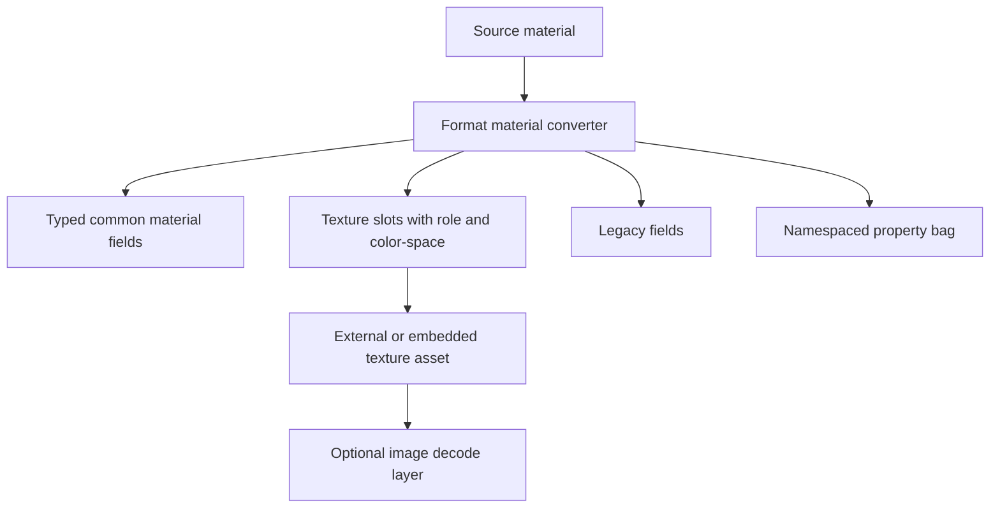
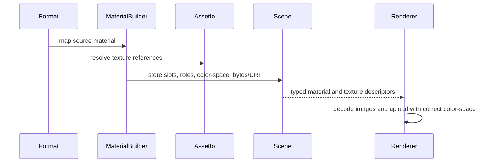

# ADR 0012: Material, Texture, Image, and Color-Space Policy

## Context

Many importers appear to work until rendered. Geometry can be correct while colors, alpha, normal maps, packed PBR textures, or legacy Phong properties are wrong. Baozi needs a material and texture policy before public `Material` fields become hard to change.

ADR 0003 defines a typed material model plus extension bags. This ADR defines color-space, texture role, image decoding, and legacy-to-PBR mapping rules.

## Decision

Baozi will preserve source material data, expose typed common material fields, and record color-space semantics explicitly. Image decoding is not required during model import. Texture bytes and references are carried as assets; decoding and GPU upload are separate concerns.

Core decisions:

- material colors are stored as linear values unless a field explicitly represents encoded source data
- base color and emissive color textures are treated as sRGB color textures by default when the source format says so or convention is clear
- normal, metallic, roughness, occlusion, height, displacement, and mask textures are data textures and must not receive sRGB conversion
- texture role, UV set, transform, wrap, filter, channel packing, and color-space metadata are part of the texture slot
- embedded textures are preserved as bytes with MIME/format hints
- image decoding is optional and not part of core import success
- legacy material fields are preserved and mapped to PBR only through documented conversion helpers

## Architecture

## Material Model

`Material` should have these layers:

- identity: name, source format, metadata
- shading model: unlit, legacy Phong/Blinn, metallic-roughness PBR, specular-glossiness, unknown
- PBR common fields: base color, metallic, roughness, emissive, normal scale, occlusion strength, alpha mode
- legacy fields: diffuse, specular, ambient, shininess, opacity, reflectivity
- texture slots: role-specific descriptors
- extension property bag: namespaced loss-aware data

PBR fields should not erase legacy fields. A user should be able to inspect both the source legacy data and Baozi's best-effort common interpretation.

## Texture Slot Semantics

Each texture slot should record:

- role
- asset reference or embedded texture ID
- UV set index
- UV transform
- wrap mode
- filter hint
- coordinate set source when known
- color-space
- channel mapping
- scale/strength factor
- original source key

Texture roles include:

- base color
- diffuse
- specular
- metallic
- roughness
- metallic-roughness packed
- normal
- occlusion
- emissive
- opacity
- height
- displacement
- lightmap
- sheen
- clearcoat
- transmission
- unknown

Unknown roles are allowed only with diagnostics or extension metadata.

## Color-Space Policy

Default assumptions:

| Data | Default interpretation |
| --- | --- |
| base color factor | linear |
| diffuse factor | linear |
| emissive factor | linear |
| base color texture | sRGB color |
| diffuse texture | sRGB color |
| emissive texture | sRGB color |
| normal texture | linear data |
| metallic/roughness/occlusion texture | linear data |
| opacity/mask texture | linear data |
| height/displacement texture | linear data |

If a format specifies a different rule, the format rule wins and must be documented.

Baozi should not convert texture pixels during import unless an explicit post-import image processing API is used. It records enough metadata for the caller to decode correctly.

## Image Decoding Policy

Core import succeeds when Baozi can resolve and preserve image references or embedded bytes. Decoding PNG, JPEG, WebP, KTX, DDS, or EXR is optional.

Rules:

- `baozi-core` stores texture asset descriptors, not decoded image pixels by default
- optional image helper crates may decode bytes into image data
- failed optional image decode is a diagnostic unless the caller requested strict decode
- compressed GPU-ready texture payloads should be preserved without forced CPU decode

## Legacy to PBR Mapping

Legacy material mapping is best-effort and must be explicit:

- Phong diffuse maps to base color only as an approximation
- specular and shininess can inform roughness/specular helpers but must not erase original fields
- opacity maps to alpha factor and alpha mode with documented heuristics
- MTL `illum` is preserved in extension metadata and influences shading model only through documented rules
- unknown source keys go into namespaced metadata

## Normal Map and Tangent Basis Policy

Normal maps are data textures. Baozi records normal scale and tangent-space convention metadata where known.

Initial policy:

- do not flip normal map green channel implicitly during import
- coordinate-system post-process may update tangent basis metadata when it changes handedness
- tangent generation uses a documented basis, with MikkTSpace as an optional backend
- tangent handedness is stored in `Vec4.w` when tangents exist

## Alternatives Considered

### Option A: Store only a stringly Assimp-like material property table

Pros:

- Maximum flexibility.
- Easy to preserve unknown source keys.
- Similar to Assimp's broad material property model.

Cons:

- Hard for Rust users to consume safely.
- Color-space and texture role semantics stay implicit.
- Repeated conversions become ad hoc.

Decision: rejected as the only model. Keep extension bags, but promote common fields to typed API.

### Option B: Make glTF PBR the only material model

Pros:

- Clean modern renderer path.
- Matches many current asset pipelines.
- Simple for real-time graphics.

Cons:

- Loses legacy and DCC-specific material data.
- Forces OBJ/MTL, FBX, Collada, and CAD materials into approximations.
- Makes round-trip and diagnostics weaker.

Decision: rejected. Use PBR as a common layer, not the only truth.

### Option C: Typed common material plus source-preserving extensions

Pros:

- Ergonomic common rendering path.
- Preserves source data and unknown fields.
- Lets format docs define mapping quality.

Cons:

- More fields and conversion rules to maintain.
- Requires careful snapshot tests.
- Some users must inspect both common and source-specific layers.

Decision: chosen.

## Success Metrics

| Metric | Target | Measurement |
| --- | --- | --- |
| Color-space clarity | texture slots identify color vs data textures | material snapshot tests |
| Source preservation | legacy material fields remain inspectable after PBR mapping | OBJ/MTL and Collada/FBX-style fixtures |
| Decode separation | import can preserve image bytes without decoding | embedded/external texture tests |
| Normal correctness | normal maps are never sRGB-converted by default | material conversion tests |
| Mapping docs | each stable format documents material conversion | `docs/formats/*.md` |
| Extension hygiene | unknown fields are namespaced | validator tests |

## Risks and Mitigations

| Risk | Severity | Likelihood | Mitigation |
| --- | --- | --- | --- |
| Material model becomes too large | Medium | Medium | Keep common fields typed and push rare fields to namespaced extensions |
| Color-space mistakes become silent rendering bugs | High | Medium | Snapshot texture slot roles and color-space metadata |
| Legacy-to-PBR mapping misleads users | Medium | Medium | Preserve original legacy fields and label approximations |
| Optional image decoding becomes mandatory by accident | Medium | Medium | Keep decode APIs outside core import success |
| Normal map conventions vary by source | Medium | Medium | Store convention metadata and avoid implicit green-channel flips |

## Implementation Plan

### Phase 0: Material Types

- Define `Material`, `ShadingModel`, `TextureSlot`, `TextureRole`, `ColorSpace`, and alpha modes.
- Add typed legacy and PBR fields.
- Add namespaced extension properties.

### Phase 1: Format Mapping

- Implement STL default material, OBJ/MTL legacy material, PLY color attributes, and glTF PBR mapping.
- Add material snapshots.
- Document mapping in format docs.

### Phase 2: Optional Decode Helpers

- Add optional image decode helper only after texture descriptors are stable.
- Keep compressed texture payloads preserved.

## Consequences

Positive:

- Renderers get a usable common material path.
- Format-specific data is not silently discarded.
- Color-space semantics become testable.

Negative:

- Material API is broader than minimal mesh loaders.
- Mapping rules need ongoing documentation.
- Image decoding remains a separate step for users who need pixels.

## Open Questions

1. Should Baozi include direct image decoding in the facade?
   Recommendation: no initially; provide optional helpers later.
2. Should material factors store HDR values?
   Recommendation: allow values above 1.0 for emissive and source-preserving fields.
