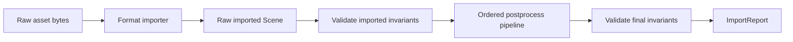
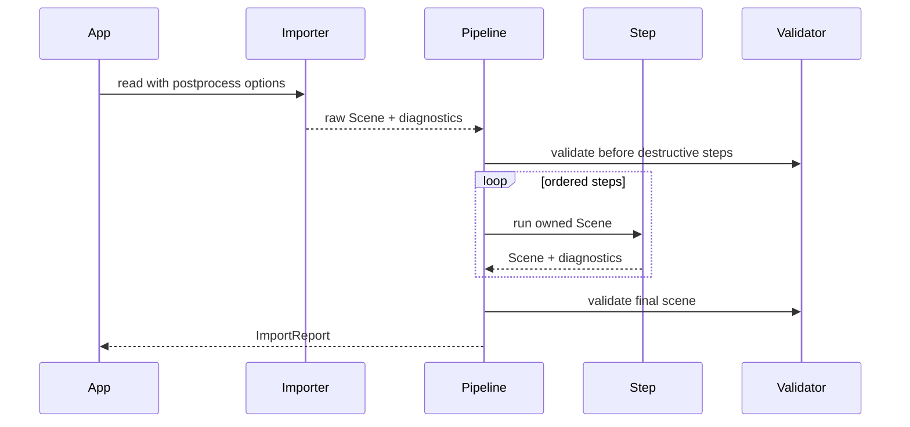

# ADR 0013: Post-Process Pipeline Semantics, Presets, and Mutation Model

## Context

Assimp's post-processing pipeline is a major part of its value. Importers produce raw scenes, and post-process steps normalize, validate, repair, optimize, and adapt data for common rendering or tooling workflows.

Baozi already has ADR-level commitments to a post-process crate. This ADR defines stage semantics, ordering, mutability, presets, and the boundary between importer behavior and post-process behavior.

## Decision

Baozi will keep importers source-preserving by default and move normalization into ordered post-process steps. Importers may perform only format-required decoding and structural repair. They must not silently triangulate, flip coordinates, generate normals, merge vertices, or drop unsupported features unless the format requires it and emits diagnostics.

Post-process steps operate on owned `Scene` values and return a new validated stage result. Implementations may mutate internally while they own the scene, but public APIs must make stage transitions explicit.

Requested steps must never be silent no-ops. If a caller requests a known `PostProcessStep` whose
algorithm is not implemented, the pipeline returns a `PostProcess` error naming that step. Presets
must include only implemented steps; future preset expansion happens when the corresponding steps
land with tests.

## Architecture

## Scene Stages

Baozi recognizes these conceptual stages:

| Stage | Meaning |
| --- | --- |
| RawImported | source-preserving scene produced by importer |
| ValidatedImported | raw scene passed structural validation |
| PostProcessed | requested steps applied |
| ValidatedOutput | final scene passed output validation |

The type system may not need distinct types for every stage initially, but diagnostics and tests should name stages.

## Importer Boundary

Importers may:

- decode file-level structures
- resolve sidecar files through `AssetIo`
- create source coordinate metadata
- preserve source topology where possible
- repair minor format-specific inconsistencies with diagnostics
- reject structurally unsafe input

Importers must not silently:

- triangulate all polygons
- flip winding or handedness
- generate normals or tangents
- merge vertices
- optimize meshes
- remove degenerate geometry
- normalize units
- decode images

Exceptions must be documented per format.

## Step Ordering

Initial canonical order:

1. `ValidateScene`
2. `ApplyGlobalScale`
3. `NormalizeCoordinates`
4. `Triangulate`
5. `SortByPrimitiveType`
6. `FindDegenerates`
7. `FindInvalidData`
8. `JoinIdenticalVertices`
9. `GenerateNormals`
10. `GenerateTangents`
11. `GenerateBoundingBoxes`
12. `OptimizeMeshes`
13. `OptimizeGraph`
14. final `ValidateScene`

Not every requested pipeline runs every step. The order is the conflict-resolution rule when multiple requested steps interact.

## Destructive and Non-Destructive Steps

Steps must declare whether they are destructive:

| Step | Destructive? | Notes |
| --- | --- | --- |
| ValidateScene | no | emits diagnostics or errors |
| GenerateBoundingBoxes | no | adds derived data |
| ApplyGlobalScale | yes | changes geometry and transforms |
| NormalizeCoordinates | yes | changes axes, transforms, cameras, lights, animation |
| Triangulate | yes | replaces polygon topology |
| JoinIdenticalVertices | yes | changes vertex identity and indices |
| GenerateNormals | yes when replacing, no when filling missing | mode must be explicit |
| GenerateTangents | yes when replacing, no when filling missing | tangent basis must be documented |
| FindDegenerates | optionally destructive | remove or diagnose mode |
| OptimizeMeshes | yes | may merge or split meshes |
| OptimizeGraph | yes | changes node graph |

Destructive steps must emit diagnostics or stats describing what changed.

## Coordinate, Winding, UV, and Tangent Policy

Coordinate normalization is a post-process step. Raw import preserves source coordinates.

Default normalized target:

- right-handed
- Y-up
- meters
- counter-clockwise front faces unless a target option says otherwise

UV policy:

- raw scene records source UV origin when known
- `FlipUvs` or target preset converts UV origin explicitly
- no importer silently flips UVs for renderer convenience

Tangent policy:

- generated tangents use a documented basis
- MikkTSpace can be an optional backend
- tangent handedness is stored in tangent `w`
- coordinate conversion must update tangent basis or invalidate tangents with diagnostics

## Presets

Baozi may expose Assimp-inspired presets, but they are Baozi-defined contracts:

| Preset | Long-term intent | Current pre-1.0 implemented subset |
| --- | --- | --- |
| Raw | no normalization beyond importer-required decoding and validation | validate scene |
| RealtimeFast | triangulate, validate, bounding boxes, basic coordinate/unit options | validate, triangulate, bounding boxes |
| RealtimeQuality | RealtimeFast plus normals/tangents where missing and degeneracy diagnostics | same implemented subset as `RealtimeFast` |
| RealtimeMaxQuality | RealtimeQuality plus vertex joining and mesh/graph optimization | same implemented subset as `RealtimeFast` |
| ToolingPreserve | validate and enrich while preserving source topology as much as possible | validate and bounding boxes |

Presets expand to explicit step lists. Users can inspect and customize the list. A preset may be a
supported subset of its long-term intent while Baozi is pre-1.0, but it must not include an
unimplemented step just to advertise future behavior.

## Idempotence and Determinism

Each step must document idempotence:

- idempotent: repeated runs produce no further changes
- stable-with-options: repeated runs are stable only with same options
- destructive-non-idempotent: repeated runs may further alter data and should be guarded

Tests must cover deterministic output for supported steps, including parallel backends.

## Alternatives Considered

### Option A: Let importers normalize however they want

Pros:

- Simpler first parsers.
- Less pipeline machinery.
- Format-specific quirks can be handled locally.

Cons:

- Behavior differs by format.
- Post-process tests become impossible to reason about.
- Users cannot choose raw versus normalized output.

Decision: rejected.

### Option B: Always return fully normalized scenes

Pros:

- Easy for renderers.
- Fewer options for users.
- Similar to a game-engine asset pipeline.

Cons:

- Loses source information.
- Bad for tools, converters, diagnostics, and round-trip workflows.
- Makes compatibility comparison harder.

Decision: rejected.

### Option C: Source-preserving import plus explicit ordered post-process

Pros:

- Separates parsing from transformation.
- Lets users choose raw or renderer-friendly output.
- Makes destructive changes testable.

Cons:

- More API surface.
- Some users must pick a preset.
- Pipeline order must be maintained carefully.

Decision: chosen.

## Success Metrics

| Metric | Target | Measurement |
| --- | --- | --- |
| Importer discipline | first format importers do not silently normalize renderer conveniences | code review and snapshots |
| Stage visibility | raw and postprocessed snapshots can be compared | golden tests |
| Order determinism | requested steps run in canonical order | pipeline unit tests |
| Destructive visibility | destructive steps report stats or diagnostics | step tests |
| Coordinate correctness | normalized target applies to nodes, meshes, cameras, lights, animation | integration fixtures |
| Parallel equivalence | parallel and scalar step results match within tolerance | backend tests |

## Risks and Mitigations

| Risk | Severity | Likelihood | Mitigation |
| --- | --- | --- | --- |
| Pipeline feels heavy for simple users | Low | Medium | Provide facade presets and `load_scene` convenience |
| Step order is wrong for some assets | Medium | Medium | Keep order documented and add per-step dependency tests |
| Destructive steps lose source data unexpectedly | High | Medium | Mark destructive steps and keep raw snapshots in tests |
| Coordinate conversion misses cameras or animation | High | Medium | Add complex fixtures before stabilizing coordinate normalization |
| Presets drift from docs | Medium | Medium | Test preset expansion |
| Unimplemented step silently passes | High | Medium | Return `PostProcess` error for explicit requests and keep presets implemented-only |

## Implementation Plan

### Phase 0: Pipeline Core

- Define `PostProcessStep`, `PostProcessPipeline`, step metadata, and presets.
- Add stage diagnostics and stats.
- Add validator before and after the pipeline.

### Phase 1: First Steps

- Implement validation, bounding boxes, triangulation, coordinate/unit normalization, and basic normals.
- Add raw versus processed snapshots.

### Phase 2: Quality Steps

- Add tangent generation, vertex joining, degeneracy handling, and optimization.
- Add scalar/parallel equivalence tests.

## Consequences

Positive:

- Importer behavior stays consistent.
- Raw and normalized workflows are both supported.
- Assimp-like post-process value is designed into Baozi.

Negative:

- More initial pipeline code.
- Presets require maintenance.
- Some transformations need complex fixtures to prove.
- Callers see early errors for requested future steps instead of accidentally shipping unchanged data.

## Open Questions

1. Should `NormalizeCoordinates` be included in realtime presets by default?
   Recommendation: no initially; make target coordinate presets explicit.
2. Should destructive steps keep reverse maps?
   Recommendation: only in debug or tooling options if real use cases appear.
