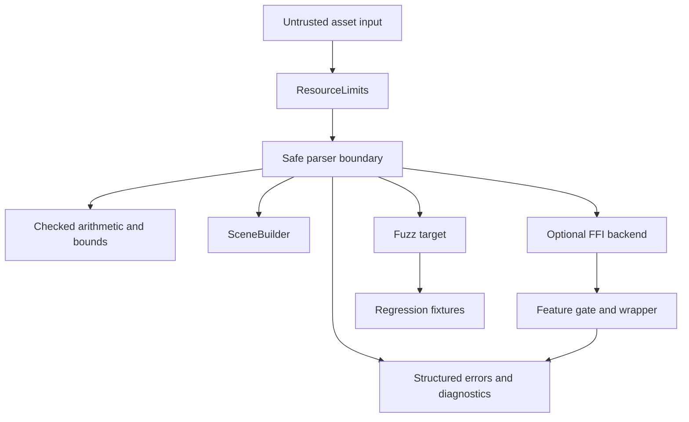
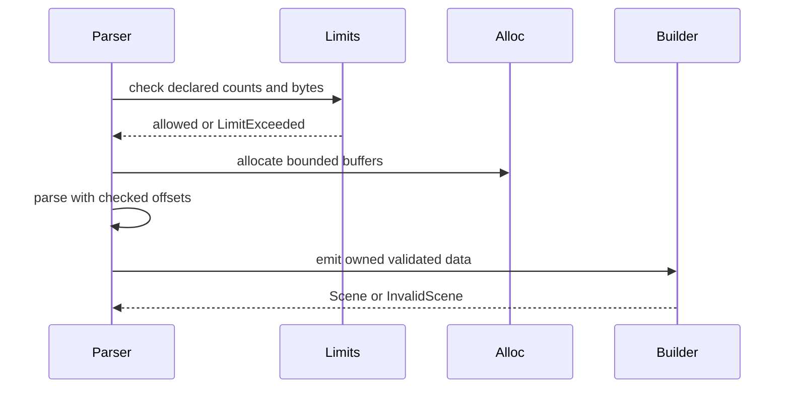

# ADR 0014: Parser Security, Unsafe, FFI, and Panic Boundary Policy

## Context

Baozi parses untrusted, complex, often malformed files. Rust gives memory safety, but parser bugs can still cause panics, unbounded allocation, integer overflow, path abuse through sidecars, denial of service, or unsafe FFI failures.

ADR 0010 covers IO and path security. This ADR covers parser-internal security, unsafe usage, FFI isolation, panic behavior, and fuzzing gates.

## Decision

Baozi parser crates must be safe-by-default, panic-averse, limit-aware, and fuzzable. `unsafe` and FFI are allowed only behind explicit review boundaries and feature gates. Library code must return structured errors instead of panicking on malformed input.

Core policy:

- no `unsafe` in core or parser crates unless justified with a safety comment and test/fuzz coverage
- no `unwrap`, `expect`, unchecked indexing, or debug-only validation on untrusted input paths
- all counts and byte sizes are checked with overflow-safe arithmetic
- every parser reads `ResourceLimits`
- parser panics are bugs
- FFI backends live in isolated opt-in crates or modules
- fuzz targets are required before parser maturity reaches stable

## Architecture

## Parser Safety Rules

All parser crates must follow:

- reject malformed input through `BaoziError` or diagnostics
- never panic for expected malformed input
- use `checked_add`, `checked_mul`, and bounded conversions for size calculations
- validate offsets before slicing
- validate declared counts before allocation
- validate recursion depth
- validate text encoding where required
- keep resource accounting centralized through `ImportContext`
- convert third-party parser failures into Baozi errors

`panic!`, `unwrap`, and `expect` are allowed only in tests, examples, or unreachable internal invariant checks that cannot be triggered by user input. Prefer returning `InvalidScene`, `Parse`, or `LimitExceeded`.

## Unsafe Policy

Default: no `unsafe`.

`unsafe` may be accepted only when:

1. safe Rust cannot meet the measured need
2. the block is small and encapsulated
3. the safety invariant is documented immediately above the block
4. tests cover normal and malformed cases
5. fuzzing covers the public parser path
6. a safe fallback exists when practical

Do not use `unsafe` for convenience or premature micro-optimization.

## FFI Policy

FFI-backed importers or codecs must be opt-in.

Rules:

- isolate FFI in a dedicated crate or private backend module
- keep facade feature names explicit
- never make FFI part of `default-formats`
- document native build requirements and licenses
- wrap foreign errors into `BaoziError`
- treat FFI panics, aborts, and memory errors as backend risks
- keep pure-Rust or safe fallback paths where practical

FFI may be appropriate for complex codecs or external ecosystems, but not for the core import pipeline.

## Panic Boundary

Baozi should not use `catch_unwind` as a normal parser control flow mechanism. Panics are bugs and should become regression tests.

Potential exception:

- optional third-party or FFI backend wrappers may use panic boundaries defensively if the backend has known unwind behavior and Rust safety permits it

Even then, caught panics must become diagnostics or backend errors, and the backend must remain opt-in.

## Allocation and OOM Policy

Rust cannot reliably recover from all out-of-memory cases. Baozi should prevent obvious unbounded allocation:

- enforce declared count limits before allocation
- cap total asset bytes and decompressed bytes
- cap vertex, face, material, texture, animation, and metadata counts
- reject suspicious count/stride combinations
- prefer streaming or chunked parsing for large text formats where feasible

## Fuzzing and Regression Policy

Every public parser crate needs:

- one fuzz target for raw parser entry
- one malformed fixture suite for stable formats
- regression fixtures for every fuzz-found panic or infinite loop
- CI smoke fuzz or scheduled fuzz workflow when practical

Crashes from fuzzing must not be dismissed as "invalid input." Invalid input is the primary parser threat model.

## Alternatives Considered

### Option A: Rely on Rust memory safety alone

Pros:

- Less process.
- Faster parser implementation.
- Rust prevents many memory corruption bugs.

Cons:

- Panics, OOM, integer overflow, and denial of service remain possible.
- FFI and unsafe can bypass safety.
- Security posture becomes inconsistent.

Decision: rejected.

### Option B: Ban all unsafe and FFI permanently

Pros:

- Strongest safety message.
- Simpler audits.
- Avoids native build complexity.

Cons:

- May block useful codecs or future complex formats.
- Some performance backends may need narrow unsafe internals.
- Not pragmatic for an Assimp-class ecosystem.

Decision: rejected as permanent policy.

### Option C: Safe default with reviewed unsafe and isolated opt-in FFI

Pros:

- Keeps core safe and portable.
- Allows pragmatic backends when justified.
- Makes security posture auditable.

Cons:

- Requires review discipline.
- FFI features need separate CI and docs.
- Some performance optimizations may wait for proof.

Decision: chosen.

## Success Metrics

| Metric | Target | Measurement |
| --- | --- | --- |
| Panic-free malformed input | malformed fixtures return errors, not panics | parser tests |
| Unsafe visibility | every unsafe block has safety comment and review note | code review / lint |
| Limit enforcement | declared oversized counts fail before allocation | limit tests |
| FFI isolation | FFI dependencies are absent from default feature tree | `cargo tree -e features` |
| Fuzz coverage | every stable parser has fuzz target and regression corpus | fuzz inventory |
| Error structure | parser failures map to `BaoziError` and diagnostics | snapshot tests |

## Risks and Mitigations

| Risk | Severity | Likelihood | Mitigation |
| --- | --- | --- | --- |
| Parser authors use `unwrap` during early work | Medium | High | Clippy review and malformed fixtures |
| Limits reject legitimate huge assets | Medium | Medium | Make limits configurable and document defaults |
| FFI backend destabilizes builds | High | Medium | Keep FFI opt-in and isolated |
| Unsafe optimization introduces UB | High | Low | Require narrow blocks, comments, tests, fuzz, and safe fallback |
| Fuzzing is not run long enough | Medium | Medium | Add smoke CI and scheduled deeper runs |
| Third-party parser panics | Medium | Medium | Backend wrapper, regression tests, and replacement policy |

## Implementation Plan

### Phase 0: Guardrails

- Add parser security rules to contributor docs.
- Add clippy lints and review checklist for parser crates.
- Define `ResourceLimits` in import context.

### Phase 1: First Parsers

- Implement STL/OBJ/PLY with checked counts and malformed fixtures.
- Add fuzz targets before beta/stable promotion.
- Convert parser failures to structured diagnostics.

### Phase 2: Advanced Backends

- Add optional FFI policy docs before first FFI backend.
- Add feature tree checks for default dependency hygiene.

## Consequences

Positive:

- Parser code starts with a clear threat model.
- Fuzzing and limits are not afterthoughts.
- FFI remains possible without contaminating core.

Negative:

- Parser implementation is slower than quick-and-dirty loaders.
- Some optimizations require proof before adoption.
- FFI users need explicit feature configuration.

## Open Questions

1. Should Baozi deny `unsafe_code` at crate level initially?
   Recommendation: yes for core crates; allow parser crates to opt out only with a documented reason.
2. Should `catch_unwind` wrap all third-party parser backends?
   Recommendation: no by default; use only where a backend has known unwind-safe behavior and value.
