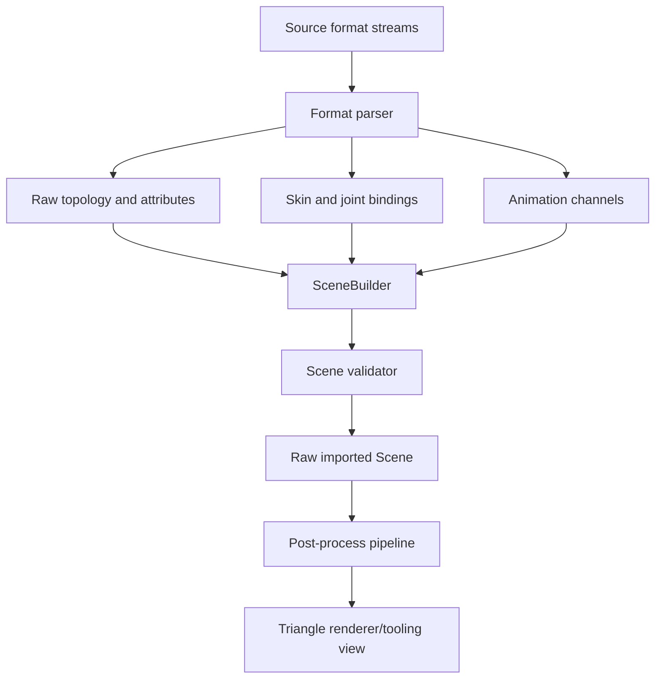
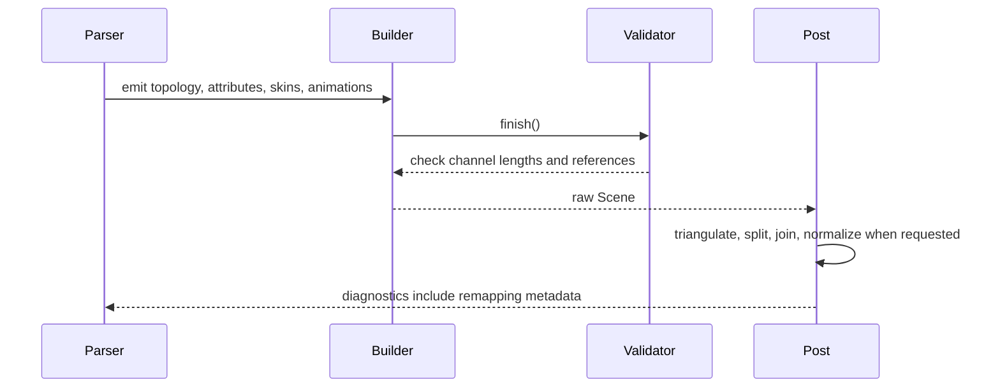

# ADR 0015: Mesh Topology, Vertex Attributes, Skinning, and Animation Semantics

## Context

Baozi's first scene model can represent basic meshes, but Assimp-class format breadth requires
clear semantics for topology, vertex attributes, skeletal skinning, morph targets, and animation.
Formats disagree on how they store polygons, indexed attributes, coordinate channels, bone weights,
bind poses, animation ticks, interpolation, and target paths.

If Baozi leaves these details implicit, early STL/OBJ/PLY work may look simple, but glTF, FBX,
Collada, IQM, MD5, and MMD support will force an IR rewrite. This ADR defines the stable semantic
direction before complex importers are implemented.

## Decision

Baozi will model source-preserving mesh topology and animation concepts explicitly in `baozi-core`.
Importers must preserve source intent where practical, then post-process steps may triangulate,
split, merge, generate, or normalize data.

Core policy:

- raw import may represent points, lines, triangles, polygons, and patches
- triangle-only views are helper APIs, not the canonical raw model
- mesh vertex data is stored as structure-of-arrays attribute streams, not fixed
  `struct Vertex` arrays
- vertex attributes are associated by vertex index after importer normalization into Baozi IR
- multiple UV, color, and custom channels are first-class
- skinning is represented as explicit skins, joints, inverse bind matrices, and vertex influences
- morph targets are attached to meshes and animated as named target weights
- animation uses seconds as normalized public time while preserving original tick metadata
- interpolation and extrapolation behavior are explicit per channel
- destructive conversion steps must report remapping diagnostics

## Architecture





## Mesh Topology

`Mesh` should support these primitive classes:

| Topology | Meaning | Notes |
| --- | --- | --- |
| Points | independent vertices | point clouds and marker data |
| Lines | independent or indexed line segments | wire data and CAD-like formats |
| LineStrip | connected line strip | may be lowered to lines by post-process |
| Triangles | triangle list | common renderer path |
| TriangleStrip | connected triangle strip | may be lowered to triangles |
| Polygons | variable-size faces | OBJ, FBX, Collada, authoring formats |
| Patches | higher-order or tessellation patches | preserve as unsupported-for-rendering until a backend exists |

The raw mesh representation may keep face descriptors instead of only a flat index buffer:

```text
MeshPrimitive
├── topology
├── indices
├── face_ranges for polygonal data
├── material binding
├── attribute set
└── source metadata
```

Baozi should allow one `Mesh` to contain multiple primitives only if each primitive has distinct
topology or material binding semantics. Otherwise, importers should keep the model simple and use
one primitive per mesh.

## Vertex Attributes

Baozi normalizes imported vertex data into a vertex-indexed attribute model. Formats with separate
position, normal, UV, and color indices must expand or remap data during import, with diagnostics
when expansion is large.

Attribute storage is structure-of-arrays (SoA):

```text
Mesh
├── positions: Vec<Vec3>
├── normals: Vec<Vec3>
├── tangents: Vec<Vec4>
├── texcoords: Vec<Vec<Vec2>>
├── colors: Vec<Vec<Color>>
└── indices: Vec<u32>
```

Baozi will not use a fixed public AoS type such as `Vertex { position, normal, uv }` as the canonical
IR. Fixed AoS layouts fail for common source assets that have missing normals, multiple UV sets,
multiple color sets, separate attribute indices, or custom attributes.

Renderer-facing interleaved buffers are helper outputs. A future helper may pack selected SoA
channels into an AoS byte buffer for `wgpu`, Vulkan, OpenGL, or engine upload, but that helper must
be derived from the owned mesh streams and must not replace the canonical raw IR layout.

Standard attributes:

- positions: required for renderable geometry
- normals
- tangents with handedness in `w`
- bitangents only when preserving source data or required by a format
- texture coordinates, multiple channels
- vertex colors, multiple channels
- joint indices and weights, multiple sets when required
- morph target deltas
- custom attributes with namespaced semantic keys

Channel names use stable semantic names:

```text
POSITION
NORMAL
TANGENT
TEXCOORD_0
COLOR_0
JOINTS_0
WEIGHTS_0
baozi:source_vertex_id
gltf:_CUSTOM_ATTRIBUTE
```

Unknown attributes are preserved only when their storage type is bounded and representable. Unsupported
attributes must produce diagnostics.

## Skinning

Baozi should represent skinning independently from mesh topology:

```text
Skin
├── name
├── joints: Vec<NodeId>
├── skeleton_root: Option<NodeId>
├── inverse_bind_matrices: Vec<Mat4>
└── metadata
```

Mesh vertices reference joints through joint-index and weight attributes. Importers must preserve
source weights, then validator or post-process can normalize them.

Rules:

- four influences per vertex is a common renderer view, not the core limit
- fixed `[u16; 4]` joint indices plus `[f32; 4]` weights may be offered by a renderer helper or
  influence-compaction pass, but must not be the only canonical IR representation
- the core IR may store more influences when formats provide them
- post-process presets may compact to a target influence limit
- zero or non-finite weights are invalid unless repaired with diagnostics
- inverse bind matrix count must match joint count when present
- skeleton root is advisory unless the source format requires it

## Morph Targets

Morph targets attach to meshes and store sparse or dense deltas:

- position deltas
- normal deltas
- tangent deltas
- target name
- default weight
- source metadata

Sparse source data may remain sparse internally, but public helper views can expose dense deltas.
Animation channels target morph weights by mesh or node binding, depending on source semantics.

## Animation

Baozi animation uses normalized seconds for public timing. Importers must preserve source tick data
in metadata when the source format uses ticks, frames, or arbitrary time units.

Channel classes:

- node translation
- node rotation
- node scale
- node transform matrix when decomposition is unsafe
- morph target weights
- material or visibility channels only when the IR can preserve them without pretending renderer support

Interpolation modes:

- step
- linear
- cubic spline
- quaternion spherical interpolation for rotation helpers
- source-specific interpolation in metadata when not supported

Baozi should not silently resample animation during import. Runtime sampling, blending, IK, retiming,
and animation playback belong in game engines, DCC tools, post-process passes, or future animation
utility crates. Raw import stores keyframe times, values, target bindings, interpolation declarations,
and source timing metadata; it does not evaluate those tracks into transforms.

## Validation Invariants

The validator must check:

- topology and index buffers are compatible
- polygon face ranges are valid and non-overlapping
- all vertex attributes used by a primitive have compatible counts
- indices are in range
- material bindings reference existing materials
- skin joint references are valid nodes
- inverse bind matrix counts match joint counts when present
- vertex influences reference valid joints
- weights are finite
- animation channels target existing nodes, meshes, morph targets, or materials
- keyframe times are finite and monotonic per channel
- interpolation payloads match channel type

## Alternatives Considered

### Option A: Store only triangulated meshes

Pros:

- Simple renderer-facing API.
- Easier early STL and glTF mesh output.
- Fewer topology cases in post-process.

Cons:

- Loses source polygons and line data.
- Forces importer-specific triangulation behavior.
- Makes tooling and round-trip workflows weaker.

Decision: rejected.

### Option A2: Store a fixed AoS vertex struct

Pros:

- Convenient for simple renderers.
- One `Vec<Vertex>` can be uploaded directly after choosing a GPU layout.

Cons:

- Does not represent missing or multiple attribute channels well.
- Forces early interleaving for formats that store attribute streams separately.
- Makes OBJ-style separate indices and glTF-style accessor views harder to preserve or diagnose.
- Couples raw import to one renderer layout.

Decision: rejected for canonical IR. Interleaved renderer buffers belong in helper APIs or
post-process output.

### Option B: Mirror each source format's native attribute model

Pros:

- Maximum source fidelity.
- Less importer remapping work.
- Useful for format-specific converters.

Cons:

- No common post-process pipeline.
- Public API becomes a union of all supported formats.
- Users must learn every source layout.

Decision: rejected.

### Option B2: Make runtime-friendly four-influence skinning and evaluated animation canonical

Pros:

- Matches a common real-time renderer upload path.
- Makes simple examples easy to feed into shaders.

Cons:

- Loses source influence counts from formats that provide more than four weights.
- Forces importer-time weight pruning and renormalization that should be diagnostic post-process work.
- Encourages Baozi to implement animation sampling and interpolation semantics that engines already
  own.
- Makes high-fidelity tooling, conversion, and round-trip workflows weaker.

Decision: rejected for raw IR. Compact four-influence streams and evaluated transforms belong in
helpers or post-process outputs.

### Option C: Use source-preserving topology plus normalized vertex-indexed attributes

Pros:

- Keeps a common IR for post-processing.
- Preserves polygons, lines, skins, and animation semantics.
- Keeps renderer views available as helper APIs.

Cons:

- Importers with separate attribute indices must remap data.
- Validator is more complex.
- Large source assets may expand during import.

Decision: chosen.

## Success Metrics

| Metric | Target | Measurement |
| --- | --- | --- |
| Topology coverage | OBJ polygons, PLY points, and glTF triangles map without public format-specific types | importer snapshots |
| Attribute preservation | multiple UV and color channels survive raw import | fixture tests |
| Skin readiness | glTF skin fixtures map without IR changes | glTF integration tests |
| Animation readiness | translation, rotation, scale, and morph weight channels have typed targets | animation snapshots |
| Deterministic remapping | separate-index formats produce stable vertex ordering | golden tests |
| Renderer helper clarity | triangle-only helpers fail clearly for non-triangulated meshes | unit tests |

## Risks and Mitigations

| Risk | Severity | Likelihood | Mitigation |
| --- | --- | --- | --- |
| IR becomes too complex before parsers mature | Medium | Medium | Add fields incrementally but keep semantics documented now |
| Vertex expansion creates high memory use | High | Medium | Use `ResourceLimits`, diagnostics, and optional deduplication post-process |
| Animation semantics are still too narrow for FBX | High | Medium | Preserve source metadata and avoid premature stabilization |
| Joint influence rules conflict with renderer expectations | Medium | High | Keep core broad and provide compacting post-process options |
| Patches remain unsupported for rendering | Low | Medium | Preserve as topology plus diagnostic until a tessellation backend exists |

## Implementation Plan

### Phase 0: Type Design

- Add primitive descriptors and face ranges to `baozi-core`.
- Add attribute channel descriptors and semantic names.
- Add skin, joint, morph target, and animation channel structs.

### Phase 1: Validation

- Validate attribute counts, indices, face ranges, skin references, and animation targets.
- Add malformed fixtures for invalid counts and references.

### Phase 2: Importer Proof

- Prove topology with STL, OBJ, and PLY.
- Prove skin and animation semantics with glTF fixtures before stabilizing public names.

### Phase 3: Post-Process Integration

- Add triangulation remapping diagnostics.
- Add influence compaction and animation validation helpers.

## Consequences

Positive:

- Baozi can grow into complex formats without replacing the core IR.
- Raw import and renderer-friendly output remain separate.
- Users get a predictable attribute and animation model.

Negative:

- Early core code has more types than the first parser needs.
- Format importers must be explicit about remapping and lossy behavior.
- Stable animation APIs should wait for real fixture coverage.

## Open Questions

1. Should `Mesh` contain a list of primitives or should `Scene` store `MeshPrimitive` separately?
   Recommendation: start with mesh-owned primitives; split only if sharing becomes necessary.
2. Should dense and sparse morph targets share one public type?
   Recommendation: expose one semantic type with internal sparse storage allowed.
3. Should animation time use `f32` or `f64`?
   Recommendation: use `f64` for public animation time even if geometry remains `f32`.
