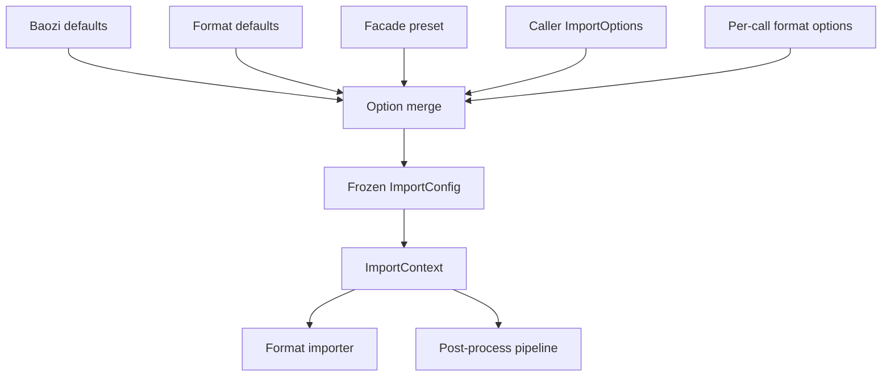
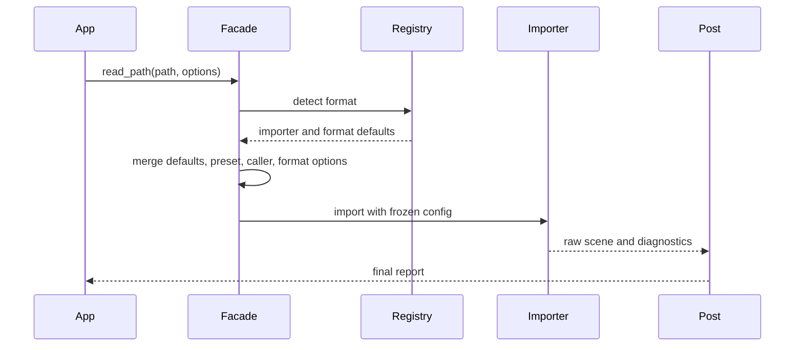

# ADR 0016: Import Options, Presets, and Configuration Precedence

## Context

Assimp exposes many importer and post-process options. Baozi needs comparable power without turning
the public API into stringly typed global state. Options affect security limits, IO behavior, format
detection, parser quirks, coordinate normalization, post-process steps, logging, and diagnostics.

Without an explicit precedence model, options will drift by crate. That creates hard-to-debug behavior
when a facade preset, caller override, environment default, and format-specific option disagree.

## Decision

Baozi will use immutable per-import option values with explicit precedence. There will be no mutable
process-global importer configuration.

Precedence from lowest to highest:

1. Baozi built-in defaults
2. format default profile
3. facade preset
4. caller import options
5. explicit per-call format options

Higher layers override lower layers only for fields they set. Unknown options are rejected in strict
mode and reported as diagnostics in permissive mode.

## Architecture





## Option Categories

Baozi options are grouped by ownership:

| Category | Owner | Examples |
| --- | --- | --- |
| Resource limits | `baozi-io` / `baozi-import` | max bytes, max vertices, max recursion depth |
| IO policy | `baozi-io` | sidecar access, archive access, allowed URI schemes |
| Detection | `baozi-import` | extension hints, magic confidence threshold |
| Parser behavior | format crates | OBJ smoothing groups, PLY property policy |
| Post-process | `baozi-postprocess` | triangulate, coordinate target, generate normals |
| Diagnostics | facade/import | strictness, warning level, source location retention |
| Observability | facade/import | tracing spans, profile counters |

Each option must have one owner crate. Cross-crate options are represented in the facade by composing
owned option structs, not by duplicating fields.

## Typed and Format-Specific Options

Common options are typed Rust fields:

```rust
pub struct ImportOptions {
    pub limits: ResourceLimits,
    pub io: IoOptions,
    pub detection: DetectionOptions,
    pub postprocess: PostProcessPipeline,
    pub diagnostics: DiagnosticOptions,
}
```

Format-specific options use typed structs when the format crate is linked:

```rust
pub struct ObjOptions {
    pub parse_mtl: bool,
    pub preserve_smoothing_groups: bool,
}
```

The facade may also support a namespaced dynamic option map for plugin or CLI use:

```text
obj:parse_mtl = true
gltf:load_buffers = external
```

Dynamic options must be parsed into typed format options before parser execution.

## Presets

Presets are named option overlays, not hidden code paths:

- `Raw`
- `ToolingPreserve`
- `RealtimeFast`
- `RealtimeQuality`
- `RealtimeMaxQuality`

Users must be able to inspect the expanded preset as an explicit `ImportOptions` value. Presets may
set post-process steps, coordinate targets, diagnostics, and default IO policy, but they must not
silently enable unsafe or FFI backends.

## Strict and Permissive Modes

Strict mode:

- unknown options are errors
- lossy parser behavior is an error unless explicitly allowed
- resource limit defaults are conservative
- validation failures stop import

Permissive mode:

- unknown dynamic options become diagnostics
- recoverable parser issues become warnings
- lossy behavior is allowed only with diagnostics
- structurally unsafe scenes still fail

Permissive mode is not a security bypass. Resource limits and path policy still apply.

## Serialization of Options

Options may support `serde` behind a feature flag, but the serialized representation is not stable
until Baozi declares a config schema version. CLI tools and test fixtures should include an explicit
schema version when serializing options.

## Alternatives Considered

### Option A: Global mutable importer configuration

Pros:

- Similar to many legacy C/C++ libraries.
- Easy for quick examples.
- Avoids passing options through every layer.

Cons:

- Bad for parallel imports.
- Hard to test.
- Surprising behavior in libraries and services.

Decision: rejected.

### Option B: Single string-key option map

Pros:

- Flexible and easy to expose in a CLI.
- Format crates can add options without facade changes.
- Similar to some Assimp property patterns.

Cons:

- Weak type safety.
- Runtime errors for typos.
- Difficult documentation and completion.

Decision: rejected as the primary API.

### Option C: Typed common options with typed format extensions and optional dynamic bridge

Pros:

- Strong Rust API for library users.
- Still supports CLI/plugin use cases.
- Clear owner and precedence rules.

Cons:

- More boilerplate.
- Dynamic options need parsing and diagnostics.
- Facade must coordinate feature-gated option types.

Decision: chosen.

## Success Metrics

| Metric | Target | Measurement |
| --- | --- | --- |
| Deterministic merge | same inputs always produce same frozen config | unit tests |
| No global state | concurrent imports cannot mutate shared options | API review and tests |
| Unknown option policy | strict and permissive modes behave differently and predictably | option tests |
| Preset transparency | presets can be expanded and inspected | facade tests |
| Format option isolation | disabling a format removes its typed options from default API surface where practical | feature checks |
| Resource limit consistency | all parsers receive the same frozen limits | importer contract tests |

## Risks and Mitigations

| Risk | Severity | Likelihood | Mitigation |
| --- | --- | --- | --- |
| Option structs grow too large | Medium | High | Group by ownership and use builders |
| Feature-gated format options complicate facade docs | Medium | Medium | Generate option docs from crate metadata later |
| Dynamic option bridge becomes a second API | Medium | Medium | Parse dynamic keys into typed structs before execution |
| Presets hide destructive behavior | High | Medium | Require preset expansion and post-process diagnostics |
| Strict mode rejects useful real-world files | Medium | High | Keep permissive mode documented but limit-aware |

## Implementation Plan

### Phase 0: Common Option Types

- Add `ImportOptions`, `DiagnosticOptions`, `DetectionOptions`, and `IoOptions`.
- Make `ResourceLimits` part of the per-import configuration.
- Add immutable `ImportConfig` produced by merging options.

### Phase 1: Presets

- Implement preset expansion to explicit options.
- Add tests for precedence and canonical post-process order.

### Phase 2: Format Options

- Add typed options to first parser crates as needed.
- Add dynamic namespaced option parsing for CLI and plugin use.

### Phase 3: Documentation and Tooling

- Document all common options.
- Add snapshot tests for preset expansion.
- Consider schema-versioned config serialization.

## Consequences

Positive:

- Parallel imports remain deterministic.
- Library users get type-safe configuration.
- Format-specific behavior can evolve without global state.

Negative:

- Initial option plumbing is more work.
- Facade API needs careful feature-gated documentation.
- Some users may still want a simple property map.

## Open Questions

1. Should `ImportOptions::default()` be strict or permissive?
   Recommendation: use safe permissive parsing with conservative limits, plus `Strict` preset.
2. Should environment variables affect library imports?
   Recommendation: no for library APIs; only CLI tools may read environment variables.
3. Should format detection options be per-import or registry-wide?
   Recommendation: per-import, with registry only storing capabilities.
