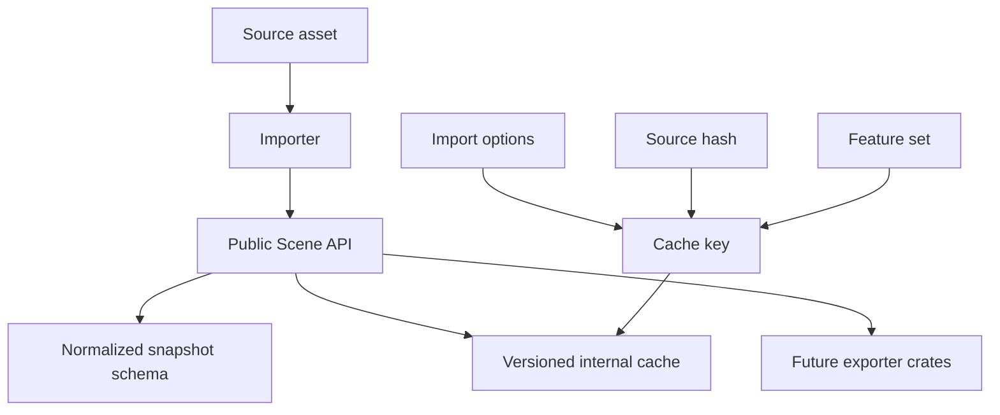
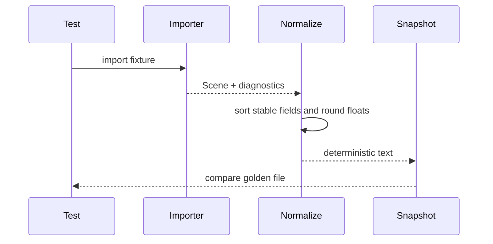

# ADR 0017: Serialization, Snapshot, and Cache Boundary

## Context

Baozi needs several representations of imported scenes:

- public Rust structs used by applications
- normalized test snapshots used for golden fixtures and differential testing
- possible serialized configs for CLI and tooling
- possible binary caches for faster repeated imports
- possible interchange exports in future crates

These are different contracts. If Baozi treats `serde` output of public structs as a stable file
format, early internal changes will become breaking changes. If snapshots are too close to debug
output, tests will become noisy and hard to review.

## Decision

Baozi will separate public API, test snapshot format, and cache format.

Policy:

- public `Scene` structs are the Rust API, not a stable serialized schema
- `serde` support is optional and feature-gated
- golden snapshots use a dedicated normalized text schema
- binary cache is an internal versioned artifact, not an interchange format
- cache compatibility is scoped to Baozi version, feature set, options, and source content hash
- exporters are separate future crates and must not rely on debug or snapshot output

## Architecture

## Public Rust API Boundary

The Rust API is source-compatible according to ADR 0006, but its derived serialization is not stable
unless a schema version says so.

Rules:

- do not promise stable `serde_json` for `Scene`
- do not use `Debug` output for tests
- avoid deriving `Serialize` and `Deserialize` by default on all core types
- add `serde` only behind a feature flag when a crate has a clear use case
- document every stable serialized schema separately

## Snapshot Schema

Golden snapshots are designed for tests and review. They should be:

- deterministic
- compact enough to review
- stable across irrelevant allocation/order changes
- explicit about lossy normalization
- independent from `Debug`

Snapshot normalization should include:

- stable object ordering by IDs
- stable metadata key ordering
- rounded float formatting with documented epsilon
- explicit omitted fields for empty/default values
- deterministic diagnostics ordering
- source path redaction where required

Snapshot files are test artifacts, not a user interchange format.

## Cache Format

Binary cache may be introduced later to skip repeated parsing. The cache must include:

- Baozi crate version
- cache schema version
- source content hash and sidecar hashes
- import options hash
- post-process pipeline hash
- feature set or backend identity
- target architecture only if representation is architecture-dependent

Cache read failures must fall back to import unless the caller explicitly asks for cache-only mode.

Cache files must not execute code, load arbitrary plugins, or bypass `AssetIo` path policy.

## Export Boundary

Exporters are future work and should live in explicit crates, for example:

- `baozi-export-gltf`
- `baozi-export-obj`
- `baozi-cache`

Exporter output is a format contract. Snapshot and cache output are not exporter output.

## Alternatives Considered

### Option A: Derive `serde` on every public type and call it stable

Pros:

- Fast to implement.
- Useful for tools and debugging.
- Familiar to Rust users.

Cons:

- Freezes internal structure too early.
- Makes harmless refactors breaking.
- Produces poor golden tests without normalization.

Decision: rejected.

### Option B: Use one binary representation for snapshots, cache, and interchange

Pros:

- One implementation.
- Potentially fast.
- Avoids writing multiple schemas.

Cons:

- Hard to review in tests.
- Confuses internal cache with external compatibility.
- Makes security and compatibility policy harder.

Decision: rejected.

### Option C: Separate Rust API, normalized snapshots, internal cache, and exporter contracts

Pros:

- Keeps each representation honest.
- Allows internal API evolution.
- Produces reviewable tests.
- Leaves room for fast caches later.

Cons:

- More documentation and tooling.
- Snapshot schema needs maintenance.
- Cache and exporter crates require separate versioning.

Decision: chosen.

## Success Metrics

| Metric | Target | Measurement |
| --- | --- | --- |
| Snapshot determinism | same fixture and options produce identical snapshot text | golden tests |
| Public API freedom | internal field reordering does not break snapshot tests | refactor tests |
| Cache safety | stale or mismatched cache never silently returns wrong scene | cache key tests |
| Serde clarity | crates without `serde` feature do not expose serialization deps | feature checks |
| Review quality | snapshot diffs are readable in code review | fixture review |
| Export separation | no exporter uses `Debug` or snapshot schema as format output | API review |

## Risks and Mitigations

| Risk | Severity | Likelihood | Mitigation |
| --- | --- | --- | --- |
| Snapshot schema becomes another public API by accident | Medium | Medium | Document it as test-only and keep path under test-support docs |
| Too much normalization hides real bugs | High | Medium | Keep raw values available and document epsilon rules |
| Cache invalidation misses sidecars | High | Medium | Include resolved dependency hashes from `AssetIo` |
| Optional `serde` feature causes version churn | Medium | Medium | Keep it additive and avoid promising stable schema |
| Binary cache has security issues | High | Low | Treat cache as untrusted input and validate after decode |

## Implementation Plan

### Phase 0: Snapshot Policy

- Add `baozi-test-support` snapshot data model.
- Document float rounding and deterministic ordering.
- Add first snapshots for empty scene and simple mesh fixtures.

### Phase 1: Optional Serde

- Add feature-gated `serde` only where needed.
- Document that derived representation is unstable unless schema-versioned.

### Phase 2: Cache Design

- Create a separate cache ADR before implementing persistent binary cache.
- Include source dependency hashing and option hashing in the design.

### Phase 3: Exporter Boundary

- Add exporter crate policy before first exporter implementation.
- Keep exporter tests independent from snapshot internals.

## Consequences

Positive:

- Tests can be stable without freezing internals.
- Future cache work has a clear safety boundary.
- Users are not misled into treating debug output as an interchange format.

Negative:

- More than one representation must be maintained.
- Snapshot tooling must be designed before many fixtures are added.
- `serde` users need clear caveats.

## Open Questions

1. Should normalized snapshots be TOML, JSON, RON, or a custom text format?
   Recommendation: start with deterministic JSON or RON in `baozi-test-support`, then revisit after
   real fixture diffs.
2. Should cache be a workspace crate or facade feature?
   Recommendation: separate crate, because cache policy and dependencies will grow.
3. Should public `Scene` support stable schema export in 1.0?
   Recommendation: only if there is a concrete user story beyond testing.
