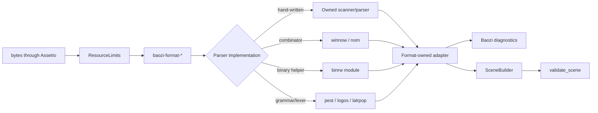
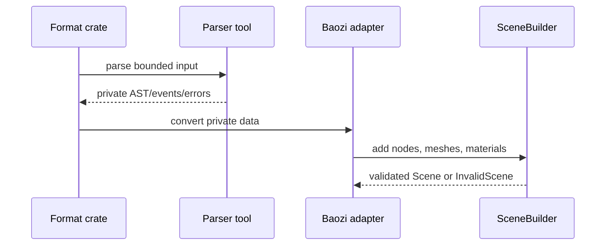

# ADR 0018: Parser Tooling and Format-Owned Parser Policy

## Context

Baozi will eventually need parsers for formats where the Rust ecosystem does not provide a mature,
well-licensed, WASM-compatible, replaceable loader. ADR 0004 already allows Baozi-owned parsers.
This ADR defines when those owned parsers should be hand-written and when they should use mature
parser tooling such as `binrw`, `winnow`, `nom`, `pest`, `logos`, or `lalrpop`.

The important boundary is ownership: a parser generator or parser-combinator crate may help a
format crate parse bytes, but it must not define Baozi's public importer traits, diagnostics,
scene IR, feature flags, or support promises.

Current metadata observed from crates.io API on 2026-07-09:

| Crate | Version | License | Rust version | Initial recommendation |
| --- | --- | --- | --- | --- |
| `binrw` | 0.15.1 | MIT | 1.70 | Candidate for record-oriented binary subparsers |
| `winnow` | 1.0.3 | MIT | 1.65.0 | Candidate for text parsers where combinators improve clarity |
| `nom` | 8.0.0 | MIT | 1.65.0 | Mature alternative to `winnow`; use when it fits local style better |
| `pest` | 2.8.7 | MIT OR Apache-2.0 | 1.83 | Candidate for grammar-shaped text formats after audit |
| `logos` | 0.16.1 | MIT OR Apache-2.0 | 1.80.0 | Candidate lexer for token-heavy text formats |
| `lalrpop` | 0.23.1 | Apache-2.0 OR MIT | 1.86 | Defer as a default dependency while Baozi MSRV is 1.85 |

## Decision

Baozi will use parser tooling selectively behind format crate boundaries.

Core rules:

- every parser remains format-owned and converts into Baozi-owned diagnostics, options, and `Scene`
- parser tooling is private implementation detail unless a format-specific feature explicitly exposes
  an optional backend
- simple formats should start with small hand-written parsers when that yields clearer limits and
  diagnostics
- mature parsing crates may be used when they reduce real complexity without weakening resource
  limits, WASM compileability, MSRV, or panic safety
- `lalrpop` is not eligible as a default dependency while its latest metadata requires a higher Rust
  version than Baozi's documented MSRV
- generated parsers must be checked in only when generation is deterministic and the generator is
  also available through a documented development workflow
- parser tools must not bypass `ImportContext`, `AssetIo`, `ResourceLimits`, or `SceneBuilder`
  validation

Recommended first choices by format shape:

| Format shape | Preferred approach |
| --- | --- |
| Small fixed binary, such as STL | Hand-written byte parser first |
| Record-structured binary with many typed fields | Hand-written core plus optional `binrw` submodules after audit |
| Simple line/token text, such as early OBJ/MTL slices | Hand-written scanner or `winnow`/`nom` if it improves error handling |
| Grammar-heavy text with nested constructs | `pest` or `lalrpop` only after MSRV/license/WASM review |
| Token-heavy text where lexer clarity matters | `logos` plus Baozi-owned parser state machine |
| XML/JSON/container formats | Use domain libraries for XML/JSON/container decoding, then Baozi-owned normalization |

## Architecture

## Adoption Checklist

A parser tool may be added to a production crate only when all checks pass:

- license fits Baozi's downstream `MIT OR Apache-2.0` intent or is explicitly documented as compatible
- MSRV does not exceed Baozi's documented MSRV unless a separate MSRV decision accepts the raise
- `wasm32-unknown-unknown` bytes-path build passes for the relevant format feature
- dependency does not add native FFI, process-global runtime, threads, or filesystem assumptions to
  the default parser path
- malformed input returns `BaoziError` or diagnostics rather than panicking
- parser resource usage is bounded by `ResourceLimits`
- parser output is private and converted into Baozi IR immediately
- tests cover happy path, malformed input, resource limits, and at least one snapshot

## Alternatives Considered

### Option A: Hand-write every parser

Pros:

- maximum control over diagnostics, limits, and WASM behavior
- smallest dependency tree
- easiest clean-room reasoning

Cons:

- slow for grammar-heavy formats
- increases maintenance burden for complex grammars
- risks ad hoc parser bugs where mature tooling would help

Decision: rejected as an absolute rule, but preferred for small first slices such as STL.

### Option B: Adopt parser tooling as the default parser strategy

Pros:

- faster to build complex parsers
- mature crates can reduce grammar and binary-layout boilerplate
- grammar files can document format structure

Cons:

- dependencies can raise MSRV or affect WASM compatibility
- generated parsers may obscure resource-limit enforcement
- crate-specific errors and ASTs can leak into architecture if not contained

Decision: rejected as the default policy. Tooling must be selected per format and stay private.

### Option C: Format-owned parser boundary with selective tooling

Pros:

- keeps Baozi API stable and tool-agnostic
- allows mature parser tools where they materially reduce complexity
- preserves diagnostics, limits, validation, and clean-room ownership
- lets each format choose the right parsing style

Cons:

- requires per-format audits
- different format crates may use different parser styles
- test and fuzz discipline must stay consistent across tools

Decision: chosen.

## Success Metrics

| Metric | Target | Measurement |
| --- | --- | --- |
| API isolation | No public Baozi type exposes parser-tool ASTs or errors | rustdoc/API review |
| Feature hygiene | Disabling a format removes its parser-tool dependencies | `cargo tree -e features` |
| MSRV hygiene | Parser tools do not accidentally raise documented MSRV | dependency metadata review and MSRV check |
| WASM hygiene | Format bytes path compiles for `wasm32-unknown-unknown` | target-specific `cargo check` |
| Error quality | Malformed inputs return Baozi errors/diagnostics | malformed fixture tests |
| Resource control | Oversized inputs hit `ResourceLimits` before unbounded allocation | limit tests/fuzz seeds |

## Risks and Mitigations

| Risk | Severity | Likelihood | Mitigation |
| --- | --- | --- | --- |
| Parser tool raises MSRV | High | Medium | Gate additions through ADR 0007 and dependency metadata review |
| Tool AST leaks into public API | High | Low | Keep tools private to format crates and convert immediately |
| Generated parser hides allocation behavior | Medium | Medium | Require resource-limit tests and fuzz seeds before maturity promotion |
| Different parser styles fragment maintenance | Medium | Medium | Keep common diagnostics, `ImportContext`, snapshots, and validation shared |
| Tool is not WASM-friendly | High | Medium | Require bytes-path target check before enabling the format feature |

## Consequences

Positive:

- Baozi can self-write parsers without reinventing every parsing technique.
- Mature crates are allowed when they earn their place through measurable constraints.
- Public API remains stable even if a format crate swaps parsing implementation later.

Negative:

- Each parser-tool adoption requires an audit instead of a blanket approval.
- Contributors need to understand the format-owned adapter boundary before adding dependencies.

## Sources

- crates.io API: [`binrw`](https://crates.io/api/v1/crates/binrw)
- crates.io API: [`winnow`](https://crates.io/api/v1/crates/winnow)
- crates.io API: [`nom`](https://crates.io/api/v1/crates/nom)
- crates.io API: [`pest`](https://crates.io/api/v1/crates/pest)
- crates.io API: [`logos`](https://crates.io/api/v1/crates/logos)
- crates.io API: [`lalrpop`](https://crates.io/api/v1/crates/lalrpop)
