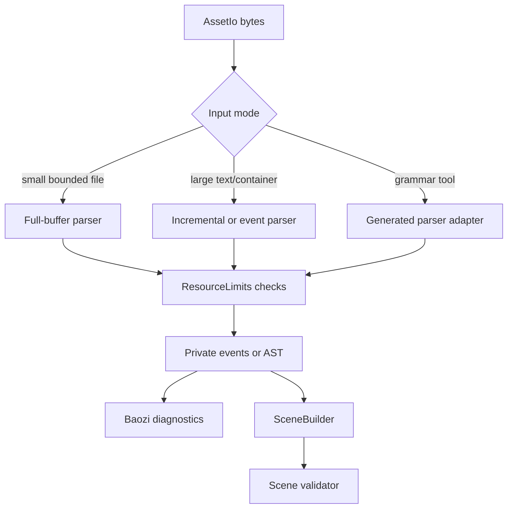
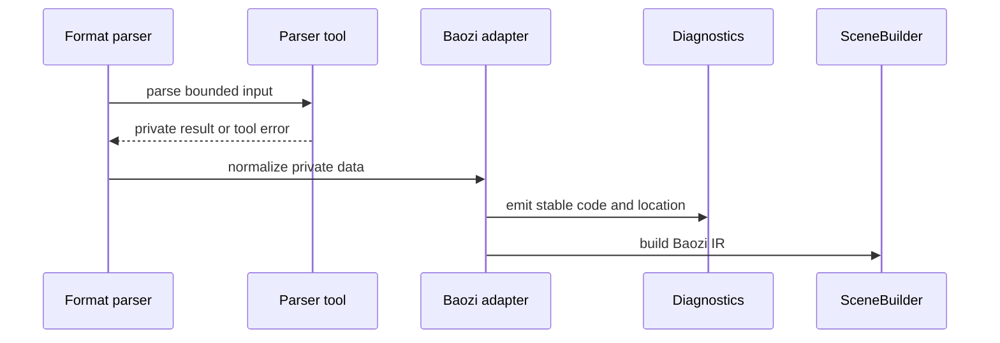

# ADR 0019: Parser Diagnostic, Streaming, and Generated-Code Contract

## Context

ADR 0018 allows Baozi format crates to use parser tools selectively. That decision is necessary but
not sufficient. Parser tools usually spend engineering time in places that are easy to underestimate:

- mapping tool-specific errors into stable Baozi diagnostics
- preserving useful byte, line, and column locations
- keeping resource limits visible when macros or generated parsers hide allocation paths
- deciding whether a format may be parsed from a full byte buffer or needs incremental parsing
- keeping generated grammar output deterministic and reviewable
- avoiding tool-specific ASTs becoming the real internal architecture
- defining what fuzz sanitizer evidence means across nightly, Windows, Linux, and CI environments

Baozi needs a shared contract before OBJ, PLY, glTF, archive containers, and future grammar-heavy
formats add their own parser styles.

## Decision

Baozi will require every production parser implementation, hand-written or tool-assisted, to satisfy
the same diagnostic, resource, streaming, generated-code, and verification contract.

Format crates must document these choices before promotion beyond experimental:

- input mode: full-buffer, bounded chunk, event stream, or hybrid
- diagnostic model: fail-fast, recoverable warnings, or strict/permissive split
- location model: byte offset, line/column, both, or explicitly unavailable
- allocation model: where counts, offsets, strings, and AST containers are bounded
- generated-code workflow, when a grammar or code generator is used
- fuzz and sanitizer evidence required for the format tier
- fallback/replacement plan if the parser tool becomes unsuitable

Simple bounded formats may use full-buffer parsing. Large text, archive, container, or sidecar-heavy
formats should prefer incremental or event-oriented parsing unless a format-specific review justifies
bounded full-buffer parsing.

## Architecture

## Contract

### Diagnostics

- Tool-specific errors must be converted to Baozi-owned diagnostic codes and `BaoziError`.
- Malformed input should include byte offset or line/column location when the parser representation
  makes it possible.
- Strict mode may fail fast; permissive mode may recover only when the resulting `Scene` still passes
  validation.
- Diagnostic flooding must be capped by `ResourceLimits::max_diagnostics`.
- Public documentation must describe which malformed cases are hard errors and which are warnings.

### Streaming and Memory

- Full-buffer parsing is acceptable for small formats such as STL when `max_primary_asset_bytes`
  bounds the input and parser allocation is checked before growth.
- Text formats with unbounded lines, repeated records, or sidecars must enforce line, token, name,
  vertex, face, mesh, and diagnostic limits during parsing.
- Container and archive formats must enforce entry count, decompressed byte, path, nesting, and
  recursion limits before extracting data into memory.
- Parser tools that allocate ASTs or pair trees must be justified against the expected asset size and
  WASM memory budget.

### Generated Code

- Grammar files must be committed and reviewed.
- Generated parser files may be committed only when regeneration is deterministic and documented.
- CI must either regenerate and diff committed generated files or build from grammar sources.
- Generator dependencies must remain build-time or feature-local and must not leak into unrelated
  format features.
- Generated parsers are subject to the same malformed-input and fuzz gates as hand-written parsers.

### Fuzz and Sanitizer Evidence

- Parser fuzz targets must compile before a parser can be promoted beyond experimental.
- Stable-promotion fuzz smoke runs should use nightly Rust with sanitizer support, preferably on a
  Linux CI runner where libFuzzer and sanitizer runtime availability are predictable.
- Windows sanitizer runs are useful but not required as the canonical gate because AddressSanitizer
  runtime DLL availability can depend on local Visual Studio or LLVM installation details.
- If a local fuzz smoke run cannot start because of a missing sanitizer runtime, record it as an
  environment failure, not parser evidence.
- `cargo check --manifest-path fuzz/Cargo.toml`, `cargo +nightly fuzz check <target>`, and malformed
  regression tests are acceptable experimental-slice evidence, but they do not replace sanitizer
  fuzz smoke evidence for stable promotion.
- Useful seed corpora may be committed; generated artifacts and target directories must stay ignored.

### Tool-Specific Reviews

- `binrw` review focuses on hidden allocations from count fields, seek behavior, endian declarations,
  and offset validation.
- `winnow` and `nom` review focuses on span choice, backtracking cost, lifetime complexity, and error
  quality.
- `pest` and `lalrpop` review focuses on grammar ambiguity, generated-code workflow, error recovery,
  and line/column mapping.
- `logos` review focuses on invalid-token policy, source spans, and the ownership of the parser state
  machine after lexing.
- XML, JSON, and archive libraries review focuses on entity expansion, recursion, path normalization,
  external references, and decompression bombs.

## Alternatives Considered

### Option A: Let ADR 0018 cover this implicitly

Pros:

- fewer architecture documents
- parser implementation remains flexible

Cons:

- future format crates may choose incompatible diagnostic and memory models
- generated parser workflow remains ambiguous
- full-buffer parsing can spread to formats where it is not acceptable

Decision: rejected. ADR 0018 answers tool ownership; this ADR answers parser delivery contracts.

### Option B: Ban parser tools and require all parsers to be hand-written

Pros:

- maximum control over memory and diagnostics
- no generated-code lifecycle
- smallest parser dependency graph

Cons:

- poor fit for grammar-heavy formats
- slower implementation of complex text/container formats
- still does not automatically solve streaming, diagnostics, or recovery policy

Decision: rejected. Hand-written parsing remains preferred for small formats, not a universal rule.

### Option C: Require a separate ADR for every parser tool adoption

Pros:

- strong traceability
- forces explicit per-format decisions

Cons:

- too heavy for small optional subparsers
- duplicates common audit questions
- discourages low-risk improvements

Decision: rejected as the default. A separate ADR is required only when a parser tool changes public
support promises, default dependency policy, MSRV, FFI posture, or streaming architecture.

### Option D: Shared contract plus per-format checklist

Pros:

- keeps the architecture rule stable
- gives implementers a mechanical review path
- scales from hand-written STL to grammar-heavy future formats
- leaves room for separate ADRs when a parser choice is genuinely architectural

Cons:

- requires checklist discipline
- does not remove the need for format-specific judgement

Decision: chosen.

## Success Metrics

| Metric | Target | Measurement |
| --- | --- | --- |
| Diagnostic stability | Public errors use Baozi codes/messages, not tool-specific types | API and docs review |
| Location quality | Malformed fixtures assert byte or line/column locations where possible | parser tests |
| Memory control | Oversized input hits `ResourceLimits` before unbounded allocation | limit tests and fuzz seeds |
| Streaming fit | Large formats document why they are incremental or bounded full-buffer | format docs |
| Generated-code reproducibility | Grammar/generated output workflow is deterministic | CI or documented regen check |
| Tool isolation | Parser dependency is feature-local and private | `cargo tree -e features` |

## Risks and Mitigations

| Risk | Severity | Likelihood | Mitigation |
| --- | --- | --- | --- |
| Checklist becomes paperwork | Medium | Medium | Require tests and feature-tree evidence, not prose-only approval |
| Full-buffer parsing spreads too far | High | Medium | Require input-mode documentation and bounded-memory justification |
| Generated parser drift | Medium | Medium | CI regeneration/diff or build-from-grammar workflow |
| Tool error model leaks into Baozi docs/API | High | Low | Keep adapters private and review public exports |
| Recovery mode returns invalid scenes | High | Medium | `SceneBuilder::finish` and `ValidateScene` remain mandatory safety gates |
| Sanitizer availability differs by host OS | Medium | High | Make Linux nightly sanitizer CI canonical and record local Windows runtime failures explicitly |

## Consequences

Positive:

- Parser choices remain replaceable even when tools differ by format.
- Diagnostics and resource limits stay consistent across hand-written and generated parsers.
- Future tool adoption has a clear review path.

Negative:

- Parser changes require more up-front documentation.
- Some convenient parser crates may be rejected if they cannot expose useful spans or bounded memory
  behavior.

## Operational Checklist

Use [`docs/architecture/parser-tool-audit-checklist.md`](../architecture/parser-tool-audit-checklist.md)
for the per-format audit record.
