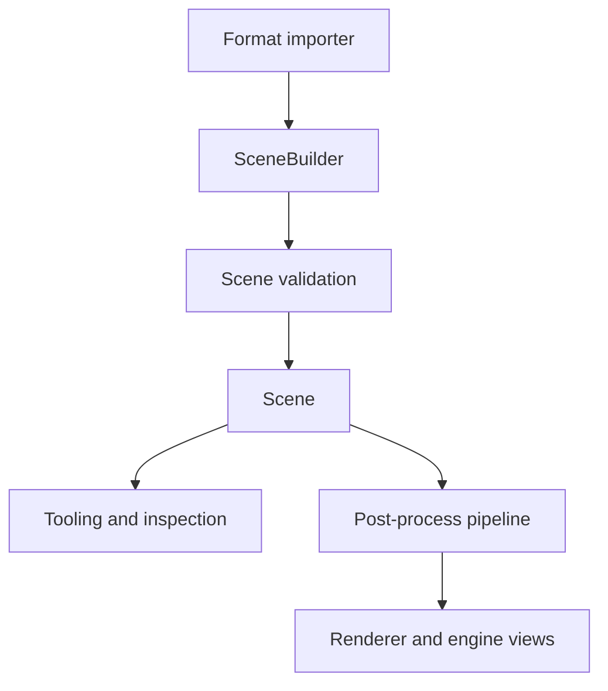

# Baozi Scene IR

Baozi's scene intermediate representation is the shared target for all importers and the input to
the post-process pipeline. It is intentionally Rust-native and source-preserving. It is not a mirror
of another library's C ABI, and it is not a glTF-only data model.

Related decisions:

- [ADR 0003: Core Scene IR and Material Model](../adr/0003-core-scene-ir-and-material-model.md)
- [ADR 0008: Math, Coordinate, Units, and Numeric Policy](../adr/0008-math-coordinate-units-and-numeric-policy.md)
- [ADR 0009: Data Ownership, Zero-Copy Lifetimes, and Memory Layout](../adr/0009-data-ownership-zero-copy-lifetimes-and-memory-layout.md)
- [ADR 0012: Material, Texture, Image, and Color Space Policy](../adr/0012-material-texture-image-and-color-space-policy.md)
- [ADR 0015: Mesh Topology, Vertex Attributes, Skinning, and Animation Semantics](../adr/0015-mesh-topology-vertex-attributes-skinning-and-animation-semantics.md)

## Mental Model



Importers build a `SceneBuilder`. A finished scene should be validated before it is exposed as a
successful import. Post-process steps consume an owned scene and produce another validated scene or
an error report.

## Core Containers

The scene is an owned graph of typed collections:

```text
Scene
├── root: NodeId
├── nodes: Vec<Node>
├── meshes: Vec<Mesh>
├── materials: Vec<Material>
├── textures: Vec<Texture>
├── animations: Vec<Animation>
├── cameras: Vec<Camera>
├── lights: Vec<Light>
├── metadata: MetadataMap
└── space: SceneSpace
```

IDs are stable handles into these collections. They are not raw references. This keeps importers and
post-process steps free to build owned data without self-referential structures.

## Nodes

Nodes represent the scene hierarchy.

Node responsibilities:

- local transform
- parent and child relationships
- mesh attachments
- names and metadata

Validator responsibilities:

- root node exists
- every child reference is valid
- no hierarchy cycles
- parent and child links agree
- mesh references are valid

The default public model should treat the hierarchy as a tree unless a future ADR introduces shared
node graphs.

## Meshes

Meshes represent source geometry. They should not be forced into renderer-ready triangles during
import.

Mesh responsibilities:

- primitive topology
- positions
- normals
- tangents
- texture coordinate channels
- color channels
- indices and polygon face descriptors
- material binding
- bounds when known or generated
- metadata

Source-preserving behavior:

- OBJ polygons should remain polygons until triangulation is requested.
- PLY point clouds should not pretend to be triangle meshes.
- Separate source attribute indices may be remapped into Baozi's vertex-indexed model.
- Remapping that expands data significantly should emit diagnostics.

Implemented topology fields:

```text
Mesh
├── topology: PrimitiveTopology
├── indices: Vec<u32>
└── face_vertex_counts: Vec<u32>
```

For `Points`, `Lines`, and `Triangles`, `face_vertex_counts` is empty and topology width is fixed.
For `Polygons`, each `face_vertex_counts` entry records one face's vertex count. The sum must match
the flat element stream: `indices.len()` for indexed meshes, or `positions.len()` for non-indexed
meshes. The triangulation post-process pass consumes polygon face counts and emits triangle-list
indices.

Renderer-facing helpers can expose triangle views later, but those helpers are not the raw import
contract.

## Materials and Textures

Materials combine typed common fields with namespaced extension metadata.

Typed fields are for common behavior:

- PBR metallic-roughness values
- legacy diffuse/specular/emissive fields
- alpha policy
- two-sided policy
- texture slots

Extension metadata is for source-specific details:

```text
obj:illum
gltf:alpha_cutoff
fbx:layered_texture_blend_mode
```

Textures may refer to external assets or embedded bytes. Importing a model should not require image
decoding unless a caller explicitly enables a helper or post-import step.

## Scene Space

`SceneSpace` records source coordinate and unit information:

- handedness
- up axis
- front axis
- unit scale to meters

Raw import preserves the source coordinate system when practical. Coordinate conversion is a
post-process step.

Default normalized target from the architecture docs:

- right-handed
- Y-up
- meters
- counter-clockwise front faces

## Animation, Skinning, and Morph Targets

Baozi reserves first-class IR space for complex scene data even if early parsers focus on static
meshes.

Skinning concepts:

- skins reference joint nodes
- inverse bind matrices match joint count when present
- vertex influences reference joints by index
- influence compaction is post-process behavior

Animation concepts:

- public time is normalized to seconds
- source ticks or frames are preserved in metadata
- channels target nodes, morph weights, or future supported properties
- import does not silently resample animation

Morph target concepts:

- targets attach to meshes
- deltas can include positions, normals, and tangents
- target names and default weights are preserved when available

## Metadata

Metadata is a loss-awareness mechanism, not a replacement for typed fields.

Rules:

- use namespaced keys
- promote repeated common metadata into typed fields
- keep values bounded by resource limits
- avoid storing unsafe paths or unbounded blobs
- preserve source details only when they help diagnostics, tooling, or future export

## Validation

Validation is part of the IR contract. A scene that cannot be safely traversed should not be returned
as a successful import.

Minimum checks:

- ID references are in range
- hierarchy is acyclic
- mesh indices are in range
- attribute channel lengths are compatible
- materials and textures references are valid
- numeric values are finite unless explicitly documented
- animation targets exist
- resource limits remain respected

Repairable problems should produce diagnostics. Structurally unsafe scenes should fail with
`BaoziError::InvalidScene`.

## Source-Preserving Versus Runtime-Ready

Baozi separates raw import from normalization:

| Need | Use |
| --- | --- |
| Inspect source data | raw scene |
| Compare importer output | normalized test snapshot |
| Render quickly | post-process preset |
| Convert coordinates | coordinate normalization step |
| Generate missing data | normals/tangents/bounds steps |
| Optimize for engine use | mesh and graph optimization steps |

This separation prevents importers from hiding destructive behavior.

## Design Alternatives Reference

The main alternatives are recorded in ADR 0003 and ADR 0015:

- mirroring a C-style Assimp scene layout
- making glTF the canonical scene model
- storing only triangulated meshes
- exposing every source format's native object model

Baozi chooses a Rust-native broad IR with typed common fields, source-preserving topology, and
extension metadata.

## Success Criteria

| Criterion | Target |
| --- | --- |
| Simple static meshes | STL, OBJ, and PLY map without format-specific public scene types |
| Modern scenes | glTF materials, textures, skins, morphs, and animations map without replacing the IR |
| Validation | invalid references and malformed topology are rejected or diagnosed |
| Determinism | snapshots of equivalent scenes are stable |
| Ergonomics | facade helpers can expose common renderer views without weakening raw import |

## Implementation Notes

Near-term code should evolve toward:

- `SceneBuilder::finish()` returning `Result<Scene, BaoziError>` after validation
- richer `PrimitiveTopology`, polygon face counts, and eventually primitive descriptors
- typed attribute channel metadata
- first-class skin and animation channel structs
- snapshot support in `baozi-test-support`

Do not stabilize public animation and skinning names before glTF fixture coverage proves the model.
