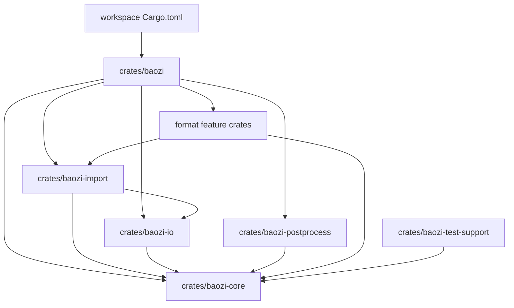

# Baozi Workspace Scaffold - Plan

## Goal Capsule

| Field | Value |
| --- | --- |
| Objective | Convert Baozi from an empty single package into the first Rust workspace scaffold for an Assimp-class importer library. |
| Authority | ADR 0001-0014 are the architecture source of truth; current user instruction permits breaking scaffold changes. |
| Execution profile | Start with compileable crate boundaries, core domain types, IO/import/postprocess contracts, format crate shells, and verification gates. |
| Stop condition | Stop if implementation would contradict an ADR, require a product-scope decision, or need adopting an external parser backend not covered by docs. |

---

## Product Contract

### Summary

Baozi should become a Rust-native, Assimp-inspired model import workspace with owned scene data, secure asset IO, typed diagnostics, explicit post-processing, and replaceable format parser backends.

### Problem Frame

The repository currently has a root `Cargo.toml` package and `src/main.rs` hello-world binary. That shape conflicts with ADR 0001 and ADR 0007 because parser breadth, feature isolation, and public API stability require a workspace with clear crate boundaries.

### Requirements

- R1. The repository is converted into a Cargo workspace with resolver 3, edition 2024, MSRV metadata, and clean-room `MIT OR Apache-2.0` package metadata.
- R2. The root hello-world binary is removed because the facade belongs in `crates/baozi`.
- R3. Initial crates exist for facade, core IR, IO, import registry, postprocess pipeline, test support, and first planned format shells.
- R4. Core crate exposes initial owned scene, math, material, texture, diagnostic, and error types consistent with ADR 0003, ADR 0008, ADR 0009, ADR 0012, and ADR 0014.
- R5. IO crate exposes root-scoped asset path/scope/resource-limit contracts consistent with ADR 0010.
- R6. Import crate exposes format info, maturity, capability statuses, import context, and registry contracts consistent with ADR 0004 and ADR 0011.
- R7. Postprocess crate exposes stage, step, preset, and pipeline contracts consistent with ADR 0013.
- R8. Format crates are compileable shells only; they must not claim stable support or pull third-party parser backends yet.
- R9. Documentation scaffolding for format onboarding, support matrix, coordinate conventions, and parser threat model remains aligned with code constants.
- R10. Workspace checks, formatting, and tests pass with nextest when available, falling back to cargo test if nextest is unavailable.

### Scope Boundaries

Deferred to follow-up work:

- Implementing real STL, OBJ, PLY, or glTF parsing.
- Adding async IO, parallel postprocess, SIMD backends, or image decoding.
- Adding exporter crates, dynamic plugins, C ABI, or binary cache formats.
- Publishing crates or creating a public release.

Outside this scaffold:

- Copying Assimp source or test assets into Baozi.
- Using `asset-importer` as an architecture source.
- Adding remote HTTP(S) asset fetching to core IO.

---

## Planning Contract

### Key Technical Decisions

- KTD1. Root becomes a virtual workspace. This removes the hello-world binary and makes `crates/baozi` the public facade, matching ADR 0007.
- KTD2. Crates are created only where the first import pipeline needs a boundary. Future exporter, plugin, and FFI crates stay documented but absent.
- KTD3. Public `Scene` data is owned and lifetime-free. Parser zero-copy remains internal to future parser crates.
- KTD4. Baozi-owned math types are used in `baozi-core`; `mint` interop is feature-gated and no heavyweight math crate appears in core public API.
- KTD5. Format crates expose metadata and unsupported stubs first. A crate existing does not mean the format is supported.
- KTD6. Security and limit types exist before parsers. Future parsers cannot bypass resource accounting without contradicting ADR 0010 and ADR 0014.

### High-Level Technical Design

### Assumptions

- The project can break the existing root package shape because it only contains hello-world code.
- No existing tracked code needs preservation because the repository is still scaffold-stage.
- `cargo nextest` may not be installed on every machine; `cargo test --workspace` is the fallback.

---

## Implementation Units

### U1. Convert root manifest into a workspace

- **Goal:** Replace the single-package root with a virtual workspace and shared package/dependency metadata.
- **Requirements:** R1, R2
- **Dependencies:** none
- **Files:** `Cargo.toml`, `src/main.rs`, `.gitignore`
- **Approach:** Use `resolver = "3"`, workspace members under `crates/*`, workspace package metadata, and shared dependencies. Remove the root hello-world source because it is no longer a package target. Add `repo-ref/` to `.gitignore` unless already intentionally tracked.
- **Test scenarios:** Run cargo metadata/check after crates exist; verify root no longer builds a binary target.
- **Verification:** Workspace manifest loads and `cargo metadata` sees only crate members.

### U2. Add core scene, math, material, error, and diagnostics crate

- **Goal:** Create `baozi-core` with the first compileable domain model aligned to ADR 0003, ADR 0008, ADR 0009, ADR 0012, and ADR 0014.
- **Requirements:** R4
- **Dependencies:** U1
- **Files:** `crates/baozi-core/Cargo.toml`, `crates/baozi-core/src/lib.rs`, `crates/baozi-core/src/error.rs`, `crates/baozi-core/src/math.rs`, `crates/baozi-core/src/scene.rs`, `crates/baozi-core/src/material.rs`, `crates/baozi-core/src/diagnostic.rs`
- **Approach:** Define owned IDs, scene containers, math primitives, material/texture descriptors, diagnostics, source locations, resource-related error variants, and basic tests. Keep APIs simple and avoid parser-specific types.
- **Test scenarios:** Construct a scene with nodes, mesh, material, and texture; verify ID wrappers are copyable; verify finite math constructors reject invalid values where implemented; verify error variants format without panics.
- **Verification:** `cargo test -p baozi-core` passes.

### U3. Add secure asset IO crate

- **Goal:** Create `baozi-io` with root-scoped path/scope/resource-limit abstractions and filesystem/memory placeholders.
- **Requirements:** R5
- **Dependencies:** U2
- **Files:** `crates/baozi-io/Cargo.toml`, `crates/baozi-io/src/lib.rs`, `crates/baozi-io/src/path.rs`, `crates/baozi-io/src/limits.rs`, `crates/baozi-io/src/memory.rs`, `crates/baozi-io/src/fs.rs`
- **Approach:** Define `AssetUri`, `AssetPath`, `AssetScope`, `AssetIo`, `ReadSeek`, `ResourceLimits`, and simple memory/filesystem IO types. Keep path traversal enforcement minimal but testable.
- **Test scenarios:** Resolve a sibling sidecar inside scope; reject `..` traversal outside scope; open a memory-bundle asset by logical path; default limits are finite.
- **Verification:** `cargo test -p baozi-io` passes.

### U4. Add import registry and format metadata crate

- **Goal:** Create `baozi-import` with importer metadata, maturity, capability status, read confidence, import context, and registry shell.
- **Requirements:** R6, R8
- **Dependencies:** U2, U3
- **Files:** `crates/baozi-import/Cargo.toml`, `crates/baozi-import/src/lib.rs`, `crates/baozi-import/src/format.rs`, `crates/baozi-import/src/context.rs`, `crates/baozi-import/src/registry.rs`
- **Approach:** Define sealed or workspace-internal importer trait shape carefully. Provide a registry that can register static importers and return unsupported-format errors. Do not expose third-party backend types.
- **Test scenarios:** Register a dummy importer; query by extension; unsupported source returns structured error; `FormatInfo` carries maturity and capabilities.
- **Verification:** `cargo test -p baozi-import` passes.

### U5. Add postprocess crate and facade crate

- **Goal:** Create `baozi-postprocess` stage/preset contracts and `baozi` facade re-exports with unsupported load stubs.
- **Requirements:** R7, R8
- **Dependencies:** U2, U3, U4
- **Files:** `crates/baozi-postprocess/Cargo.toml`, `crates/baozi-postprocess/src/lib.rs`, `crates/baozi-postprocess/src/pipeline.rs`, `crates/baozi-postprocess/src/preset.rs`, `crates/baozi/Cargo.toml`, `crates/baozi/src/lib.rs`
- **Approach:** Define postprocess stages, step kinds, presets, and no-op validation shell. Facade exposes `Importer`, `load_scene`, and `load_report` placeholders that wire registry/options but return unsupported until format crates implement parsing.
- **Test scenarios:** Preset expands in canonical order; unsupported facade load returns `UnsupportedFormat`; facade crate builds with default features.
- **Verification:** `cargo test -p baozi-postprocess -p baozi` passes.

### U6. Add format crate shells and test support

- **Goal:** Create compileable first format shells and a test-support crate without claiming implemented support.
- **Requirements:** R3, R8, R9
- **Dependencies:** U4, U5
- **Files:** `crates/baozi-format-stl/Cargo.toml`, `crates/baozi-format-stl/src/lib.rs`, `crates/baozi-format-obj/Cargo.toml`, `crates/baozi-format-obj/src/lib.rs`, `crates/baozi-format-ply/Cargo.toml`, `crates/baozi-format-ply/src/lib.rs`, `crates/baozi-format-gltf/Cargo.toml`, `crates/baozi-format-gltf/src/lib.rs`, `crates/baozi-test-support/Cargo.toml`, `crates/baozi-test-support/src/lib.rs`
- **Approach:** Each format crate exposes `format_info()` and an unsupported importer stub with experimental maturity. `baozi-test-support` starts with normalized snapshot/differ placeholders only.
- **Test scenarios:** Format info returns planned extensions and experimental maturity; facade optional features compile; test-support crate builds.
- **Verification:** `cargo check --workspace --all-targets` passes.

### U7. Add verification configuration and documentation glue

- **Goal:** Add minimal verification configuration and docs that keep future contributors aligned.
- **Requirements:** R9, R10
- **Dependencies:** U1-U6
- **Files:** `.config/nextest.toml`, `deny.toml`, `docs/contributing/format-onboarding.md`, `THIRD_PARTY_NOTICES.md`
- **Approach:** Keep nextest config minimal, cargo-deny permissive enough for initial dependencies, format onboarding tied to ADR 0011 and ADR 0014, and third-party notices as a template.
- **Test scenarios:** Documentation links point to existing ADRs; `cargo nextest run --workspace` works when installed; fallback `cargo test --workspace` works.
- **Verification:** Formatting, check, tests, and docs link scan where practical.

---

## Verification Contract

| Gate | Applies to | Done signal |
| --- | --- | --- |
| Format | workspace | `cargo fmt --all -- --check` passes |
| Metadata/check | workspace | `cargo check --workspace --all-targets` passes |
| Tests | workspace | `cargo nextest run --workspace` passes, or `cargo test --workspace` passes if nextest is unavailable |
| Forbidden reference scan | docs | the forbidden Rust importer reference name is absent outside `repo-ref` |
| Memory validation | docs | `engineering-wiki-memory validate` passes |

---

## Definition of Done

- Root is a Cargo workspace, not a hello-world package.
- All planned scaffold crates compile.
- Core APIs reflect the ADR decisions without pulling parser backends into public types.
- Format crates are honest experimental shells, not false support claims.
- Verification gates pass or any unavailable tool is reported with fallback evidence.
- Engineering memory records the plan and verified state.
