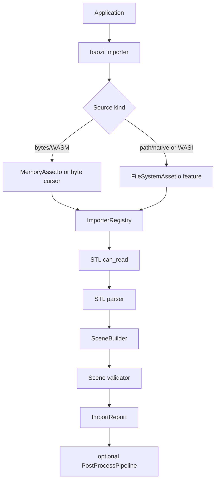
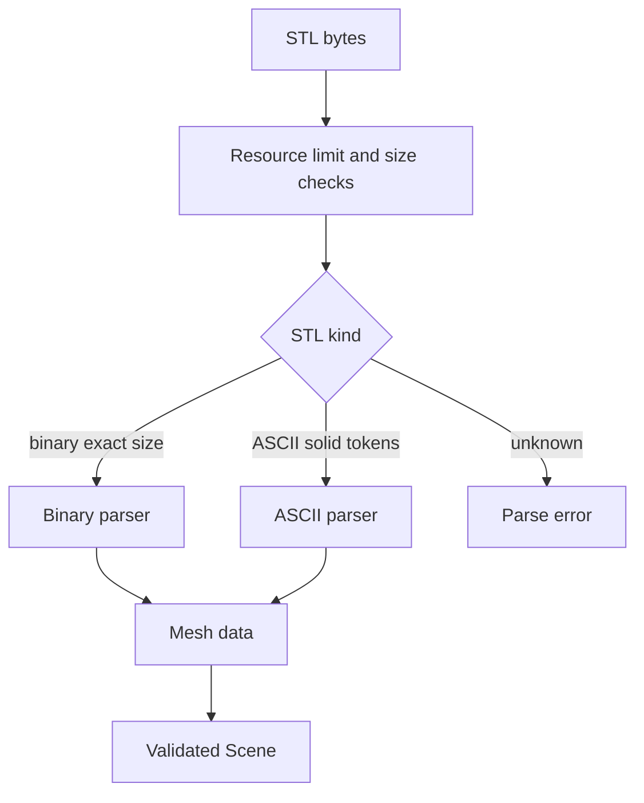

# Baozi STL Importer Vertical Slice - Plan

## Goal Capsule

| Field | Value |
| --- | --- |
| Objective | Implement Baozi's first real importer vertical slice by loading binary and ASCII STL into the owned `Scene` IR through the facade. |
| Authority | ADR 0001-0017, `docs/roadmap.md`, `docs/model/scene-ir.md`, and the user's requirement to keep Baozi clean-room, Rust-native, and WASM-capable. |
| Execution profile | Break scaffold APIs where needed; prioritize owned parser control, deterministic diagnostics, WASM-friendly bytes import, and fixture-driven validation over quick third-party parser adoption. |
| Stop condition | Stop if the implementation requires copying Assimp code/assets, adopting a default dependency with unresolved license/WASM/MSRV risk, or changing product scope beyond the first importer vertical slice. |

---

## Product Contract

### Summary

This plan moves Baozi from format-crate shells to a real STL import path: detection, parse, validation, snapshots, facade integration, docs, and WASM compileability for browser-style byte inputs.

### Problem Frame

The current workspace compiles but every format importer returns unsupported. The next milestone needs one complete importer path to prove `AssetIo`, `FormatImporter`, `SceneBuilder`, diagnostics, support tiers, and test-support contracts before OBJ, PLY, and glTF add sidecars, flexible attributes, materials, textures, and animation.

STL is the right first slice because it is geometry-only but still exercises binary detection, ASCII token parsing, malformed input, per-face normals, optional binary color attributes, empty mesh validation, fixture snapshots, and facade behavior. WASM support must be handled now because IO and dependency choices are harder to unwind after parser APIs spread across format crates.

### Requirements

**Importer Behavior**

- R1. Baozi detects STL by extension and content, including binary STL files whose 80-byte header begins with `solid`.
- R2. Baozi parses binary STL with checked size arithmetic, little-endian floats, triangle normals, vertex positions, documented binary color attributes, and resource-limit enforcement.
- R3. Baozi parses ASCII STL with one or more `solid` blocks, facet normals, three-vertex facets, empty solids as diagnostics, bounded token/line/solid/facet handling, and clear parse errors for incomplete facets.
- R4. Imported STL produces a source-preserving `Scene` with root node, mesh nodes, triangle topology, default material, geometry metadata, diagnostics, and no source-format public types.

**Facade, IO, and WASM**

- R5. The facade exposes a bytes/memory import path that works on `wasm32-unknown-unknown` without filesystem or sidecar access.
- R6. Filesystem import remains available for native and WASI users behind a single `native-fs` feature and a scoped `AssetIo` policy.
- R7. Import options carry resource limits, diagnostics strictness, and post-process preset selection as per ADR 0016.
- R8. `ImporterRegistry` owns detection arbitration: bounded `can_read` probes are rewound, content confidence beats extension hints, and ambiguous top-confidence matches return diagnostics instead of guessing.

**Validation, Postprocess, and Testing**

- R9. `SceneBuilder::finish` validates structural invariants and returns `Result<Scene>`.
- R10. `ValidateScene` postprocess uses the same validator and fails structurally unsafe scenes such as mesh references or indices out of range.
- R11. `baozi-test-support` provides deterministic scene snapshots that can compare raw STL output without relying on `Debug`.
- R12. Tests cover native filesystem import, memory/bytes import, ASCII STL, binary STL, malformed inputs, empty solids, default material, diagnostics, and facade registration.

**Dependency and Documentation Policy**

- R13. The default STL parser is Baozi-owned; third-party crates such as `stl_io` may be used only as reference, optional oracle, or dev dependency after license/WASM/MSRV review.
- R14. The support matrix and new `docs/formats/stl.md` describe exactly what STL capabilities are implemented, experimental, lossy, or unsupported.
- R15. The verification contract includes `wasm32-unknown-unknown` compile checks for the bytes/memory path and keeps native-only gates separate.

### Scope Boundaries

#### In Scope

- Binary STL and ASCII STL import.
- Geometry, normals, vertex colors where STL encodes them, default material, diagnostics, validation, snapshots, and facade integration.
- Browser-compatible bytes import and `wasm32-unknown-unknown` compileability for the first slice.

#### Deferred to Follow-Up Work

- OBJ/MTL, PLY, glTF/GLB parser implementation.
- Async remote fetching, browser JavaScript bindings, npm packaging, and drag-and-drop examples.
- Full tangent generation, mesh optimization, coordinate normalization, and exporter support.
- Persistent binary cache, dynamic plugins, C ABI, and FFI-backed importers.
- Long-running fuzz infrastructure beyond an initial fuzz target or fuzz-check wiring.

#### Outside This Plan

- Copying Assimp source code or test assets into Baozi.
- Claiming STL stable support before fuzzing, capability docs, malformed fixtures, and promotion evidence meet ADR 0011.
- Making any Assimp binding a default runtime dependency.

---

## Planning Contract

### Key Technical Decisions

- KTD1. Build the STL parser in Baozi rather than adopting a default parser crate. STL is small enough that owned parsing gives better diagnostics, limits, WASM control, and clean-room confidence; `stl_io` remains a MIT-licensed reference/oracle candidate, not the implementation source.
- KTD2. Add bytes-first import APIs before parser work. Browser WASM cannot depend on host filesystem semantics, so `Importer::read_bytes` and memory-backed import must be first-class while `read_path` becomes a native/WASI convenience.
- KTD3. Use one filesystem feature name. `baozi-io/default = []`, `baozi-io/fs = []`, and `baozi/native-fs = ["std", "baozi-io/fs"]`; default browser-oriented builds use bytes/memory APIs, while native path helpers and `FileSystemAssetIo` are gated by `native-fs`.
- KTD4. Keep `std` support but avoid native assumptions in the WASM path. This slice targets `wasm32-unknown-unknown` with byte buffers, not full `no_std`, JS bindings, native threads, SIMD acceleration, or browser fetch integration.
- KTD5. Introduce validation before trusting parser output. `SceneBuilder::finish` should return `Result<Scene>` and use one validator shared with `PostProcessStep::ValidateScene`.
- KTD6. Snapshot tests are a separate normalized schema. They should summarize IDs, counts, topology, positions, normals, colors, material refs, scene space, and diagnostics deterministically without freezing public `Scene` serialization.
- KTD7. Treat Assimp as behavior reference only. Useful STL behaviors include binary-size detection, `solid` false-positive handling, multi-solid ASCII scenes, empty-solid validation, and binary color conventions, but Baozi must not copy C++ code, pointer layouts, or fixture assets.
- KTD8. Keep default dependency tree WASM/MSRV/license clean. Latest metadata showed `image` currently has MSRV 1.88, `meshopt` is FFI-backed, and PLY/glTF crates have different maturity profiles; none should enter the default STL slice.
- KTD9. Parser crates start with `#![forbid(unsafe_code)]` and no panics on malformed input. `unwrap`, `expect`, `panic!`, unchecked indexing, and future unsafe exceptions require an explicit review note, tests, and fuzz coverage.
- KTD10. Binary STL color handling is scoped and documented. Support Materialise `COLOR=` header default RGBA, Materialise facet color ordering when that header is present, Magics-style 15-bit facet colors when no header is present, expanded `Mesh.colors[0]` for per-facet colors, material base/diffuse color for default-only header color, and diagnostics for conflicts or unknown conventions.

### High-Level Technical Design

### Assumptions

- Browser WASM support means compileable and usable with byte buffers on `wasm32-unknown-unknown`; JavaScript packaging and async fetch are deferred.
- STL remains experimental after this work until ADR 0011 stable-promotion gates are complete.
- Fixture files created in Baozi are hand-authored or generated for tests and do not copy Assimp assets.
- External crate metadata from crates.io API is enough for planning but not enough to add a default dependency without a source-level license audit.

### Sources and Research

- Local architecture: `README.md`, `docs/roadmap.md`, `docs/model/scene-ir.md`, `docs/security/parser-threat-model.md`, `docs/adr/0001-baozi-assimp-compatible-architecture.md`, `docs/adr/0007-workspace-crate-graph-feature-flags-msrv-and-ci-gates.md`, `docs/adr/0010-asset-io-virtual-filesystem-uri-archive-and-path-security.md`, `docs/adr/0011-format-support-tiers-and-compatibility-charter.md`, `docs/adr/0014-parser-security-unsafe-ffi-and-panic-boundary-policy.md`, `docs/adr/0016-import-options-presets-and-configuration-precedence.md`, `docs/adr/0017-serialization-snapshot-and-cache-boundary.md`.
- Current scaffold: `crates/baozi/src/lib.rs`, `crates/baozi-core/src/scene.rs`, `crates/baozi-io/src/lib.rs`, `crates/baozi-import/src/format.rs`, `crates/baozi-format-stl/src/lib.rs`, `crates/baozi-test-support/src/lib.rs`.
- Assimp behavior reference: `repo-ref/assimp/code/AssetLib/STL/STLLoader.cpp`, `repo-ref/assimp/code/Common/BaseImporter.cpp`, `repo-ref/assimp/code/PostProcessing/ValidateDataStructure.cpp`, `repo-ref/assimp/test/unit/utSTLImportExport.cpp`.
- Ecosystem metadata: crates.io API entries for [`stl_io`](https://crates.io/api/v1/crates/stl_io), [`tobj`](https://crates.io/api/v1/crates/tobj), [`ply-rs`](https://crates.io/api/v1/crates/ply-rs), [`gltf`](https://crates.io/api/v1/crates/gltf), [`winnow`](https://crates.io/api/v1/crates/winnow), [`binrw`](https://crates.io/api/v1/crates/binrw), [`nom`](https://crates.io/api/v1/crates/nom), [`image`](https://crates.io/api/v1/crates/image), [`meshopt`](https://crates.io/api/v1/crates/meshopt), and [`mikktspace`](https://crates.io/api/v1/crates/mikktspace).
- Platform reference: Rust target documentation for [`wasm32-unknown-unknown`](https://doc.rust-lang.org/rustc/platform-support/wasm32-unknown-unknown.html) and [`wasm32-wasip1`](https://doc.rust-lang.org/rustc/platform-support/wasm32-wasip1.html).

---

## Implementation Units

### U1. Introduce import options, report, registry detection, and bytes-first facade APIs

- **Goal:** Make the facade capable of returning a scene plus diagnostics from bytes or paths without hardwiring parser logic to native filesystem access.
- **Requirements:** R5, R7, R8, R12, R15
- **Dependencies:** none
- **Files:** `crates/baozi/src/lib.rs`, `crates/baozi-import/src/context.rs`, `crates/baozi-import/src/format.rs`, `crates/baozi-import/src/registry.rs`, `crates/baozi-import/src/lib.rs`, `crates/baozi-io/src/memory.rs`, `crates/baozi/tests/importer_api.rs`
- **Approach:** Add `ImportOptions`, `DiagnosticOptions`, `IoOptions`, `ExternalReferencePolicy`, `ImportReport`, and facade entry points for bytes/memory and paths. Keep path import as a `native-fs` convenience layered on the same import context. Add registry detection that probes candidates with bounded reads, rewinds between probes, treats `Likely`/`Certain` content matches as selectable, uses extension hints only as tie-breakers, and reports ambiguous top-confidence matches.
- **Patterns to follow:** `ImportContext` diagnostic storage in `crates/baozi-import/src/context.rs`; registry lookup in `crates/baozi-import/src/registry.rs`.
- **Test scenarios:** Importing unknown bytes returns `UnsupportedFormat` with diagnostics; importing with an extension hint selects the registered importer only when content does not contradict it; diagnostics survive into `ImportReport`; repeated bytes imports do not share mutable state; ambiguous equal-confidence importers return a diagnostic error; `read_bytes` denies external references by default.
- **Verification:** Facade tests prove unsupported and registered dummy importers through bytes and path-oriented APIs.

### U2. Make IO and feature graph WASM-aware

- **Goal:** Split browser-safe IO from native filesystem IO and add target checks that prevent native assumptions from entering the default parser path.
- **Requirements:** R5, R6, R13, R15
- **Dependencies:** U1
- **Files:** `Cargo.toml`, `crates/baozi/Cargo.toml`, `crates/baozi-core/Cargo.toml`, `crates/baozi-import/Cargo.toml`, `crates/baozi-io/Cargo.toml`, `crates/baozi-io/src/lib.rs`, `crates/baozi-io/src/fs.rs`, `crates/baozi-io/src/memory.rs`, `crates/baozi-io/src/path.rs`, `crates/baozi-io/src/limits.rs`
- **Approach:** Add the feature graph from KTD3 and use dependency `default-features = false` where needed so `--no-default-features --features format-stl` does not re-enable filesystem code transitively. Extend `ResourceLimits` with STL-relevant mesh/vertex/face/solid/line limits. Require format crates to open dependencies only through `ImportContext` and `AssetIo`, never direct `std::fs`.
- **Patterns to follow:** Existing facade features in `crates/baozi/Cargo.toml`; ADR 0002 runtime neutrality; ADR 0007 feature policy.
- **Test scenarios:** `MemoryAssetIo` opens inserted bytes on all targets; `FileSystemAssetIo`, `read_path`, and filesystem re-exports are unavailable when `native-fs` is off; existing `AssetPath` traversal rejection remains covered under feature gating; filesystem import rejects absolute paths and scope escapes; symlink escape behavior is tested or explicitly rejected by implementation-time scope policy.
- **Verification:** Native checks still pass, and `wasm32-unknown-unknown` compile checks are part of the Verification Contract.

### U3. Add scene validation and validated builder finish

- **Goal:** Make parser output structurally safe before returning successful scenes or running postprocess steps.
- **Requirements:** R4, R9, R10, R12
- **Dependencies:** U1
- **Files:** `crates/baozi-core/src/scene.rs`, `crates/baozi-core/src/validation.rs`, `crates/baozi-core/src/lib.rs`, `crates/baozi-import/src/registry.rs`, `crates/baozi-postprocess/src/pipeline.rs`, `crates/baozi-core/tests/scene_validation.rs`
- **Approach:** Add a validator that checks root existence, node parent/child integrity, mesh references, material references, finite positions/normals, topology/index compatibility, attribute lengths, and empty renderable meshes. Change `SceneBuilder::finish` to return `Result<Scene>` and update existing tests accordingly.
- **Patterns to follow:** Validator requirements in `docs/model/scene-ir.md` and Assimp's validation posture in `repo-ref/assimp/code/PostProcessing/ValidateDataStructure.cpp`.
- **Test scenarios:** Valid scene finishes successfully; missing material reference fails; node cycle fails; mesh index out of range fails; empty mesh with no positions fails in strict validation; `ValidateScene` postprocess returns the same validation error.
- **Verification:** Core and postprocess validation tests cover all new invariants.

### U4. Build deterministic snapshot and fixture support

- **Goal:** Give parser tests a stable way to assert scene output without freezing `Debug` or public serde formats.
- **Requirements:** R11, R12
- **Dependencies:** U3
- **Files:** `crates/baozi-test-support/src/lib.rs`, `crates/baozi-test-support/src/snapshot.rs`, `crates/baozi-test-support/tests/snapshot.rs`, `docs/testing/snapshot-and-fixture-policy.md`
- **Approach:** Add a normalized `SceneSnapshot` that records object counts, topology, material bindings, selected vertex data, bounds, metadata keys, and diagnostics with stable float formatting. Keep snapshots deterministic and test-only.
- **Patterns to follow:** ADR 0017 snapshot boundary and current `SceneSummary` in `crates/baozi-test-support/src/lib.rs`.
- **Test scenarios:** Empty root scene snapshot is deterministic; simple triangle snapshot includes positions/normals/material id; float formatting is stable within the documented precision; diagnostics sort deterministically; snapshot output changes when topology changes.
- **Verification:** Test-support tests prove deterministic output across repeated runs.

### U5. Implement STL detection and parser module structure

- **Goal:** Replace the STL unsupported stub with detection and parser entry points while keeping behavior experimental.
- **Requirements:** R1, R8, R13
- **Dependencies:** U1, U2
- **Files:** `crates/baozi-format-stl/src/lib.rs`, `crates/baozi-format-stl/src/detect.rs`, `crates/baozi-format-stl/src/parser.rs`, `crates/baozi-format-stl/tests/detect.rs`
- **Approach:** Implement bounded header detection for binary exact-size STL and ASCII `solid` tokens. Preserve the Assimp lesson that `solid` alone is insufficient because binary headers may contain that prefix. Make the default stub `can_read` return `No` until real detection exists. Keep parser internals private and return Baozi diagnostics/errors only.
- **Patterns to follow:** `FormatImporter::can_read` in `crates/baozi-import/src/format.rs`; Assimp detection logic in `repo-ref/assimp/code/AssetLib/STL/STLLoader.cpp`.
- **Test scenarios:** Binary STL with exact `84 + 50 * n` length is `Certain`; binary STL whose header starts with `solid` is detected as binary; ASCII STL beginning with whitespace then `solid` is detected as ASCII; files under 84 bytes are not binary; random bytes are rejected; `can_read` does not consume input for `read`.
- **Verification:** Detection tests pass without using external fixture assets.

### U6. Implement binary STL parsing

- **Goal:** Parse binary STL bytes into a validated Baozi scene with triangles, normals, optional colors, and default material.
- **Requirements:** R2, R4, R9, R11, R12, R14
- **Dependencies:** U3, U4, U5
- **Files:** `crates/baozi-format-stl/src/binary.rs`, `crates/baozi-format-stl/src/parser.rs`, `crates/baozi-format-stl/tests/binary.rs`, `docs/formats/stl.md`, `docs/formats/support-matrix.md`
- **Approach:** Read the 80-byte header, checked facet count, and 50-byte facet records. Use `f32::from_le_bytes` and checked arithmetic instead of pointer casts. Emit one mesh under one child node, duplicate facet normals to vertices, create triangle indices, and implement the KTD10 color mapping. Enforce byte, face, vertex, allocation, and diagnostic limits before allocation.
- **Patterns to follow:** Assimp's binary STL behavior in `repo-ref/assimp/code/AssetLib/STL/STLLoader.cpp`, but implemented as clean Rust byte parsing.
- **Test scenarios:** One-triangle binary STL imports with three positions, three normals, one face, and default material; zero-facet binary STL returns parse error; declared count larger than available bytes returns parse error before allocation; non-finite float returns validation error or diagnostic according to strictness; Materialise default color maps to material color when no per-facet colors exist; Magics and Materialise facet colors expand into `Mesh.colors[0]`; oversized count hits `ResourceLimits`.
- **Verification:** Binary tests compare normalized snapshots and diagnostics.

### U7. Implement ASCII STL parsing

- **Goal:** Parse ASCII STL into the same scene contract while preserving multi-solid structure and malformed-input diagnostics.
- **Requirements:** R3, R4, R9, R11, R12, R14
- **Dependencies:** U3, U4, U5
- **Files:** `crates/baozi-format-stl/src/ascii.rs`, `crates/baozi-format-stl/src/parser.rs`, `crates/baozi-format-stl/tests/ascii.rs`, `docs/formats/stl.md`
- **Approach:** Parse `solid`, `facet normal`, `outer loop`, exactly three `vertex` lines, `endloop`, `endfacet`, and `endsolid` with tolerant whitespace. Emit one mesh/node per non-empty solid and diagnostics for empty solids or unexpected EOF. Enforce max asset bytes, max solids, max facets, max vertices, max line/token bytes, and max diagnostics during incremental parsing. Do not silently create polygon or point topology.
- **Patterns to follow:** Multi-solid and empty-solid cases from `repo-ref/assimp/test/unit/utSTLImportExport.cpp`; ADR 0014 panic boundary.
- **Test scenarios:** Single triangle ASCII imports; two solids create two mesh attachments; empty solid emits diagnostic and fails strict validation when no valid mesh remains; facet with more or fewer than three vertices returns parse error; missing `endsolid` emits diagnostic or error according to strictness; invalid float returns parse error with source location; oversized line/token/solid/facet inputs stop at `ResourceLimits`; diagnostic flooding is capped.
- **Verification:** ASCII tests compare normalized snapshots and malformed fixtures.

### U8. Wire facade, docs, fuzz target, and experimental capability evidence

- **Goal:** Make STL usable through `baozi::Importer`, document its exact experimental support, and add the first malformed/fuzz safety hooks without claiming stable promotion.
- **Requirements:** R12, R13, R14, R15
- **Dependencies:** U1, U2, U3, U4, U5, U6, U7
- **Files:** `crates/baozi/src/lib.rs`, `crates/baozi/tests/stl_facade.rs`, `crates/baozi-format-stl/tests/malformed.rs`, `docs/formats/stl.md`, `docs/formats/support-matrix.md`, `docs/security/parser-threat-model.md`, `fuzz/Cargo.toml`, `fuzz/fuzz_targets/stl_import.rs`
- **Approach:** Route facade reads through registry detection and STL importer. Add malformed in-memory fixtures, a committed raw parser fuzz target, and a small seed corpus. Keep long-running fuzzing and stable-promotion evidence deferred, but require a compileable fuzz target and either a short smoke run when `cargo-fuzz` is installed or a property-style malformed fallback test.
- **Patterns to follow:** ADR 0011 promotion gates, ADR 0014 fuzzing policy, existing `docs/formats/_template.md`.
- **Test scenarios:** `load_scene` on a native STL path works when `native-fs` is enabled; bytes import works with no filesystem feature; unknown extension with STL bytes still imports by signature through registry detection; malformed bytes never panic; support matrix does not claim stable support; fuzz target compiles and smoke-runs when fuzz tooling is installed.
- **Verification:** Workspace tests, docs updates, and target checks prove the first importer slice without overstating maturity.

---

## Verification Contract

| Gate | Applies to | Done signal |
| --- | --- | --- |
| `cargo fmt --all -- --check` | all units | formatting stable |
| `cargo check --workspace --all-targets` | all units | native workspace compiles |
| `cargo clippy --workspace --all-targets -- -D warnings` | parser and API units | no warning debt in parser paths |
| `cargo nextest run --workspace` | all test-bearing units | unit and integration tests pass |
| `cargo check -p baozi --no-default-features` | feature hygiene | facade builds without default formats or native conveniences |
| `cargo check -p baozi --features all-formats,native-fs` | feature integration | all declared format crates and native filesystem convenience compile together |
| `cargo check -p baozi --target wasm32-unknown-unknown --no-default-features --features format-stl` | WASM browser bytes path | STL bytes import API compiles without native filesystem assumptions |
| `cargo check -p baozi --target wasm32-wasip1 --no-default-features --features format-stl,native-fs` | WASI/native-like path | filesystem-gated code remains target-aware |
| `cargo deny check` | dependency policy | licenses, advisories, registries, and source policy pass |
| `cargo clippy -p baozi-format-stl --all-targets -- -D warnings -D clippy::unwrap_used -D clippy::expect_used -D clippy::panic` | parser safety | parser path has no casual panics on malformed input |
| `cargo fuzz check stl_import` and `cargo fuzz run stl_import -- -runs=256` when fuzz tooling is installed; otherwise a property-style malformed-input fallback test | parser safety | STL fuzz target compiles, and malformed seeds are exercised by fuzz tooling or fallback tests |
| Documentation review | docs units | `docs/formats/stl.md` and support matrix match implemented capabilities |

---

## Definition of Done

- STL ASCII and binary imports work through facade and bytes APIs.
- Parser failures return `BaoziError` and diagnostics rather than panicking.
- Scene validation prevents structurally unsafe STL scenes from being returned as successful imports.
- Tests cover happy paths, malformed inputs, diagnostics, snapshots, and repeated importer use.
- The first WASM compile gate passes for bytes-based STL import.
- Default dependencies remain compatible with Baozi's license, MSRV, and WASM goals.
- Documentation marks STL as experimental and accurately states supported, partial, lossy, diagnostic, and unsupported capabilities.
- Any exploratory code or abandoned parser approach is removed before the work is considered complete.

---

## Appendix

### External Crate Findings

| Crate | Latest metadata observed | License | Recommended use |
| --- | --- | --- | --- |
| `stl_io` | 0.11.0, rust-version 1.85 | MIT | Reference or dev oracle only; do not use as default parser in this slice |
| `tobj` | 4.0.4 | MIT | Future OBJ reference or optional backend candidate |
| `ply-rs` | 0.1.3, last updated 2020 | MIT | Prior art only unless refreshed by deeper audit |
| `gltf` | 1.4.1, rust-version 1.61 | MIT OR Apache-2.0 | Strong future glTF parser candidate behind format feature |
| `winnow` | 1.0.3, rust-version 1.65 | MIT | Candidate for future text parsers; not needed for STL first slice |
| `binrw` | 0.11.3 | MIT | Candidate for binary formats; macro-heavy review needed |
| `nom` | 8.0.0, rust-version 1.65 | MIT | Mature parser alternative to `winnow` |
| `image` | 0.25.10, rust-version 1.88 | MIT OR Apache-2.0 | Optional future image decoding only; latest metadata exceeds current MSRV |
| `meshopt` | 0.6.2 | MIT OR Apache-2.0 | Optional postprocess optimization only; FFI/native risk |
| `mikktspace` | 0.3.0 | MIT/Apache-2.0 | Optional tangent generation candidate; audit before default use |
