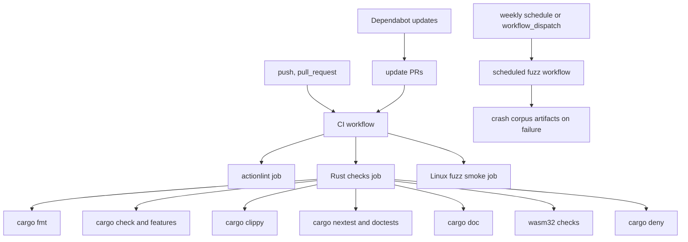

# GitHub Actions CI Upgrade - Plan

## Goal Capsule

| Field | Value |
| --- | --- |
| Objective | Upgrade Baozi's GitHub Actions CI so every PR gets current workflow actions, clearer supply-chain posture, stronger Rust gates, and Linux-authoritative fuzz evidence. |
| Authority | ADR 0005, ADR 0007, ADR 0014, `docs/contributing/fuzzing.md`, and the user's request to upgrade Actions before continuing larger fearless refactors. |
| Execution profile | Treat CI as shared infrastructure: make breaking YAML/config changes freely when they reduce future maintenance, but keep runtime scope to GitHub-hosted Linux unless the plan says otherwise. |
| Stop condition | Stop if the workflow needs repository secrets, write permissions, Windows sanitizer gating, copied third-party scripts, or a release/publish workflow that has not been designed yet. |
| Tail ownership | The implementer owns a green GitHub Actions run after push, not only local YAML validation. |

---

## Product Contract

### Summary

Baozi should move from a working first CI baseline to a maintainable CI platform: current checkout behavior, less mutable action usage, explicit concurrency, action linting, Dependabot updates, stronger Rust docs/features checks, and a fuzz posture that keeps Linux sanitizer CI authoritative while documenting Windows local limits.

### Problem Frame

The current workflow is already green, but it was created as an early vertical-slice gate.
It still uses `actions/checkout@v4`, `dtolnay/rust-toolchain@master` for both stable and nightly installs, `taiki-e/install-action@nextest` and `@cargo-deny` shorthand tags, no workflow-level `concurrency`, no Dependabot config, and no workflow linter.

This matters because Baozi is about to add more parser crates and more malformed-input gates.
CI drift will become expensive if action versions, fuzz evidence, WASM checks, and feature checks stay informal.

### Requirements

**Workflow Maintenance**

- R1. The main CI workflow uses current supported action tags where practical and records intentional exceptions instead of accidental mutable refs.
- R2. The workflow keeps least-privilege `GITHUB_TOKEN` permissions, disables persisted checkout credentials for untrusted jobs, and adds workflow-level concurrency that cancels superseded runs for the same workflow and ref.
- R3. GitHub Actions workflow syntax is statically checked so YAML, expression, runner-label, and action-input mistakes fail before Rust jobs hide them.
- R4. Dependabot tracks GitHub Actions plus Cargo manifests at the repository root and the workspace-adjacent fuzz package on a predictable schedule.

**Rust Quality Gates**

- R5. Existing Rust gates stay intact: formatting, workspace check, clippy with warnings denied, nextest, facade feature checks, WASM browser bytes path, WASI native-fs path, and cargo-deny.
- R6. CI adds doc-oriented gates that protect crate docs and doctests as public APIs start to form.
- R7. Feature checks remain scoped enough for PR latency but leave a documented path toward cargo-hack feature powersets when format count grows.

**Fuzz and Platform Policy**

- R8. PR CI keeps a short Linux sanitizer fuzz smoke for `stl_import`.
- R9. A scheduled or manually dispatched deeper fuzz workflow exists for longer campaigns without slowing normal PRs.
- R10. Windows fuzzing remains documented as local tooling support, not an authoritative CI gate, because `cargo-fuzz` and libFuzzer sanitizer support remain Unix-like oriented.
- R11. Fuzz failures upload enough artifacts for triage when a scheduled run discovers a crash.

**Documentation and Future Maintenance**

- R12. Contributor docs explain the CI action version policy, manually pinned workflow tools, the dated nightly exception, local `actionlint`, and the Windows ASan DLL troubleshooting boundary.
- R13. The plan does not introduce release, publish, artifact attestation, or SHA-pinning enforcement workflows; those remain separate supply-chain hardening work.

### Scope Boundaries

#### In Scope

- `.github/workflows/ci.yml` upgrades.
- New `.github/workflows/fuzz.yml` for scheduled/manual deeper fuzz.
- New `.github/dependabot.yml`.
- CI and fuzz contributor documentation updates.
- Small README CI badge or command-list updates if they prevent drift.

#### Deferred to Follow-Up Work

- Release or crates.io publish workflows.
- Artifact attestations, OIDC publishing, Sigstore, or GitHub immutable release policy.
- Organization/repository settings such as branch protection, Actions allowlists, and SHA-pinning enforcement.
- Cross-platform fuzz gates on Windows or macOS.
- Full feature powerset CI across every future format crate.

#### Outside This Plan

- Changing Rust library APIs or parser behavior.
- Adding new parser crates or fuzz targets beyond wiring existing `stl_import` infrastructure.
- Rewriting CI around a different provider.

### Assumptions

- Baozi continues to use GitHub-hosted runners for this phase.
- `main` remains the default protected integration branch.
- CI has no repository secrets and needs no `contents: write` permission.
- The current MSRV stays Rust `1.95` for this upgrade.

### Sources and Research

- GitHub announced `actions/checkout` v7 on 2026-06-18 with safer defaults for `pull_request_target` and related `workflow_run` pwn-request patterns: https://github.blog/changelog/2026-06-18-safer-pull_request_target-defaults-for-github-actions-checkout/
- The `actions/checkout` README documents v7, v6 credential storage changes, and v5 Node 24 runner requirements: https://github.com/actions/checkout
- GitHub workflow syntax documents `permissions`, including that unspecified permissions become `none` after explicit permissions are set: https://docs.github.com/en/actions/reference/workflows-and-actions/workflow-syntax
- GitHub concurrency docs show workflow-level `concurrency` and `cancel-in-progress: true`: https://docs.github.com/en/actions/how-tos/write-workflows/choose-when-workflows-run/control-workflow-concurrency
- GitHub Dependabot docs require `package-ecosystem: "github-actions"` with `directory: "/"` for workflow updates: https://docs.github.com/en/code-security/reference/supply-chain-security/dependabot-options-reference
- GitHub secure-use guidance recommends least privilege and says full-length commit SHA pins are the only immutable action reference form today: https://docs.github.com/en/actions/reference/security/secure-use
- GitHub added policy support for blocking actions and enforcing SHA pinning in 2025; this plan defers that to release/publish hardening: https://github.blog/changelog/2025-08-15-github-actions-policy-now-supports-blocking-and-sha-pinning-actions/
- The `actions/upload-artifact` repository currently exposes v7 tags for artifact uploads: https://github.com/actions/upload-artifact
- `dtolnay/rust-toolchain` selects the Rust toolchain by action ref, but recommends `@master` when an explicit `toolchain` input such as `nightly-YYYY-MM-DD` is passed: https://github.com/dtolnay/rust-toolchain
- `taiki-e/install-action` recommends `@v2` plus `with.tool` when action/tool pinning matters and treats tool-name shorthand as convenience: https://github.com/taiki-e/install-action
- `cargo-fuzz` documents libFuzzer sanitizer and nightly requirements and still frames support as Unix-like rather than Windows: https://github.com/rust-fuzz/cargo-fuzz
- `actionlint` checks workflow syntax, expressions, action inputs, runner labels, and untrusted expression usage: https://github.com/rhysd/actionlint

---

## Planning Contract

### Key Technical Decisions

- KTD1. Upgrade validation CI to `actions/checkout@v7` and keep this read-only PR CI on maintained action tags instead of immediate full-SHA pins. Baozi's current CI has no secrets, write permissions, `pull_request_target`, privileged `workflow_run`, or self-hosted runners, so major action tags plus Dependabot provide lower maintenance cost; any workflow that adds those trust-boundary changes must re-evaluate SHA pinning.
- KTD2. Remove `dtolnay/rust-toolchain@master` from the stable Rust job by using `dtolnay/rust-toolchain@1.95.0`. The dated fuzz nightly keeps `dtolnay/rust-toolchain@master` with `toolchain: nightly-2026-05-27`, because the action README recommends `@master` for explicit `toolchain` input and `git ls-remote` showed no `nightly-2026-05-27` action ref.
- KTD3. Replace `taiki-e/install-action@nextest` and `@cargo-deny` shorthand with `taiki-e/install-action@v2` plus `with.tool`. This keeps the action reference conventional and makes later tool-version pinning possible without changing workflow shape.
- KTD4. Add `actionlint` as a separate fast job. Workflow YAML failures should be isolated from Rust failures, and `actionlint` gives useful checks for expressions, labels, and action inputs that GitHub may otherwise report only after a pushed run.
- KTD5. Keep Linux as the sanitizer authority. The existing Windows ASan DLL work belongs in `docs/contributing/fuzzing.md` as local troubleshooting, while PR and scheduled fuzz jobs run on `ubuntu-latest`.
- KTD6. Split short and long fuzz proof. PR CI should stay fast with `-runs=256`; scheduled/manual fuzz can use a time budget and upload failure artifacts.
- KTD7. Add Dependabot before stricter pinning. Action and Cargo update PRs give reviewable drift control; full SHA enforcement is deferred until Baozi has release workflows with stronger supply-chain stakes.
- KTD8. Add docs/doctest gates before public API growth. Baozi's Rust-native facade and crate docs will become the integration contract, so CI should fail broken doctests and docs early.
- KTD9. Treat workflow-installed CLI versions as manual pins unless they live in a Dependabot-managed manifest. `actionlint`, `cargo-fuzz`, and future pinned CI tools need a documented review cadence even when GitHub Actions and Cargo manifests are automated.

### High-Level Technical Design

### Action Version Map

| Area | Current | Planned | Rationale |
| --- | --- | --- | --- |
| Checkout | `actions/checkout@v4` | `actions/checkout@v7` | Pick up v7 safer fork PR defaults and newer runtime/dependency fixes. |
| Stable Rust | `dtolnay/rust-toolchain@master` with `toolchain: 1.95.0` | `dtolnay/rust-toolchain@1.95.0` | Remove mutable ref where the action supports toolchain-by-ref. |
| Fuzz Rust | `dtolnay/rust-toolchain@master` with `toolchain: nightly-2026-05-27` | keep, with an explicit workflow comment | Dated nightly refs are an input-based path in this action. |
| Rust cache | `Swatinem/rust-cache@v2` | keep `@v2` | Current major remains maintained; Dependabot will surface future updates. |
| Tool install | `taiki-e/install-action@nextest`, `@cargo-deny` | `taiki-e/install-action@v2` with `tool: cargo-nextest,cargo-deny` | Retire shorthand and prepare for version pinning. |
| Artifact upload | none | `actions/upload-artifact@v7` in scheduled fuzz only | Needed for crash corpus triage, not normal PR CI. |
| Workflow lint | none | `actionlint` installed at a pinned release | Catch workflow mistakes before Rust jobs run. |

### Alternatives Considered

- Full SHA pinning for every action now. Rejected for this plan because Baozi has no release workflow, secrets, write permissions, privileged PR triggers, or self-hosted runners in CI yet; it would add update friction before the repository has a stronger supply-chain surface. Revisit it for any workflow that crosses those boundaries.
- Replace `dtolnay/rust-toolchain` with another Rust setup action. Deferred because the current action already supports stable-by-ref and explicit dated nightlies; the only exception is understood and documented.
- Move all fuzzing to a scheduled workflow. Rejected because ADR 0014 wants parser panics caught early; keep a short PR smoke and move only longer campaigns to schedule/manual dispatch.
- Add cargo-hack feature powersets immediately. Deferred because the workspace feature matrix is still small and current targeted feature checks are faster; revisit when format crates gain optional parser backends.

### System-Wide Impact

This plan affects every future PR because CI becomes the gate for Rust code, docs, WASM, dependency policy, and fuzz smoke.
It also sets the update pattern for all future workflows, so action version policy must be explicit rather than ad hoc.

### Risks and Mitigations

| Risk | Severity | Mitigation |
| --- | --- | --- |
| `checkout@v7` behavior breaks a future privileged workflow pattern | Medium | Baozi has no `pull_request_target` workflow in scope; document that `allow-unsafe-pr-checkout` is not allowed without a separate security review. |
| Actionlint installation adds flakiness | Low | Pin the actionlint release and keep it in a separate job so failures are easy to diagnose. |
| Extra doc gates slow PRs | Low | Start with doctests and no-deps docs; defer full docs.rs packaging checks until publishing work. |
| Scheduled fuzz produces artifacts without triage ownership | Medium | Upload only on failure and require converting crashes into regression fixtures before stable parser promotion. |
| Dependabot opens noisy update PRs | Medium | Use weekly schedule and grouping where supported; adjust cadence after observing real PR volume. |
| The dated nightly exception is mistaken for accidental `@master` drift | Medium | Add an inline workflow comment and document the exception in contributor docs. |

---

## Implementation Units

### U1. Upgrade CI action refs and workflow hardening

- **Goal:** Modernize `.github/workflows/ci.yml` action references and workflow-level safety controls without changing Rust behavior.
- **Requirements:** R1, R2, R5
- **Dependencies:** none
- **Files:** `.github/workflows/ci.yml`
- **Approach:** Upgrade checkout to `actions/checkout@v7`, set `persist-credentials: false` on checkout steps unless a future job documents why git credentials are required, add top-level `concurrency` with `${{ github.workflow }}-${{ github.ref }}` and `cancel-in-progress: true`, keep `permissions: contents: read`, use `dtolnay/rust-toolchain@1.95.0` for the stable job, and preserve the dated nightly via `dtolnay/rust-toolchain@master` with an explanatory comment. Convert `taiki-e/install-action` shorthand steps to `@v2` with `tool: cargo-nextest,cargo-deny`.
- **Patterns to follow:** Existing `.github/workflows/ci.yml` job names and env constants; ADR 0007 CI gate list.
- **Test scenarios:** Test expectation: none -- config change is proved by workflow lint and the full GitHub Actions run.
- **Verification:** The workflow parses, uses least privilege, cancels superseded same-ref runs, and produces the same or stronger Rust checks as before.

### U2. Add workflow linting

- **Goal:** Add a fast CI gate that statically validates GitHub Actions YAML before Rust jobs consume runner time.
- **Requirements:** R3
- **Dependencies:** U1
- **Files:** `.github/workflows/ci.yml`
- **Approach:** Add an `actionlint` job that checks all workflow files. Pin `actionlint` to a release such as `v1.7.12`, preferably through `go install github.com/rhysd/actionlint/cmd/actionlint@v1.7.12` or an equivalently pinned installation path. If the `go install` path is used and GitHub-hosted runner Go availability is insufficient, add an explicit pinned Go setup step instead of an unpinned download script. Keep the job independent from Rust cache and Rust toolchain setup.
- **Patterns to follow:** Current CI style of named jobs and explicit timeouts.
- **Test scenarios:** Test expectation: none -- the behavior is the workflow linter itself.
- **Verification:** `actionlint` passes locally and in GitHub Actions; intentional YAML mistakes would fail this job before Rust jobs.

### U3. Expand Rust docs and feature gates

- **Goal:** Protect public API documentation, doctests, and feature topology as parser crates grow.
- **Requirements:** R5, R6, R7
- **Dependencies:** U1
- **Files:** `.github/workflows/ci.yml`, `docs/adr/0007-workspace-crate-graph-feature-flags-msrv-and-ci-gates.md` if the ADR needs wording updates
- **Approach:** Add doctest and no-deps documentation gates to the Rust job, with rustdoc warnings denied. Keep the existing facade no-default, all-formats/native-fs, browser WASM, WASI native-fs, and cargo-deny checks. Do not add cargo-hack feature powersets unless implementation proves the current targeted feature checks miss a real dependency boundary.
- **Patterns to follow:** ADR 0007's required and optional CI gates; current workspace `resolver = "3"` and MSRV metadata in `Cargo.toml`.
- **Test scenarios:** Test expectation: none -- CI commands are the proof surface.
- **Verification:** Docs and doctests pass on the same Rust toolchain as the workspace check, and failure output identifies the crate that broke the contract.

### U4. Add Dependabot update automation

- **Goal:** Ensure GitHub Actions, Cargo dependencies, and manually pinned CI tools do not silently drift after this upgrade.
- **Requirements:** R4, R12
- **Dependencies:** U1
- **Files:** `.github/dependabot.yml`
- **Approach:** Add Dependabot version updates for `github-actions` at `directory: "/"` and Cargo at both `"/"` and `"/fuzz"` through `directories` or separate Cargo update entries, all on a weekly schedule. Group related GitHub Actions updates together if supported, keep Cargo updates separate from Actions so CI infrastructure changes remain easy to review, and document that shell-pinned workflow tools such as `actionlint` and `cargo-fuzz` need manual review when this plan's version constants are revisited.
- **Patterns to follow:** Repository root package layout and `Cargo.lock` ownership.
- **Test scenarios:** Test expectation: none -- Dependabot behavior is verified by repository settings and the first generated PR.
- **Verification:** GitHub accepts the Dependabot config, future action/Cargo update PRs target `main`, and `fuzz/Cargo.toml` is covered by the Cargo update configuration.

### U5. Split scheduled fuzz from PR fuzz smoke

- **Goal:** Keep PR fuzz evidence fast while adding a route for longer sanitizer campaigns and crash artifacts.
- **Requirements:** R8, R9, R10, R11
- **Dependencies:** U1
- **Files:** `.github/workflows/ci.yml`, `.github/workflows/fuzz.yml`, `docs/contributing/fuzzing.md`
- **Approach:** Preserve the existing PR `stl_import` smoke with pinned `nightly-2026-05-27` and `cargo-fuzz` `0.13.2`. Add a separate Linux-only scheduled/manual fuzz workflow with `timeout-minutes: 20`, an initial `cargo fuzz run stl_import -- -max_total_time=120` budget, and `actions/upload-artifact@v7` guarded by `if: failure()` for `fuzz/artifacts/stl_import/**` and relevant logs with short retention such as `retention-days: 14`. Keep Windows sanitizer notes as local setup guidance in `docs/contributing/fuzzing.md`.
- **Patterns to follow:** ADR 0005 layered verification and ADR 0014 panic/fuzz boundary; existing `fuzz/` workspace-adjacent setup.
- **Test scenarios:** Test expectation: none -- fuzz workflows are CI/tooling behavior, not Rust library behavior.
- **Verification:** PR fuzz smoke still completes within the CI timeout, the scheduled workflow can be manually dispatched, and any failing scheduled fuzz run exposes a bounded downloadable artifact for triage.

### U6. Document the CI policy

- **Goal:** Make the upgraded CI behavior understandable for future contributors and future agents.
- **Requirements:** R12, R13
- **Dependencies:** U1, U2, U3, U4, U5
- **Files:** `docs/contributing/fuzzing.md`, `docs/contributing/format-onboarding.md`, `README.md`, `docs/knowledge/engineering/current-state.md` if engineering memory is updated
- **Approach:** Document the action version policy, the `dtolnay@master` dated-nightly exception, local `actionlint`, manually pinned CI tool versions and their review cadence, the Linux-authoritative fuzz boundary, and how Windows ASan failures should be interpreted. Add a README CI badge only if it points to the actual `CI` workflow on `main`.
- **Patterns to follow:** Existing contributor docs use command snippets and explicit Windows outcomes; engineering memory logs stay short and factual.
- **Test scenarios:** Test expectation: none -- documentation-only unit.
- **Verification:** A contributor can reproduce the main gates locally or understand why a gate is GitHub-only, and the docs do not imply Windows fuzz is equivalent to Linux sanitizer CI.

---

## Verification Contract

| Gate | Command or Evidence | Covers |
| --- | --- | --- |
| Workflow lint | `actionlint` | U1, U2, U5 |
| Formatting | `cargo fmt --all -- --check` | U3 |
| Workspace check | `cargo check --workspace --all-targets` | U3 |
| Clippy | `cargo clippy --workspace --all-targets -- -D warnings` | U3 |
| Tests | `cargo nextest run --workspace` | U3 |
| Doctests | `cargo test --doc --workspace` | U3 |
| Docs | `RUSTDOCFLAGS="-D warnings" cargo doc --workspace --all-features --no-deps` | U3 |
| Facade feature smoke | `cargo check -p baozi --no-default-features` and `cargo check -p baozi --features all-formats,native-fs` | U3 |
| WASM browser bytes path | `cargo check -p baozi --target wasm32-unknown-unknown --no-default-features --features format-stl` | U3 |
| WASI native-fs path | `cargo check -p baozi --target wasm32-wasip1 --no-default-features --features format-stl,native-fs` | U3 |
| Dependency policy | `cargo deny check` | U3, U4 |
| Fuzz smoke | `cargo fuzz check stl_import` and `cargo fuzz run stl_import -- -runs=256` on Linux CI | U5 |
| Scheduled fuzz | Manually dispatch the scheduled fuzz workflow once after merge or observe the next scheduled run; initial budget is `cargo fuzz run stl_import -- -max_total_time=120` inside a 20-minute job timeout | U5 |
| Remote proof | GitHub Actions run is green on `main` after push | All units |

---

## Definition of Done

- U1 is done when `.github/workflows/ci.yml` uses current action refs, least-privilege permissions, disabled persisted checkout credentials, workflow concurrency, and a documented dated-nightly exception.
- U2 is done when actionlint runs in CI and catches workflow mistakes independently of Rust jobs.
- U3 is done when docs/doctest gates pass without weakening existing fmt/check/clippy/nextest/features/WASM/deny gates.
- U4 is done when `.github/dependabot.yml` tracks GitHub Actions, root Cargo dependencies, and `fuzz/Cargo.toml` dependencies.
- U5 is done when PR fuzz remains short, scheduled/manual fuzz exists on Linux with an explicit budget, and bounded crash artifacts are available for scheduled failures.
- U6 is done when contributor docs explain local reproduction, Windows ASan limitations, the action version policy, and manual review of shell-pinned CI tools.
- The whole plan is done when local validation passes where applicable, the GitHub Actions run is green on `main`, and any abandoned experimental workflow edits are removed from the final diff.
