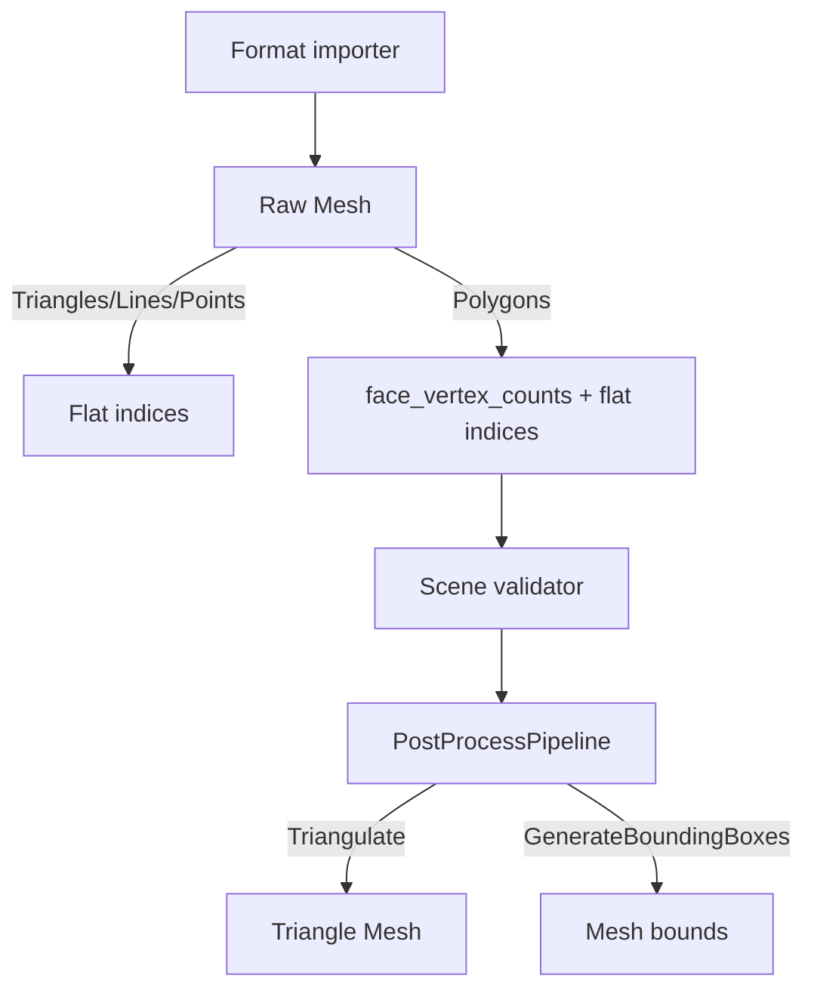

# Mesh Topology and Triangulation - Plan

## Goal Capsule

| Field | Value |
| --- | --- |
| Objective | Extend Baozi's core mesh IR so raw import can preserve polygon face boundaries, then implement reusable triangulation and bounding-box postprocess passes. |
| Authority | ADR 0013, ADR 0015, `docs/model/scene-ir.md`, and the roadmap's OBJ-before-PLY/glTF dependency chain. |
| Execution profile | Break unstable public APIs freely; keep the slice small enough to land directly on `main` and preserve existing STL behavior. |
| Stop condition | Stop if this requires implementing OBJ parsing, adding a third-party triangulation dependency, or changing material/animation contracts. |

## Product Contract

### Problem

`Mesh` currently has `PrimitiveTopology::Polygons`, but only a flat `indices: Vec<u32>` and no face
boundary data. The validator therefore rejects polygon topology with "lacks face range data".

This blocks the next roadmap milestone. OBJ needs to preserve quads and N-gons before requested
triangulation, and PLY/glTF work should not inherit a triangle-only assumption.

### Requirements

- R1. Triangle, line, and point meshes keep their current flat-index behavior.
- R2. Polygon meshes can represent each face's vertex count without format-specific public types.
- R3. Validation rejects malformed face counts, undersized polygon faces, count/index mismatches, and out-of-range indices.
- R4. Scene snapshots expose face counts so raw polygon output is reviewable.
- R5. `PostProcessStep::Triangulate` converts polygons to triangle-list indices using deterministic fan triangulation.
- R6. `PostProcessStep::GenerateBoundingBoxes` fills missing mesh bounds from positions without overwriting existing valid bounds.
- R7. Existing STL importer output, facade tests, WASM checks, and fuzz smoke remain valid.

### Non-Goals

- No OBJ/MTL parser in this slice.
- No constrained Delaunay triangulation, ear clipping, hole support, or polygon self-intersection validation.
- No new public renderer interleaving helpers.
- No dependency on `lyon`, `earcutr`, `parry`, or geometry crates.

## Technical Design

### Data Flow



### Proposed Representation

Add `face_vertex_counts: Vec<u32>` to `Mesh`.

Semantics:

- Empty `face_vertex_counts` means fixed-width topology:
  - `Points`: one index or implicit vertex per point.
  - `Lines`: two elements per segment.
  - `Triangles`: three elements per triangle.
- Non-empty `face_vertex_counts` is only valid for `PrimitiveTopology::Polygons`.
- For polygon meshes, the sum of `face_vertex_counts` must match the element count:
  - `indices.len()` when indexed.
  - `positions.len()` when non-indexed.
- Each polygon face must have at least three vertices.
- Triangulation emits a triangle list with empty `face_vertex_counts`.

This is intentionally narrower than a full `MeshPrimitive` list, but it matches the immediate OBJ
blocking issue and leaves a clean migration path to mesh-owned primitives later.

## Alternatives Considered

### Option A: Keep rejecting polygons until OBJ parser work

Pros:

- Smallest immediate code change.
- STL remains the only real format.

Cons:

- OBJ implementation would be forced to make the topology decision under parser pressure.
- Parser tests would mix OBJ remapping bugs with core IR design bugs.

Decision: rejected.

### Option B: Add `face_vertex_counts: Vec<u32>` now

Pros:

- Solves the polygon preservation gap with one simple SoA-compatible stream.
- Keeps fixed-width topologies cheap and unchanged.
- Easy to validate and snapshot.

Cons:

- Does not model multiple material/topology primitives inside one mesh.
- Future primitive descriptors may supersede it.

Decision: chosen for this slice.

### Option C: Replace `Mesh` with `Vec<MeshPrimitive>`

Pros:

- More general for glTF-style multi-primitive meshes and per-primitive material bindings.
- Matches ADR 0015's longer-term direction.

Cons:

- Larger API churn before any parser needs multi-primitive meshes.
- More validation, snapshot, and facade churn now.

Decision: deferred until a real format proves the need.

## Risks and Mitigations

| Risk | Severity | Likelihood | Mitigation |
| --- | --- | --- | --- |
| Fan triangulation is mistaken for robust polygon triangulation | Medium | Medium | Document it as deterministic simple-face triangulation only. |
| Existing STL snapshots churn unnecessarily | Low | Medium | Keep `face_vertex_counts` empty for triangle STL meshes. |
| Validator becomes too permissive for polygons | High | Medium | Add invalid-count, undersized-face, and index mismatch tests. |
| Future mesh primitives conflict with this field | Medium | Low | Keep field semantics narrow and documented as per-mesh face boundaries. |

## Implementation Units

### U1. Add Mesh face boundary data

- Add `Mesh::face_vertex_counts`.
- Update defaults, validation, snapshots, docs, and focused tests.
- Keep existing triangle STL output semantically unchanged.

### U2. Implement bounding-box postprocess

- Implement `GenerateBoundingBoxes` in `PostProcessPipeline::run`.
- Fill `bounds` only when missing.
- Reuse finite-position validation assumptions; return `InvalidScene` for empty meshes through validator.

### U3. Implement polygon triangulation postprocess

- Implement `Triangulate` for polygon meshes using fan triangulation.
- Preserve material, attributes, metadata, positions, normals, tangents, texcoords, colors, and bounds.
- Clear `face_vertex_counts` and set `topology = Triangles`.
- Leave non-polygon meshes unchanged.

### U4. Update documentation

- Update ADR 0015 and `docs/model/scene-ir.md` with current field semantics.
- Add a short note to roadmap Milestone 2 that core topology support is now ready for OBJ.

### U5. Verify, commit, and push `main`

- Run local targeted and workspace gates.
- Commit with Conventional Commits.
- Push `main` and wait for GitHub Actions CI.

## Verification Contract

Local gates:

```powershell
cargo fmt --all -- --check
cargo check --workspace --all-targets
cargo clippy --workspace --all-targets -- -D warnings
cargo nextest run --workspace
cargo test --doc --workspace --all-features
cargo check -p baozi --target wasm32-unknown-unknown --no-default-features --features format-stl
cargo deny check
```

Remote gate:

- GitHub Actions `CI` passes on `main` after push.

## Success Metrics

| Metric | Target | Measurement |
| --- | --- | --- |
| Polygon expressiveness | A quad or N-gon can validate as raw polygon topology | core validation tests |
| Triangulation determinism | Same polygon mesh produces stable triangle indices | postprocess tests |
| STL compatibility | Existing STL tests and snapshots still pass | nextest |
| Docs alignment | ADR 0015 and scene IR describe implemented semantics | doc review |
| CI health | main CI passes after direct push | GitHub Actions |
