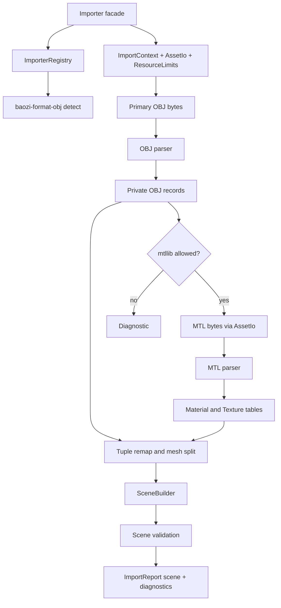

# OBJ MTL Importer - Plan

## Goal Capsule

| Field | Value |
| --- | --- |
| Objective | Replace the OBJ shell with a Baozi-owned OBJ/MTL importer that handles common static geometry, MTL sidecars, texture URI references, diagnostics, resource limits, fuzzing, docs, and WASM-safe facade paths. |
| Authority | ADR 0010, ADR 0012, ADR 0013, ADR 0015, ADR 0018, ADR 0019, `docs/roadmap.md`, and the existing STL importer pattern. |
| Execution profile | Break public APIs freely before release; commit logical slices on `main`; keep Assimp as behavior reference only and do not copy code, comments, macros, or fixtures. |
| Stop condition | Stop only for a scope change that requires replacing the scene IR, copying BSD-licensed implementation material, or adding a parser generator as a public dependency. |
| Tail ownership | The executor owns local verification, code review, commits, push to `main`, and CI follow-up. |

---

## Product Contract

### Problem

`baozi-format-obj` is currently a registered shell that reports planned capabilities but always returns `UnsupportedFormat`.
This blocks Milestone 2 because OBJ is the first format that exercises separate source indices, polygon preservation, MTL sidecars, texture URI references, and non-fatal material diagnostics.

### Requirements

**Format detection and facade**

- R1. The default facade can detect and load `.obj` assets through `Importer::read_bytes`, `read_asset`, and `read_path` without relying on `std::fs` inside the format crate.
- R2. OBJ detection uses extension and lightweight content probes, returns stable `ReadConfidence`, and rewinds the input stream.
- R3. `format_info()` reports implemented experimental OBJ capabilities honestly.

**Geometry**

- R4. OBJ parsing supports comments, blank lines, UTF-8 BOM, CRLF, `v`, `vt`, `vn`, `f`, `o`, `g`, `s`, `mtllib`, and `usemtl`.
- R5. Face tokens support `v`, `v/vt`, `v//vn`, and `v/vt/vn`, including valid negative relative indices.
- R6. OBJ separate position, texcoord, and normal indices remap into Baozi's vertex-indexed SoA mesh streams without mismatching attributes.
- R7. Raw import preserves quads and N-gons as `PrimitiveTopology::Polygons` with `face_vertex_counts`; all-triangle mesh segments may use `PrimitiveTopology::Triangles`.
- R8. Mesh segments split when the current material, object/group context, or topology requirements would violate Baozi's one-material-per-mesh contract.

**Materials and sidecars**

- R9. `mtllib` sidecars resolve through `ImportContext` and `AssetIo`, obey `ExternalReferencePolicy`, and are never opened with direct filesystem APIs.
- R10. MTL maps `newmtl`, `Kd`, `d`, `Tr`, `Ke`, `Ns`, `Ni`, `illum`, and `map_Kd` into Baozi-owned material and texture fields where the current IR can express them.
- R11. Texture map statements record external texture URIs and material texture slots without decoding image bytes.
- R12. Missing or denied MTL files, unknown material references, unsupported OBJ/MTL statements, and unsupported texture map options produce bounded diagnostics while geometry continues when safe.

**Safety, testing, and release gates**

- R13. Primary and sidecar reads enforce `ResourceLimits`, including primary bytes, sidecar bytes, line bytes, token bytes, string bytes, vertices, faces, meshes, and diagnostic caps.
- R14. Malformed geometry and unsafe references fail with structured `BaoziError` instead of panics.
- R15. The importer compiles under no-default and WASM memory-IO configurations.
- R16. OBJ has focused parser tests, facade tests, fuzz target, corpus seeds, format docs, support matrix updates, and engineering memory entries before the work is considered done.

### Acceptance Examples

- AE1. Given a hand-authored triangle OBJ with `v` and `f 1 2 3`, `Importer::new().read_bytes("mesh.obj", bytes)` returns `format.id == "obj"`, one mesh, one child node, three positions, and no diagnostics.
- AE2. Given a quad OBJ, raw import returns a polygon mesh with `face_vertex_counts=[4]`; applying `PostProcessStep::Triangulate` returns a triangle mesh with six triangle indices.
- AE3. Given `f 1/1/1 2/2/1 3/3/1` with separate `v`, `vt`, and `vn` streams, the mesh has aligned positions, texcoords, normals, and indices that reference unified remapped vertices.
- AE4. Given `mtllib materials/cube.mtl` and `usemtl red`, `read_asset` with `MemoryAssetIo` binds the mesh to a material named `red`, maps `Kd` to base color, and resolves `map_Kd` as an external texture URI relative to the MTL file.
- AE5. Given `mtllib missing.mtl`, geometry still imports and the report contains an `obj.mtl_missing` or equivalent warning diagnostic.

### Scope Boundaries

- First slice handles static face meshes only; OBJ points, polylines, free-form curves, surfaces, parameter spaces, bevel/interp directives, and exporter behavior are warnings or follow-up work.
- The importer does not triangulate during raw import; renderer-ready triangles remain a post-process concern.
- The importer does not normalize coordinates, infer units, flip winding, generate normals, decode images, or fetch remote assets.
- The importer does not claim full MTL/PBR extension coverage; unsupported material properties are diagnosed or stored only where Baozi's current IR has a safe extension field.
- The work must not copy Assimp source code, comments, macros, fixture files, or test assets.

---

## Planning Contract

### Key Technical Decisions

- KTD1. Use a Baozi-owned hand-written line parser for this OBJ/MTL slice.
  ADR 0018 allows tooling such as `winnow` or `nom`, but early OBJ/MTL is line/token text where a small scanner makes resource limits, spans, diagnostics, and WASM behavior explicit.
- KTD2. Parse into private format-owned records, then immediately assemble Baozi `Scene`.
  No parser AST type becomes public, and every parse error maps to `BaoziError` or `Diagnostic`.
- KTD3. Remap face vertex tuples by `(position, texcoord, normal)`.
  Baozi mesh channels are vertex-indexed, while OBJ streams are separately indexed; every unique tuple becomes one Baozi vertex and one unified index.
- KTD4. Split mesh builders before violating one-material-per-mesh.
  A `usemtl` change after faces flushes the current mesh; object/group/smoothing names are preserved through mesh or node metadata rather than requiring a new public primitive model.
- KTD5. Treat MTL as optional enrichment.
  Denied, missing, oversized, malformed, or partially unsupported MTL data emits diagnostics and does not discard valid OBJ geometry unless the main OBJ scene becomes structurally unsafe.
- KTD6. Add the missing core texture/material affordances only as far as OBJ needs.
  `SceneBuilder::add_texture` is required for valid `TextureId` creation, and `Material` needs metadata to preserve MTL-only values such as `illum`, `Ns`, `Ni`, `Ka`, and `Ks` without inventing unstable typed fields.
- KTD7. Keep texture values as URI references.
  `map_Kd` creates `TextureSource::External` and a material slot; image decoding and map-option semantics remain outside this slice.
- KTD8. Make fuzz and WASM first-class gates.
  OBJ is the first sidecar-aware text parser, so no-default, `wasm32-unknown-unknown`, fuzz check, fuzz smoke, and scheduled fuzz must include it.

### High-Level Technical Design



### Output Structure

```text
crates/baozi-format-obj/
├── src/
│   ├── lib.rs
│   ├── detect.rs
│   ├── parser.rs
│   ├── obj.rs
│   ├── mtl.rs
│   └── mesh_builder.rs
└── tests/
    ├── common/mod.rs
    ├── detect.rs
    ├── geometry.rs
    ├── materials.rs
    ├── malformed.rs
    └── limits.rs
```

### Assumptions

- OBJ and MTL files are UTF-8 for this experimental slice.
- Texture paths in MTL are resolved relative to the MTL file; MTL paths in OBJ are resolved relative to the OBJ file.
- `ImportOptions::memory()` keeps external references denied; tests that intentionally load sidecars use `read_asset` with an explicit sidecar-capable IO policy.
- Snapshot coverage remains useful for scene shape, but UVs, texture URI details, and texture slots need direct field assertions unless `SceneSnapshot` is expanded in U1.

### Risks and Mitigations

| Risk | Severity | Likelihood | Mitigation |
| --- | --- | --- | --- |
| Tuple remap mismatches UVs or normals | High | Medium | Add focused tests where one position appears with multiple UV/normal tuples. |
| Missing MTL becomes a fatal error and harms real-world loading | Medium | High | Treat MTL as optional enrichment and snapshot warnings. |
| Texture path resolution uses OBJ base instead of MTL base | Medium | Medium | Add subdirectory sidecar tests and direct texture URI assertions. |
| Resource limits are checked after large allocation | High | Medium | Apply limits during line/token scans and before vector growth. |
| Snapshot omits fields needed by OBJ review | Medium | Medium | Expand snapshot in U1 or use direct assertions for UV/texture slots. |
| Assimp reference leaks licensed implementation material | High | Low | Use only behavior summaries, write original fixtures, and document clean-room boundary. |
| CI fuzz runtime grows too much | Medium | Medium | Keep PR smoke at 256 runs and longer campaigns in scheduled matrix. |

### Sources and Research

- `crates/baozi-format-stl/src/parser.rs`, `ascii.rs`, `binary.rs`, and tests define the local importer style to follow.
- `crates/baozi-import/src/context.rs`, `format.rs`, and `registry.rs` define importer, detection, diagnostic, and option contracts.
- `crates/baozi-io/src/path.rs`, `memory.rs`, and `fs.rs` define sidecar-safe logical paths and memory/filesystem IO.
- `docs/model/scene-ir.md`, `docs/model/coordinate-and-render-conventions.md`, and `docs/roadmap.md` define raw import and Milestone 2 expectations.
- `docs/contributing/format-onboarding.md`, `docs/testing/snapshot-and-fixture-policy.md`, and `docs/contributing/fuzzing.md` define fixture, fuzz, and parser evidence policy.
- `repo-ref/assimp` was used only as a clean-room behavior checklist for OBJ/MTL edge cases and license boundaries.

---

## Implementation Units

### U1. Core material, texture, and snapshot support

- **Goal:** Add the minimal core affordances needed for MTL texture slots and source-preserving material metadata.
- **Requirements:** R10, R11, R16.
- **Dependencies:** none.
- **Files:** `crates/baozi-core/src/material.rs`, `crates/baozi-core/src/scene.rs`, `crates/baozi-core/src/validation.rs`, `crates/baozi-core/tests/scene_validation.rs`, `crates/baozi-test-support/src/snapshot.rs`, `crates/baozi-test-support/tests/snapshot.rs`.
- **Approach:** Add `SceneBuilder::add_texture`; add metadata to `Material`; validate material metadata and texture references; expand snapshots only where it materially improves OBJ review, especially texcoords, textures, and material texture slots.
- **Execution note:** Start with failing core/snapshot tests before changing the core IR.
- **Patterns to follow:** Existing `SceneBuilder::add_material`, texture validation in `validation.rs`, and deterministic snapshot ordering in `baozi-test-support`.
- **Test scenarios:** A material with a valid texture slot and texture validates; an out-of-range texture slot fails validation; material metadata keys appear deterministically; snapshots expose enough texture or texcoord data to support OBJ material assertions without relying on `Debug`.
- **Verification:** Core tests and snapshot tests pass, and existing STL snapshots remain semantically unchanged.

### U2. OBJ detection and parser scaffolding

- **Goal:** Make `baozi-format-obj` selectable by the registry and establish a private parser boundary.
- **Requirements:** R1, R2, R3, R4, R13, R14.
- **Dependencies:** none.
- **Files:** `crates/baozi-format-obj/src/lib.rs`, `crates/baozi-format-obj/src/detect.rs`, `crates/baozi-format-obj/src/parser.rs`, `crates/baozi-format-obj/src/obj.rs`, `crates/baozi-format-obj/tests/common/mod.rs`, `crates/baozi-format-obj/tests/detect.rs`, `crates/baozi-format-obj/tests/malformed.rs`.
- **Approach:** Implement `can_read` with extension and first-token probes; read primary bytes under `max_primary_asset_bytes`; parse UTF-8 lines with BOM, CRLF, comment, line, token, and string limits; keep parsed records crate-private.
- **Execution note:** Use detection and malformed tests as failing proof before implementing the parser.
- **Patterns to follow:** STL `detect.rs`, STL `ascii.rs` tokenization, and `BaoziError::parse` source locations.
- **Test scenarios:** `.obj` extension returns at least `Maybe`; `v`/`f` content returns `Likely`; random text returns `No`; stream position is rewound; non-UTF-8, invalid tokens, oversized line, oversized token, and empty geometry return structured errors or bounded diagnostics without panic.
- **Verification:** `cargo nextest run -p baozi-format-obj detect malformed` passes after implementation.

### U3. OBJ geometry assembly and tuple remap

- **Goal:** Convert common OBJ face geometry into validated Baozi meshes with correct SoA channels and topology.
- **Requirements:** R4, R5, R6, R7, R8, R13, R14.
- **Dependencies:** U1, U2.
- **Files:** `crates/baozi-format-obj/src/obj.rs`, `crates/baozi-format-obj/src/mesh_builder.rs`, `crates/baozi-format-obj/src/parser.rs`, `crates/baozi-format-obj/tests/geometry.rs`, `crates/baozi-format-obj/tests/limits.rs`.
- **Approach:** Resolve OBJ 1-based and negative indices, reject index zero, build unique `(v, vt, vn)` tuple vertices, allocate with checked capacities, split mesh builders on material/object/group boundaries, set `PrimitiveTopology::Triangles` for all-triangle segments and `PrimitiveTopology::Polygons` with full `face_vertex_counts` for mixed or polygonal segments.
- **Execution note:** Add failing tests for quad preservation, negative indices, and separate-index remap before production changes.
- **Patterns to follow:** `SceneBuilder` validation flow, `Mesh::face_vertex_counts` semantics, and postprocess triangulation assumptions.
- **Test scenarios:** Simple triangle imports; quad imports as polygon with `face_vertex_counts=[4]`; mixed triangle/quad segment imports as polygon with `[3,4]`; `v`, `v/vt`, `v//vn`, and `v/vt/vn` all parse; negative relative indices resolve; `0`, out-of-range, and fewer-than-three face vertices fail; repeated position with different UV produces distinct vertices; vertex and face limits fail before unsafe growth.
- **Verification:** OBJ geometry tests pass and `validate_scene` accepts every successful scene.

### U4. MTL sidecar loading and material mapping

- **Goal:** Resolve MTL files through `AssetIo`, map common legacy material fields, and attach texture URI slots.
- **Requirements:** R9, R10, R11, R12, R13.
- **Dependencies:** U1, U2, U3.
- **Files:** `crates/baozi-format-obj/src/mtl.rs`, `crates/baozi-format-obj/src/parser.rs`, `crates/baozi-format-obj/src/mesh_builder.rs`, `crates/baozi-format-obj/tests/materials.rs`, `crates/baozi-format-obj/tests/limits.rs`.
- **Approach:** Gate `mtllib` by `ExternalReferencePolicy`; resolve MTL relative to the OBJ file; read sidecar bytes under `max_sidecar_asset_bytes`; parse `newmtl`, `Kd`, `d`, `Tr`, `Ke`, `Ns`, `Ni`, `illum`, and `map_Kd`; resolve texture paths relative to the MTL file; skip supported `map_Kd` options enough to find the final texture path; create placeholder materials for unknown `usemtl` references with diagnostics.
- **Execution note:** Start from failing sidecar and missing-sidecar tests because this is the first real exercise of `AssetIo` sidecars.
- **Patterns to follow:** `AssetPath::join`, `MemoryAssetIo`, `FileSystemAssetIo`, `Diagnostic::warning`, and material defaults.
- **Test scenarios:** Memory sidecar loads and binds material; subdirectory MTL resolves texture URI relative to MTL; `Kd` maps base color; `d` and `Tr` map alpha and blend mode; `Ke` maps emissive; `Ns`, `Ni`, `illum`, `Ka`, and `Ks` are preserved as metadata or diagnosed according to available fields; missing MTL warns and returns geometry; unknown `usemtl` creates a placeholder or unbound mesh with warning; sidecar byte limit is enforced.
- **Verification:** Material tests directly assert `scene.materials`, `scene.textures`, texture slots, diagnostics, and paths.

### U5. Diagnostics, strictness, and unsupported OBJ constructs

- **Goal:** Make recoverable OBJ/MTL loss visible without making common partial assets fail unnecessarily.
- **Requirements:** R12, R13, R14.
- **Dependencies:** U2, U3, U4.
- **Files:** `crates/baozi-format-obj/src/obj.rs`, `crates/baozi-format-obj/src/mtl.rs`, `crates/baozi-format-obj/src/parser.rs`, `crates/baozi-format-obj/tests/malformed.rs`, `crates/baozi-format-obj/tests/limits.rs`.
- **Approach:** Define crate-local diagnostic codes for ignored statements, missing sidecars, denied external references, unknown materials, unsupported texture options, and skipped point/line/free-form records; keep malformed primary geometry fatal; cap diagnostics through `ImportContext::push_diagnostic`.
- **Execution note:** Add diagnostic snapshots or direct diagnostic assertions for warnings before implementing broad ignore behavior.
- **Patterns to follow:** STL empty-solid warning behavior and `SceneSnapshot` diagnostic sorting.
- **Test scenarios:** Unknown OBJ statement warns once per relevant line or bounded group; unsupported `curv`/`surf` warns and skips; unsupported `p`/`l` warns and skips; malformed `v`, `vt`, `vn`, and `f` remain fatal; diagnostic cap truncates warning floods.
- **Verification:** Malformed and limits tests prove no parser panic and no unbounded diagnostic growth.

### U6. Public facade, postprocess, and WASM coverage

- **Goal:** Prove OBJ works through the public facade and remains compatible with postprocess and WASM feature gates.
- **Requirements:** R1, R7, R15, AE1, AE2, AE3.
- **Dependencies:** U3, U4, U5.
- **Files:** `crates/baozi/tests/obj_facade.rs`, `crates/baozi-postprocess/src/pipeline.rs`, `crates/baozi-postprocess/src/preset.rs`, `crates/baozi-format-obj/tests/geometry.rs`, `.github/workflows/ci.yml`.
- **Approach:** Add facade tests for `read_bytes` and `read_asset`; add a raw quad plus `PostProcessStep::Triangulate` assertion; expand CI's WASM memory path to include `format-obj`; keep `native-fs` gated.
- **Execution note:** Use public API tests as the integration proof before considering the parser complete.
- **Patterns to follow:** `crates/baozi/tests/stl_facade.rs`, existing postprocess tests, and CI's current WASM checks.
- **Test scenarios:** Facade loads triangle OBJ by bytes; facade detects OBJ-like content with non-`.obj` extension when confidence is sufficient; memory sidecar route returns material diagnostics; raw quad triangulates through the existing pipeline; no-default facade still compiles; WASM `format-obj` check passes.
- **Verification:** Facade tests and target checks pass locally.

### U7. Fuzz targets, corpus, and CI matrix

- **Goal:** Add parser fuzz evidence for OBJ and keep sanitizer authority on Linux CI.
- **Requirements:** R13, R14, R16.
- **Dependencies:** U2, U3, U4, U5, U6.
- **Files:** `fuzz/Cargo.toml`, `fuzz/fuzz_targets/obj_import.rs`, `fuzz/corpus/obj_import/*`, `.github/workflows/ci.yml`, `.github/workflows/fuzz.yml`, `docs/contributing/fuzzing.md`.
- **Approach:** Add an `obj_import` target that exercises public facade import; include seed corpus for triangle, quad, negative indices, missing MTL, and malformed face; use a simple NUL split or equivalent memory bundle only if it materially improves sidecar coverage without making fuzz setup brittle; convert CI and scheduled fuzz to a target matrix for STL and OBJ.
- **Execution note:** Keep PR fuzz smoke bounded and rely on scheduled Linux fuzz for longer sanitizer evidence.
- **Patterns to follow:** Existing `stl_import` fuzz target, CI fuzz smoke, and scheduled fuzz artifact upload.
- **Test scenarios:** `cargo fuzz check obj_import` compiles; smoke run does not crash on seeds; scheduled matrix uploads artifacts by target on failure; Windows ASan caveats remain documented as toolchain evidence.
- **Verification:** Fuzz check and smoke run pass locally when the pinned nightly toolchain is available; CI matrix syntax passes actionlint.

### U8. Format documentation, support matrix, memory, and cleanup

- **Goal:** Make support claims accurate and leave durable continuation state.
- **Requirements:** R3, R16.
- **Dependencies:** U1, U2, U3, U4, U5, U6, U7.
- **Files:** `docs/formats/obj.md`, `docs/formats/support-matrix.md`, `docs/roadmap.md`, `docs/model/scene-ir.md`, `docs/knowledge/engineering/registry/*`, `docs/knowledge/engineering/logs/2026-07/*`, `docs/knowledge/engineering/subagents/*`, `docs/knowledge/engineering/verification/*`.
- **Approach:** Create an OBJ format page modeled on `docs/formats/stl.md`; update support matrix from Planned to Experimental with exact capability statuses; document unsupported OBJ/MTL constructs and clean-room Assimp boundary; record subagent findings, progress, verification, commits, CI, and final handoff in engineering memory.
- **Execution note:** Keep execution state out of the plan body; use engineering wiki memory for progress and verification.
- **Patterns to follow:** STL format page and existing engineering memory registry entries.
- **Test scenarios:** Documentation builds with `RUSTDOCFLAGS=-D warnings`; support matrix claims match `format_info()`; no doc claims full OBJ/MTL support beyond implemented behavior.
- **Verification:** Docs, local gates, memory validation, and CI all pass.

---

## Verification Contract

| Gate | Applies to | Done signal |
| --- | --- | --- |
| `cargo fmt --all -- --check` | all units | Formatting is stable. |
| `cargo check --workspace --all-targets` | all units | Workspace compiles on host. |
| `cargo clippy --workspace --all-targets -- -D warnings` | all Rust units | No lint regressions. |
| `cargo nextest run --workspace` | all feature units | Core, facade, OBJ, STL, postprocess, and test-support tests pass. |
| `cargo test --doc --workspace --all-features` | docs/API examples | Rustdoc examples compile. |
| `cargo doc --workspace --all-features --no-deps` with `RUSTDOCFLAGS=-D warnings` | docs/API surface | Public docs build without warnings. |
| `cargo check -p baozi --no-default-features` | feature hygiene | Facade remains usable without default formats. |
| `cargo check -p baozi --features all-formats,native-fs` | feature hygiene | All format features and native FS compile together. |
| `cargo check -p baozi --target wasm32-unknown-unknown --no-default-features --features format-obj` | WASM | OBJ memory path is browser-WASM compatible. |
| `cargo check -p baozi --target wasm32-wasip1 --no-default-features --features format-obj,native-fs` | WASI | Native FS path remains target-compatible where supported. |
| `cargo deny check` | dependency/license policy | Dependency licenses remain compatible with `MIT OR Apache-2.0`. |
| `cargo +nightly-2026-05-27 fuzz check obj_import` | fuzz target | OBJ fuzz target compiles. |
| `cargo +nightly-2026-05-27 fuzz run obj_import -- -runs=256` | fuzz smoke | Local or CI sanitizer smoke completes, or Windows toolchain failure is recorded as environment evidence. |
| GitHub Actions `CI` on `main` | final landing | Workflow lint, Rust checks, WASM checks, dependency policy, and fuzz smoke pass. |

---

## Definition of Done

- OBJ is no longer a shell: `baozi-format-obj` detects and imports common static OBJ face meshes.
- Raw OBJ import preserves polygons and can be triangulated by the existing postprocess pipeline.
- MTL sidecars load through `AssetIo`, respect external-reference policy, and map common material and texture URI data without image decoding.
- Recoverable sidecar/material/unsupported-feature issues surface as bounded diagnostics; structurally unsafe geometry returns typed errors.
- Resource-limit tests cover primary file, sidecar file, line, token, string, vertex, face, mesh, and diagnostic limits.
- Public facade tests cover bytes, memory sidecars, diagnostics, repeated importer use, and format reporting.
- OBJ fuzz target, seed corpus, CI smoke, scheduled fuzz matrix, and fuzzing docs are updated.
- WASM and no-default checks include the OBJ memory path.
- Format documentation and support matrix match implemented capabilities.
- Assimp remains a clean-room behavior reference only; no copied source, comments, macros, or fixtures are introduced.
- All local verification gates pass or any platform-specific sanitizer limitation is recorded as environment evidence.
- Work is committed in logical Conventional Commits, pushed to `main`, and the final `main` CI run is green.
- Experimental or abandoned code paths from failed attempts are removed before final completion.
