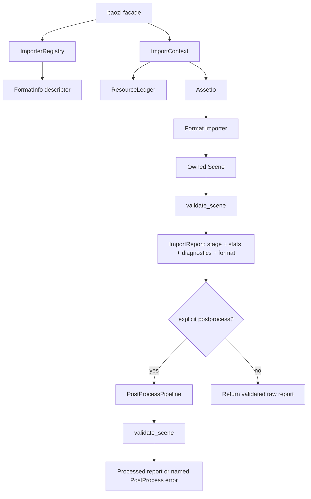

# Import Governance Foundation Refactor - Plan

## Goal Capsule

| Field | Value |
| --- | --- |
| Objective | Harden Baozi's import foundation before more formats land by收口 public API, import lifecycle, report evidence, resource accounting, registry descriptors, scene invariants, postprocess behavior, IR extensibility, release governance, defaults, docs, examples, benchmarks, and tests. |
| Authority | User authorization to refactor fearlessly, ADR 0004, ADR 0007, ADR 0010, ADR 0011, ADR 0012, ADR 0013, ADR 0014, ADR 0016, ADR 0018, ADR 0019, current OBJ/STL implementation, and `docs/formats/support-matrix.md`. |
| Execution profile | Break current APIs freely because Baozi has not shipped a stable contract yet; after this refactor, maintain a documented stable/experimental/internal boundary even if the crate stays on long-running 0.x minor releases. Delete stale scaffolding and duplicate docs, prefer Rust-owned contracts over compatibility shims, commit logical slices on `main`, and keep Assimp as a behavior reference only. |
| Stop condition | Stop only if the change would require copying third-party implementation material, replacing the owned IR wholesale, introducing native/FFI dependencies into default builds, or contradicting the clean-room licensing boundary. |
| Tail ownership | The executor owns implementation, docs, engineering memory, local gates, commits, push to `main`, and CI follow-up. |

---

## Product Contract

### Problem

Baozi has the right high-level direction, but several governance boundaries are still loose enough to cause future rewrites.
The dangerous cases are silent capability claims: default features can expose parser shells, presets can advertise unimplemented steps, support docs can drift from `FormatInfo`, and resource limits are local checks rather than a per-import ledger.
These are foundation problems, so the correct fix is allowed to break APIs and remove misleading code before users depend on it.
The project should not rely on a future `1.0` moment as the only stabilization boundary; a Rust crate can live on 0.x minor releases for a long time, so the stable/experimental/internal split must exist in the code now.

### Requirements

**Import lifecycle and reports**

- R0. Public construction surfaces for `ImportOptions`, `ImportReport`, `FormatInfo`, `ImportContext`, and importer registration are hardened with constructors, accessors, `#[non_exhaustive]`, or internal-only APIs so future additive fields do not force churn.
- R1. The facade has one documented lifecycle: detect format, read through `AssetIo`, parse to owned `Scene`, validate imported output, return `ImportReport`, and run postprocess only through explicit postprocess APIs.
- R2. `ImportReport` carries import-stage evidence rather than only `scene`, `diagnostics`, and `format`.
- R3. Facade helpers that run postprocess must make that stage visible in API naming and must not change raw import semantics.
- R4. Fatal structural invalidity returns `BaoziError`; recoverable source loss remains bounded diagnostics.

**Resource governance**

- R5. `ImportContext` owns a per-import resource ledger and is the only supported resource/security entry point for primary assets, sidecars, dependency resolution, diagnostic accounting, and generated scene counts.
- R6. OBJ and STL read paths use the ledger instead of open-coded primary/sidecar accounting.
- R7. Aggregate budget failures are deterministic and happen before large allocation when counts or byte sizes are knowable.
- R8. Future archive, data URI, decompression, and image accounting has reserved ledger fields and tests even if no importer consumes them yet.

**Registry, descriptor, and format truth source**

- R9. `FormatInfo` is the code-side truth source for maturity, identifiers, extensions, media/type/container shape, sidecar policy, limitations, security posture, docs links, and capability claims.
- R10. The registry rejects duplicate format IDs by default or reports a deterministic registration error before detection ambiguity reaches users.
- R11. `docs/formats/support-matrix.md` is checked against `FormatInfo` in tests until it can be generated.
- R12. Default facade features include only implemented, CI-gated, low-surprise formats; planned parser shells stay opt-in.
- R12a. `FormatImporter` is not treated as a stable third-party extension contract; facade re-exports are removed or marked internal until real importer implementations prove the shape.

**Postprocess contracts**

- R13. Requested `PostProcessStep`s never silently no-op; unimplemented known steps return a named `PostProcess` error.
- R14. Presets include only implemented steps while documenting their long-term intent separately.
- R15. Postprocess tests assert canonical ordering, implemented-step coverage, unsupported-step errors, and preset honesty.

**IR extension model**

- R15a. `Scene` is classified as an owned editable IR package whose validity is enforced at import, postprocess, serialization/cache, and optional user validation boundaries; it is not an immutable proof object.
- R15b. ID newtypes are opaque and expose accessors instead of public tuple fields.
- R16. Materials keep typed common fields while reserving namespaced metadata for source-specific properties.
- R17. Mesh attributes have a clear path to custom typed streams without forcing PLY/glTF to reshape the whole IR later.
- R18. Texture slots retain URI/buffer references and sampler/UV-transform extension points without mandatory image decoding.
- R18a. Animation, camera, light, skin, morph, sampler, and custom-attribute placeholders either receive explicit semantics or are clearly documented as experimental IR surface.
- R18b. Every new IR field must be covered by validator, snapshot, malformed fixture or focused test, and fuzz entry where the field is parser-reachable.

**IO and diagnostics**

- R18c. The IO contract states whether importers require seekable input or can use streaming input; any future streaming API must not bypass `ImportContext`.
- R18d. `DiagnosticOptions::strict` either gets behavior or is demoted/renamed so it does not mislead users.
- R18e. Convenience APIs that return only `Scene` are documented as dropping diagnostics, and report-returning APIs remain the primary path.

**Docs, memory, and cleanup**

- R19. ADRs capture import lifecycle/report, registry/descriptor governance, resource ledger accounting, material/custom attribute extension, and any changes to option/postprocess boundaries.
- R20. Duplicate or stale plan artifacts are deleted once superseded.
- R21. Engineering wiki memory records this governance refactor so future agents do not rediscover the same boundaries.
- R22. The final state passes local Rust gates, WASM checks, docs checks, and CI on `main`.

**Release, performance, and ecosystem governance**

- R23. Release governance exists before publishing: crate publish policy is explicit, root `CHANGELOG.md` exists, and root `SECURITY.md` tells users how to report parser/security issues.
- R24. MSRV `1.95` is documented as a deliberate early-project policy, not an accidental dependency side effect.
- R25. Empty facade features such as `parallel`, `simd`, and `async` are removed until they have behavior, dependencies, and tests.
- R26. `BaoziError` has machine-readable kind information sufficient to distinguish IO, parse, unsupported, ambiguous, invalid scene, postprocess, feature unsupported, and limit errors.
- R27. Dependency policy is tightened before heavy dependencies enter, including multi-version and wildcard review expectations.
- R28. At least one runnable example anchors the facade API and diagnostics workflow.
- R29. A benchmark harness exists for parser/postprocess baselines even if thresholds are not yet enforced in CI.
- R30. ADR statuses are triaged so implemented constraints are accepted and speculative design remains proposed or deferred.

### Acceptance Examples

- AE1. Given a caller runs `Importer::new().read_bytes("mesh.obj", bytes)`, the report stage is raw imported plus facade-validated, and no postprocess convenience step has run.
- AE2. Given a caller requests `PostProcessStep::GenerateNormals` before it is implemented, the pipeline returns `BaoziError::PostProcess { step: "GenerateNormals", ... }` instead of returning unchanged scene data.
- AE3. Given `default-features = true`, the facade registers STL and OBJ only; PLY and glTF shells remain available through explicit `format-ply` or `format-gltf`.
- AE4. Given support matrix documentation claims STL diagnostics are supported, a test proves the STL `FormatInfo` contains the matching `Diagnostics: Supported` capability.
- AE5. Given OBJ opens an MTL sidecar and then skips it due to byte limits, the report ledger distinguishes primary bytes, sidecar bytes, open count, emitted diagnostics, and dropped diagnostics.
- AE6. Given diagnostic capacity is exhausted, `ImportContext::push_diagnostic` increments dropped count and does not allocate beyond `ResourceLimits::max_diagnostics`.
- AE7. Given two importers with the same format ID are registered into one registry, registration fails or reports a deterministic duplicate ID error instead of letting detection behavior depend on insertion order.
- AE8. Given external code receives `ImportReport`, it reads fields through accessors and cannot construct a stale report literal that omits future stats or provenance.
- AE9. Given external code receives `NodeId`, it can inspect `index()` but cannot access or pattern-match a public tuple field.
- AE10. Given a user runs an example with a missing MTL sidecar, the example prints the imported scene summary and warnings instead of hiding diagnostics.
- AE11. Given a CLI or service receives `BaoziError::LimitExceeded`, it can branch on a machine-readable error kind without parsing the display string.
- AE12. Given a user enables the facade's default features, there are no empty feature flags whose names imply unavailable async, SIMD, or parallel behavior.

### Scope Boundaries

- This plan may break current APIs and delete misleading scaffolding.
- This plan must leave behind a stable/experimental/internal policy that does not depend on a future `1.0` release.
- This plan does not implement full PLY, glTF, FBX, Collada, USD, or exporter support.
- This plan does not add native dependencies, dynamic plugins, or C ABI bindings.
- This plan does not decode image pixels; texture sources remain references or optional embedded buffers.
- This plan does not copy Assimp code, comments, fixtures, architecture macros, or C++ lifecycle patterns.
- This plan does not promise `no_std`; it preserves WASM byte-buffer paths and avoids unnecessary filesystem coupling.

---

## Planning Contract

### Key Technical Decisions

- KTD1. Make the facade lifecycle raw-by-default and postprocess-explicit.
  This preserves source inspection workflows and prevents renderer convenience from changing import semantics.
- KTD2. Put import evidence in `ImportReport` and aggregate counters in `ImportStats`.
  Reports are the user-visible proof of what happened, while diagnostics explain recoverable losses.
- KTD3. Add `ResourceLedger` to `baozi-import`, not to individual format crates.
  Format crates should debit the active import context; they should not each invent counters and limit wording.
- KTD4. Keep `ImportOptions` import-only for now.
  `baozi-import` must not depend on `baozi-postprocess`; facade-level postprocess helpers can compose import and pipeline without creating a crate cycle.
- KTD5. Treat `FormatInfo` as the single code anchor and support matrix as checked documentation.
  Generating the matrix can come later; immediate tests already stop code/docs drift.
- KTD6. Demote planned parser shells from defaults.
  Parser shells are useful architectural placeholders, but default builds should not imply practical support.
- KTD7. Encode unsupported postprocess steps as errors, not no-ops.
  A no-op is indistinguishable from successful processing to downstream engines.
- KTD8. Extend material and mesh metadata incrementally.
  Typed common fields stay ergonomic; namespaced extension data absorbs source-specific values until a stable typed field is justified.
- KTD9. Prefer direct safe Rust and `#![forbid(unsafe_code)]` across workspace crates.
  Future SIMD or bytemuck use requires a narrow ADR-backed exception rather than accidental unsafe leakage.
- KTD10. Harden public structs by default.
  Use private fields with constructors/accessors for report, option, context, and descriptor types; use `#[non_exhaustive]` where public field access remains intentional.
- KTD11. Do not pretend separate workspace format crates are a stable plugin API.
  Internal format crates may use `baozi-import` internals or hidden contracts, but the facade should not advertise third-party importer implementation until registry and descriptor shape stabilizes.
- KTD12. Treat `Scene` as editable data plus boundary validation.
  Full immutability would fight tool/editor workflows; the stronger invariant is that import/postprocess/cache boundaries validate and tests cover all IR fields.
- KTD13. Remove empty features instead of reserving them publicly.
  A feature flag is a contract; future async, SIMD, and parallel support should land with behavior, tests, and docs in the same change.
- KTD14. Keep MSRV high only because this is an early foundation project.
  `1.95` buys edition/tooling flexibility; the policy must be visible so engine/tooling users can decide whether Baozi fits their environments.
- KTD15. Add machine-readable error kinds without over-enumerating source-specific parse failures.
  Detailed diagnostics carry source-specific codes; `BaoziErrorKind` should classify handling strategy.
- KTD16. Add benches and examples as API/product anchors, not optimization work.
  Benchmarks establish regression visibility; examples prove the facade remains understandable to users outside this codebase.

### High-Level Technical Design

### Sequencing

1. First harden API surfaces: report/options/descriptors/context access, facade re-exports, ID opacity, and the stable/experimental/internal policy.
2. Then land honesty and cleanup: duplicate plan deletion, conservative default features, workspace `forbid(unsafe_code)`, support matrix corrections, and no silent postprocess no-ops.
3. Then reshape import evidence: `ImportStage`, `ImportStats`, `ResourceLedger`, facade validation, and API tests.
4. Then move OBJ/STL primary and sidecar byte accounting onto the ledger.
5. Then expand registry/descriptor shape and conflict behavior.
6. Then add IR extension points and validation/snapshot/fuzz gates that unblock PLY/glTF without forcing immediate parser work.
7. Then land release/security/changelog, MSRV, error-kind, empty-feature cleanup, dependency policy, examples, and benchmark skeletons.
8. Finish with ADR status triage, engineering memory, full verification, commits, push, and CI follow-up.

---

## Implementation Units

### U1. Public API Hardening and Stability Tiers

- **Goal:** Stop current public structs and facade re-exports from freezing immature contracts.
- **Requirements:** R0, R12a, AE8.
- **Files:** `crates/baozi-import/src/context.rs`, `crates/baozi-import/src/format.rs`, `crates/baozi-import/src/registry.rs`, `crates/baozi-import/src/lib.rs`, `crates/baozi/src/lib.rs`, `crates/baozi-format-*/src/lib.rs`, `crates/baozi/tests/importer_api.rs`, `docs/adr/0006-public-api-versioning-and-crate-stability-policy.md`, `docs/adr/0021-extension-registry-and-format-descriptor-governance.md`, `docs/adr/0024-public-api-hardening-and-stability-tiers.md`.
- **Approach:** Replace public report/descriptor/context literals with constructors and accessors, remove facade re-export of unstable importer implementation traits, mark unstable extension APIs as internal or experimental, and document compatibility expectations for long-running 0.x minor releases.
- **Test scenarios:** External-style tests read `ImportReport` through accessors; format crates construct `FormatInfo` through builders; duplicate format IDs are rejected deterministically; facade users no longer need `FormatImporter` for normal loading.
- **Verification:** `cargo test -p baozi-import` and `cargo test -p baozi --test importer_api`.

### U2. Scene IR Invariant Boundary

- **Goal:** Decide and encode whether `Scene` is a validated proof object or editable owned IR.
- **Requirements:** R15a, R15b, R18a, R18b, AE9.
- **Files:** `crates/baozi-core/src/scene.rs`, `crates/baozi-core/src/validation.rs`, `crates/baozi-core/tests/scene_validation.rs`, `crates/baozi-test-support/src/snapshot.rs`, `crates/baozi-test-support/tests/snapshot.rs`, `docs/adr/0025-scene-ir-invariants-and-validation-boundaries.md`, `docs/model/scene-ir.md`.
- **Approach:** Keep `Scene` editable but make ID tuple fields private, add accessors where snapshots and validators need raw IDs, document that validity is enforced at boundaries, and extend validation/snapshot coverage for texture, camera, light, and animation placeholder semantics.
- **Test scenarios:** ID tuple fields are no longer accessed directly inside the workspace; validator rejects out-of-range texture references and non-finite scene payloads; snapshot output covers texcoords, tangents, textures, cameras, lights, animations, and metadata consistently.
- **Verification:** `cargo test -p baozi-core` and `cargo test -p baozi-test-support`.

### U3. Baseline Honesty and Cleanup

- **Goal:** Remove misleading defaults and stale artifacts before adding deeper contracts.
- **Requirements:** R12, R13, R14, R15, R20.
- **Files:** `crates/baozi/Cargo.toml`, `crates/*/src/lib.rs`, `crates/baozi-postprocess/src/pipeline.rs`, `crates/baozi-postprocess/src/preset.rs`, `docs/plans/`, `docs/adr/0004-parser-backend-and-format-coverage-policy.md`, `docs/adr/0007-workspace-crate-graph-feature-flags-msrv-and-ci-gates.md`, `docs/adr/0013-post-process-pipeline-semantics-presets-and-mutation-model.md`, `docs/formats/support-matrix.md`.
- **Approach:** Delete the duplicate OBJ/MTL vertical-slice plan, remove PLY from `default-formats`, add `#![forbid(unsafe_code)]` consistently, make unimplemented postprocess steps return `BaoziError::PostProcess`, and ensure presets contain implemented steps only.
- **Test scenarios:** Pipeline ordering still follows canonical order; `GenerateNormals` requested alone returns a named postprocess error; every preset step reports implemented; default facade feature checks no longer pull PLY or glTF shells.
- **Verification:** `cargo test -p baozi-postprocess` and `cargo check -p baozi --features default-formats`.

### U4. Import Lifecycle and Report Evidence

- **Goal:** Make raw import lifecycle and report contents explicit in code.
- **Requirements:** R1, R2, R3, R4, AE1.
- **Files:** `crates/baozi-import/src/context.rs`, `crates/baozi-import/src/lib.rs`, `crates/baozi/src/lib.rs`, `crates/baozi/tests/importer_api.rs`, `crates/baozi/tests/thread_safety.rs`, `docs/adr/0020-import-lifecycle-and-report-contract.md`.
- **Approach:** Add `ImportStage` and `ImportStats`, extend `ImportReport`, validate scenes in facade before report return, and add explicitly named facade helpers only if they compose postprocess without changing `read_*` semantics.
- **Test scenarios:** Reports from bytes and asset imports include selected `FormatInfo`, stage, stats, diagnostics, and a `Send + Sync` assertion; an importer returning invalid scene produces `BaoziError::InvalidScene`; explicit postprocess helper keeps raw helper behavior unchanged.
- **Verification:** `cargo test -p baozi --test importer_api` and `cargo test -p baozi --test thread_safety`.

### U5. Resource Ledger and Accounting API

- **Goal:** Centralize import resource accounting in `ImportContext`.
- **Requirements:** R5, R6, R7, R8, AE5, AE6.
- **Files:** `crates/baozi-import/src/context.rs`, `crates/baozi-import/src/lib.rs`, `crates/baozi-io/src/limits.rs`, `crates/baozi-format-stl/src/parser.rs`, `crates/baozi-format-obj/src/parser.rs`, `crates/baozi-format-obj/src/mtl.rs`, `crates/baozi-format-stl/tests/*`, `crates/baozi-format-obj/tests/*`, `docs/adr/0022-per-import-resource-ledger-and-budget-accounting.md`.
- **Approach:** Add `ResourceLedger` and helper methods such as `read_primary_to_end`, `read_sidecar_to_end`, `record_generated_vertices`, `record_generated_faces`, and diagnostic accounting; convert STL and OBJ reads to use them.
- **Test scenarios:** Primary byte overflow returns `LimitExceeded("max_primary_asset_bytes")`; sidecar byte overflow emits bounded warning and records sidecar bytes; total asset bytes are enforced across primary plus sidecars; diagnostic overflow increments dropped diagnostics without storing extra items.
- **Verification:** `cargo test -p baozi-format-stl`, `cargo test -p baozi-format-obj`, and facade tests for report stats.

### U6. Registry and Format Descriptor Governance

- **Goal:** Make importer registration and support claims deterministic.
- **Requirements:** R9, R10, R11, R12, AE3, AE4, AE7.
- **Files:** `crates/baozi-import/src/format.rs`, `crates/baozi-import/src/registry.rs`, `crates/baozi/src/lib.rs`, `crates/baozi-format-*/src/lib.rs`, `crates/baozi-test-support/src/support_matrix.rs`, `docs/formats/support-matrix.md`, `docs/adr/0021-extension-registry-and-format-descriptor-governance.md`.
- **Approach:** Expand `FormatInfo` with descriptor fields, make registry duplicate ID handling explicit, keep third-party registration internal/experimental, and test selected support matrix columns against `FormatInfo`.
- **Test scenarios:** Duplicate IDs return a stable error or rejected registration result; built-in format infos expose docs link and sidecar policy; support matrix tests fail when maturity or core capability columns drift.
- **Verification:** `cargo test -p baozi-import`, `cargo test -p baozi-test-support`, and `cargo test -p baozi-format-stl -p baozi-format-obj -p baozi-format-ply -p baozi-format-gltf`.

### U7. ImportContext, IO, and Diagnostics Contract

- **Goal:** Prevent parsers from bypassing safety, dependency tracking, and diagnostics semantics.
- **Requirements:** R5, R18c, R18d, R18e.
- **Files:** `crates/baozi-import/src/context.rs`, `crates/baozi-io/src/lib.rs`, `crates/baozi-format-obj/src/*`, `crates/baozi-format-stl/src/*`, `crates/baozi/src/lib.rs`, `docs/adr/0010-asset-io-virtual-filesystem-uri-archive-and-path-security.md`, `docs/adr/0016-import-options-presets-and-configuration-precedence.md`, `docs/adr/0022-per-import-resource-ledger-and-budget-accounting.md`.
- **Approach:** Make `ImportContext` fields private, expose `source()`, `limits()`, `read_primary_to_end()`, `read_sidecar_to_end()`, and resolver helpers, document current seekable IO requirement, and either implement or rename strict diagnostics semantics.
- **Test scenarios:** Format crates compile without `ctx.io`, `ctx.source`, `ctx.options`, or `ctx.diagnostics` field access; sidecar reads flow through ledger helpers; `load_scene` diagnostics-dropping behavior is documented and report APIs preserve diagnostics.
- **Verification:** `rg -n "ctx\\.(io|source|options|diagnostics)" crates` returns no production parser bypasses, then `cargo test --workspace`.

### U8. Postprocess Facade Composition

- **Goal:** Provide explicit import-plus-postprocess composition without hiding the raw import stage.
- **Requirements:** R1, R3, R13, R14, R15.
- **Files:** `crates/baozi/src/lib.rs`, `crates/baozi-postprocess/src/pipeline.rs`, `crates/baozi-postprocess/src/preset.rs`, `crates/baozi/tests/importer_api.rs`, `docs/adr/0013-post-process-pipeline-semantics-presets-and-mutation-model.md`, `docs/adr/0016-import-options-presets-and-configuration-precedence.md`.
- **Approach:** Add clearly named facade helpers such as `read_bytes_with_pipeline` or `postprocess_report` if they can remain shallow composition; keep `ImportOptions` free of `PostProcessStep` to avoid a crate cycle.
- **Test scenarios:** Raw import returns polygons for OBJ; explicit pipeline triangulates; unsupported pipeline steps fail and do not mutate silently; preset expansion stays inspectable.
- **Verification:** `cargo test -p baozi --test obj_facade` and `cargo test -p baozi-postprocess`.

### U9. Material and Custom Attribute Extension Model

- **Goal:** Add enough IR extension structure to prevent PLY/glTF from forcing a later redesign.
- **Requirements:** R16, R17, R18.
- **Files:** `crates/baozi-core/src/material.rs`, `crates/baozi-core/src/geometry.rs`, `crates/baozi-core/src/scene.rs`, `crates/baozi-format-obj/src/mtl.rs`, `crates/baozi-test-support/src/snapshot.rs`, `docs/adr/0023-material-and-custom-attribute-extension-model.md`, `docs/model/scene-ir.md`.
- **Approach:** Keep current typed material fields, add descriptor types only where missing for sampler or UV transform metadata, and introduce namespaced custom attribute descriptors without requiring existing parsers to populate them immediately.
- **Test scenarios:** Existing OBJ material snapshots remain stable or intentionally updated; metadata namespace validation catches unqualified extension keys; custom attribute lengths validate against vertex count where applicable.
- **Verification:** `cargo test -p baozi-core`, `cargo test -p baozi-test-support`, and OBJ material tests.

### U10. Validation, Snapshot, and Fuzz Gates

- **Goal:** Make future IR growth impossible to land without validator, snapshot, fixture, and fuzz coverage.
- **Requirements:** R18b.
- **Files:** `crates/baozi-core/src/validation.rs`, `crates/baozi-core/tests/scene_validation.rs`, `crates/baozi-test-support/src/snapshot.rs`, `crates/baozi-test-support/tests/snapshot.rs`, `fuzz/fuzz_targets/stl_import.rs`, `fuzz/fuzz_targets/obj_import.rs`, `docs/adr/0026-validation-snapshot-and-fuzz-gates.md`, `docs/contributing/fuzzing.md`.
- **Approach:** Extend snapshot rendering for currently omitted channels and asset payloads, add validator tests for every currently exposed IR field, and document that parser-reachable fields need malformed fixtures and fuzz coverage.
- **Test scenarios:** Removing texture snapshot output fails tests; invalid material texture references fail validation; OBJ and STL fuzz targets compile after API hardening; diagnostic flooding remains bounded.
- **Verification:** `cargo test -p baozi-core`, `cargo test -p baozi-test-support`, `cargo fuzz check stl_import`, and `cargo fuzz check obj_import`.

### U11. Release Governance and Public Project Files

- **Goal:** Make the repository safe to publish and receive parser/security reports.
- **Requirements:** R23, R24, R30.
- **Files:** `CHANGELOG.md`, `SECURITY.md`, `Cargo.toml`, `crates/*/Cargo.toml`, `docs/adr/0006-public-api-versioning-and-crate-stability-policy.md`, `docs/adr/0007-workspace-crate-graph-feature-flags-msrv-and-ci-gates.md`, `docs/adr/0024-public-api-hardening-and-stability-tiers.md`, `docs/roadmap.md`.
- **Approach:** Add root release/security docs, document which crates are intended for publication versus internal support, state the high MSRV policy plainly, and triage ADR statuses so shipped constraints are accepted.
- **Test scenarios:** Package metadata remains inherited and license-compatible; `publish = false` appears only for crates intentionally not published; docs describe security report expectations for malicious model inputs.
- **Verification:** `cargo package -p baozi --allow-dirty --no-verify` as a smoke check when practical, plus docs link review.

### U12. Error Kind and Diagnostics Productization

- **Goal:** Let callers branch on error classes without parsing strings.
- **Requirements:** R18d, R18e, R26, AE11.
- **Files:** `crates/baozi-core/src/error.rs`, `crates/baozi-core/tests/*`, `crates/baozi/tests/importer_api.rs`, `docs/adr/0002-runtime-concurrency-observability.md`, `docs/adr/0016-import-options-presets-and-configuration-precedence.md`.
- **Approach:** Add `BaoziErrorKind` and a `kind()` accessor, keep detailed display strings and diagnostics intact, and decide whether `DiagnosticOptions::strict` becomes behavior or is renamed/deferred.
- **Test scenarios:** Every `BaoziError` variant maps to the expected kind; code can match `LimitExceeded` and `UnsupportedFormat` through `kind()`; diagnostics are preserved in report-returning APIs.
- **Verification:** `cargo test -p baozi-core` and `cargo test -p baozi --test importer_api`.

### U13. Feature, Dependency, Example, and Benchmark Hygiene

- **Goal:** Avoid ecosystem-facing false promises and establish API/performance anchors.
- **Requirements:** R25, R27, R28, R29, AE10, AE12.
- **Files:** `crates/baozi/Cargo.toml`, `deny.toml`, `examples/`, `benches/`, `Cargo.toml`, `docs/contributing/ci.md`, `docs/adr/0005-testing-fuzzing-and-differential-oracle-strategy.md`, `docs/adr/0007-workspace-crate-graph-feature-flags-msrv-and-ci-gates.md`.
- **Approach:** Remove empty facade features, tighten cargo-deny defaults where feasible, add a small example that imports bytes and prints diagnostics, and add a benchmark harness for parser/postprocess baselines without making performance thresholds a release gate yet.
- **Test scenarios:** `cargo check -p baozi --features async` fails because the feature no longer exists; example compiles and runs under CI if wired; benchmark target compiles locally; deny policy remains compatible with current dependency graph.
- **Verification:** `cargo check --workspace --all-targets`, `cargo test --examples`, and `cargo bench --no-run` where available.

### U14. ADR, Support Docs, and Engineering Memory

- **Goal:** Keep durable docs aligned with the new code contracts.
- **Requirements:** R19, R21, R30.
- **Files:** `docs/adr/0020-import-lifecycle-and-report-contract.md`, `docs/adr/0021-extension-registry-and-format-descriptor-governance.md`, `docs/adr/0022-per-import-resource-ledger-and-budget-accounting.md`, `docs/adr/0023-material-and-custom-attribute-extension-model.md`, `docs/formats/support-matrix.md`, `docs/knowledge/engineering/**`.
- **Approach:** Add accepted ADRs for the new governance boundaries, update support docs to avoid planned/default confusion, register this work in engineering memory, and record final verification evidence.
- **Test scenarios:** ADR links resolve; support matrix has no code/doc drift for checked columns; engineering wiki validation succeeds or only reports known migration warnings.
- **Verification:** `python $HOME\.codex\skills\engineering-wiki-memory\scripts\wiki_memory.py validate --root docs\knowledge\engineering`.

### U15. Full Verification, Commit, Push, and CI Follow-Up

- **Goal:** Ship the refactor as a coherent main-branch change with evidence.
- **Requirements:** R22.
- **Files:** `.github/workflows/ci.yml`, `Cargo.toml`, `Cargo.lock`, all changed crates and docs.
- **Approach:** Run local formatting, workspace checks, clippy, nextest, doc tests, rustdoc, feature matrix checks, WASM checks, dependency policy where available, then commit and push.
- **Test scenarios:** Workspace tests pass with default features; no-default facade compiles; all format features compile; WASM byte-buffer path compiles; docs build without warnings.
- **Verification:** Commands in the Verification Contract pass locally or any skipped command has a documented environment reason; GitHub Actions is green after push.

---

## Verification Contract

| Gate | Command | Covers |
| --- | --- | --- |
| Formatting | `cargo fmt --all -- --check` | U1-U8 |
| Workspace compile | `cargo check --workspace --all-targets` | U1-U8 |
| Lints | `cargo clippy --workspace --all-targets -- -D warnings` | U1-U8 |
| Tests | `cargo nextest run --workspace` | U1-U8 |
| Doc tests | `cargo test --doc --workspace --all-features` | U2, U4, U7 |
| Rustdoc | `$env:RUSTDOCFLAGS='-D warnings'; cargo doc --workspace --all-features --no-deps` | U2, U4, U6, U7 |
| No-default facade | `cargo check -p baozi --no-default-features` | U1, U4 |
| Default format facade | `cargo check -p baozi --features default-formats` | U1, U4 |
| All formats facade | `cargo check -p baozi --features all-formats,native-fs` | U4 |
| Browser WASM | `cargo check -p baozi --target wasm32-unknown-unknown --no-default-features --features format-stl,format-obj` | U1, U2, U3 |
| WASI native-fs | `cargo check -p baozi --target wasm32-wasip1 --no-default-features --features format-stl,format-obj,native-fs` | U1, U2, U3 |
| Dependency policy | `cargo deny check` | U8 |
| Fuzz smoke | `cargo fuzz check stl_import; cargo fuzz check obj_import` | U3, U8 |
| Engineering memory | `python $HOME\.codex\skills\engineering-wiki-memory\scripts\wiki_memory.py validate --root docs\knowledge\engineering` | U7 |

---

## Definition of Done

- U1. Misleading defaults and stale duplicate plan artifacts are gone, workspace crates forbid unsafe code, and postprocess no longer silently ignores requested unimplemented steps.
- U2. Import lifecycle is explicit in code and docs, and `ImportReport` carries stage and stats evidence.
- U3. OBJ and STL use `ImportContext` ledger helpers for primary and sidecar accounting.
- U4. Registry and format descriptor behavior is deterministic, and support matrix drift is covered by tests.
- U5. Any import-plus-postprocess helper is explicitly named and raw import helpers stay source-preserving.
- U6. Material and mesh extension points are documented and tested without forcing immediate PLY/glTF parser implementation.
- U7. ADRs, support docs, and engineering wiki memory reflect the new governance contracts.
- U8. Local verification gates pass, changes are committed with Conventional Commit messages, pushed to `main`, and CI is green or a real external blocker is documented.
- Cleanup. Abandoned experimental code, unused helper APIs, stale comments, and superseded docs introduced during execution are removed before the final commit.
