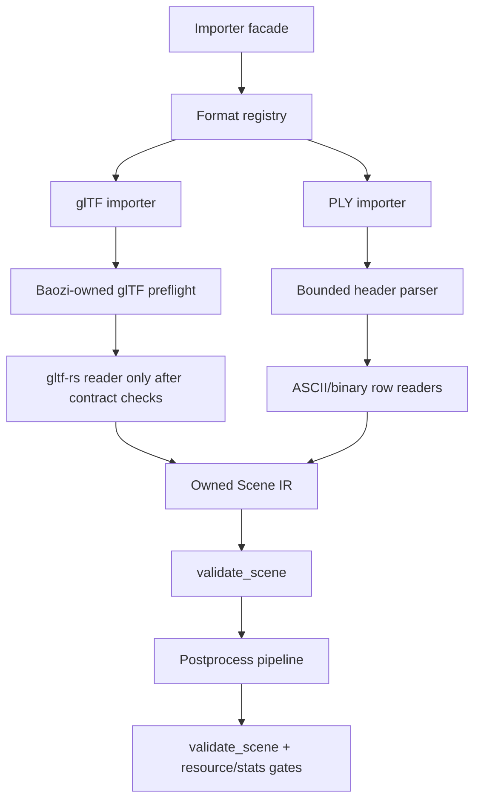

# Format Beta Hardening and Postprocess Foundation - Plan

## Goal Capsule

| Field | Value |
| --- | --- |
| Objective | Turn Baozi's next parser foundation into a trustworthy beta path: stop glTF fuzz CI from depending on an aborting bootstrap dependency, harden glTF layout/resource contracts, implement a real owned PLY parser MVP, add the first nontrivial postprocess generation pass, and anchor the public facade with examples, docs, and fuzz policy. |
| Authority | User authorization for fearless breaking refactors, ADR 0004, ADR 0015, ADR 0018, ADR 0022, ADR 0026, ADR 0027, current CI/fuzz policy, current `ImportContext`/`ResourceLimits`, user-supplied glTF fuzz findings, and read-only subagent research on glTF/PLY/postprocess gaps. |
| Execution profile | Work directly on `main` as previously authorized; break unstable internal APIs when they block the right parser architecture; commit logical slices; preserve WASM/custom-IO compatibility; keep third-party parser crates hidden behind Baozi-owned contracts. |
| Stop condition | Stop only if the work requires copying non-compatible third-party implementation code, bypassing `ImportContext`, weakening resource limits, or claiming support for a format feature that is only silently ignored. |
| Tail ownership | The executor owns implementation, engineering memory, local verification, review/fix loops, commits, push to `origin/main`, and CI follow-up. |

---

## Product Contract

### Summary

This plan completes the next foundation slice before adding more formats blindly.
glTF remains the complex-format pathfinder, PLY becomes the first fully Baozi-owned dynamic-schema parser, and postprocess gains real geometry generation beyond triangulation/bounds.

### Problem Frame

Baozi has the right macro-architecture: owned IR, `ImportContext`, feature-gated format crates, resource limits, diagnostics, and postprocess presets.
The current weak point is now maturity governance.
Several exposed docs and CI gates imply stronger guarantees than the code can currently prove, especially `gltf_import` fuzz smoke under `cargo-fuzz` and the descriptor-only PLY crate.

The highest-risk issue is glTF fuzzing.
`baozi-format-gltf` wraps `gltf::Gltf::from_slice` in `catch_unwind`, but cargo-fuzz/libFuzzer builds can abort on panic before Rust unwinding reaches that boundary.
That means `gltf_import` cannot stay in the mandatory sanitizer run matrix while `gltf-rs` validation can panic on malformed input.

### Requirements

**glTF CI and backend risk**

- R1. CI must not fail because `gltf_import` sanitizer smoke reaches an upstream `gltf-rs` validation panic that Baozi cannot catch in fuzz builds.
- R2. `gltf_import` must remain compiling and visible through `cargo fuzz check`, docs, and scheduled policy as an experimental target, not disappear silently.
- R3. A dedicated `gltf-rs` backend risk document must record known panic surfaces, current workarounds, and fork/replacement triggers.
- R4. ADR 0027 and glTF docs must distinguish "normal importer catches some backend panic paths" from "sanitizer fuzz target is promotion-safe."

**glTF layout and resource contracts**

- R5. Before calling `gltf-rs` mesh reader APIs, Baozi validates all supported vertex accessors against `POSITION` count, component type, dimension, normalization requirements, and resource limits.
- R6. Before collecting indices, Baozi validates index accessor count against `max_faces`, supported primitive mode, component type, and buffer range.
- R7. Before collecting inverse bind matrices, Baozi validates the IBM accessor is `F32`/`MAT4`, in range, and has either zero data or exactly the skin joint count.
- R8. Accessor and bufferView layout validation covers buffer index range, byte offsets, byte stride, element size, required alignment, and byteLength coverage.
- R9. Sparse accessors are either implemented correctly or rejected with a named unsupported/error path before any reader call.
- R10. Integer TEXCOORD, COLOR, and WEIGHTS accessors must follow the glTF normalization contract or fail before value conversion.
- R11. Node-level skin binding semantics must be explicit: a mesh with joint streams may not be referenced through an unskinned binding unless Baozi intentionally clones/splits that geometry.

**PLY owned parser**

- R12. `baozi-format-ply` must parse PLY rather than returning a stub unsupported error.
- R13. The PLY MVP supports ASCII, binary little-endian, and binary big-endian headers/data for common vertex and face geometry.
- R14. The parser maps `x/y/z`, `nx/ny/nz`, `red/green/blue/alpha`, `s/t`, `u/v`, and `texture_u/texture_v` into Baozi SoA mesh streams.
- R15. Face `vertex_indices` list properties map triangles to `PrimitiveTopology::Triangles` and mixed or N-gon faces to `PrimitiveTopology::Polygons` with `face_vertex_counts`.
- R16. Unknown PLY scalar vertex properties are preserved as namespaced custom attributes when their type maps cleanly to current IR, otherwise they produce diagnostics without corrupting geometry.
- R17. PLY parser limits enforce primary bytes, line/token size, vertex count, face count, list count, string size, and mesh count before unbounded allocation.

**Postprocess and facade usability**

- R18. `GenerateNormals` becomes an implemented postprocess step for triangle meshes, generating normals only when missing and rejecting degenerate triangles intentionally.
- R19. Realtime presets may include `GenerateNormals` only after the step is implemented and tested; unsupported steps must continue returning errors, not no-op.
- R20. Examples demonstrate bytes import, memory sidecar import, diagnostics/strict handling, postprocess usage, and a WASM-compatible memory-IO path.
- R21. Fuzz targets and fixture seeds cover PLY import and the new postprocess paths without adding native or non-WASM assumptions.

### Acceptance Examples

- AE1. Given the known `gltf_import` crash artifact class, CI no longer runs that target as mandatory sanitizer smoke until the backend is owned or prevalidated enough to avoid aborts; `cargo fuzz check gltf_import` still compiles.
- AE2. Given malformed glTF accessors with mismatched NORMAL/TEXCOORD/COLOR/JOINTS/WEIGHTS counts, import fails before `reader.read_*().collect()`.
- AE3. Given a glTF skin with three joints and an inverse-bind accessor count of two, import fails before collecting inverse bind matrices.
- AE4. Given one skinned glTF mesh is also referenced by an unskinned node, validation or import fails with a clear invariant error rather than accepting ambiguous joint-stream semantics.
- AE5. Given a valid ASCII PLY triangle with positions, normals, colors, and UVs, Baozi imports one mesh with matching SoA streams and no diagnostics.
- AE6. Given a binary big-endian PLY quad, Baozi imports a polygon mesh with `face_vertex_counts=[4]` and correct vertex positions.
- AE7. Given a PLY file with an unsupported element or property, Baozi skips or preserves it according to the typed property policy and records a warning when data is dropped.
- AE8. Given a triangle mesh without normals, `GenerateNormals` produces one normal per vertex; given existing normals, it leaves them untouched.
- AE9. Given a degenerate triangle, `GenerateNormals` returns a `BaoziError::PostProcess` instead of emitting non-finite or fake normals.
- AE10. Given the facade examples, `cargo check --examples -p baozi --all-features` proves the public API remains understandable outside internal tests.

### Scope Boundaries

- This plan does not promise full glTF Beta maturity, sparse accessor support, animation import, morph target import, Draco, KTX2, image decoding, or complete extension support.
- This plan does not fork `gltf-rs` immediately unless implementation proves a small local fork is required to restore a hard safety boundary.
- This plan does not implement `JoinIdenticalVertices`, `OptimizeMeshes`, or tangents unless they fall out naturally after normals; those need stronger attribute equality and UV/tangent policy.
- This plan does not stabilize third-party importer plugins or public `FormatImporter` extension ABI.
- This plan does not lower MSRV; `rust-version = "1.95"` remains acceptable while function is prioritized.

---

## Planning Contract

### Assumptions

- A temporary CI downgrade for `gltf_import` fuzz run is acceptable because it is a truthful risk boundary, not a feature removal.
- PLY fixtures can be generated inline in tests; no large external sample corpus needs to be vendored.
- Khronos sample assets are used as reference/oracle material through `repo-ref/` or small derived fixtures; large upstream assets stay out of tracked crate fixtures unless explicitly justified.
- Current `VertexAttributeData` is sufficient for a first PLY custom-property policy by upcasting small ints to `I32`/`U32` and floats/doubles to `F32`, with lossy conversion documented.

### Key Technical Decisions

- KTD1. **glTF fuzz promotion is gated by abort safety.** `catch_unwind` is a normal-build fallback but not a sanitizer-fuzz safety contract when the fuzz profile aborts on panic.
- KTD2. **glTF stays private-backend, Baozi-owned contract.** The bootstrap dependency can parse happy paths, but Baozi must validate layout/resource invariants before reader APIs and record every upstream hazard for a future fork.
- KTD3. **Accessor contracts become structured data.** `validate_primitive_contract` should return enough per-semantic counts/layout facts for reader code to enforce length and limit invariants without re-reading JSON ad hoc.
- KTD4. **Sparse accessors are explicit, not accidental.** A core glTF feature that is not implemented must be a documented fatal/unsupported path before `gltf-rs` reader behavior decides for Baozi.
- KTD5. **Skin binding semantics favor correctness over permissiveness.** A joint-stream mesh referenced by unskinned and skinned bindings is invalid unless the importer clones/splits the mesh or documents a deliberate static-copy behavior.
- KTD6. **PLY parser is handwritten.** PLY is header-driven and dynamically typed; a small owned parser using bounded token scanning and byte reads is easier to secure than forcing the whole format through LALRPOP or binrw.
- KTD7. **PLY custom data is typed but conservative.** Preserve obvious scalar vertex attributes through `VertexAttribute`, record metadata for comments/obj_info, and warn on unsupported list/element payloads rather than inventing broad IR prematurely.
- KTD8. **Postprocess normals come before optimization/tangents.** Normals are a reusable pass with clear geometry math; mesh optimization and tangent generation depend on more policy and are deferred unless this slice proves their prerequisites.
- KTD9. **Examples are API anchors.** Examples must compile in CI and use public facade APIs only; they should reveal awkward API shapes early.

### High-Level Technical Design

The facade remains the lifecycle owner.
Format crates produce owned `Scene` values, `baozi-core` validates IR invariants, and `baozi-postprocess` mutates only after validation.
glTF receives extra preflight because its bootstrap dependency is not currently fuzz-safe enough to be the first malformed-input boundary.

### Risks and Mitigations

| Risk | Mitigation |
| --- | --- |
| `gltf-rs` panics in code paths before Baozi can validate. | Remove mandatory fuzz run for `gltf_import`, keep check-only, document crash class, and add fork/preflight triggers. |
| Accessor layout validation duplicates upstream logic and misses a rule. | Start with supported semantics only, add malformed tests for each rule, and cite ADR 0027 as the promotion gate. |
| PLY binary parsing allocates before counts are bounded. | Parse header counts first, debit resource limits, then allocate with checked capacities. |
| PLY custom attribute policy pressures core IR. | Upcast only types current IR can express and warn on dropped payloads; record future IR extensions separately. |
| `GenerateNormals` creates misleading normals for bad topology. | Support triangle topology first and return `PostProcess` errors on degenerate faces or unsupported topology. |
| Large cross-cutting work causes stale docs. | Update support matrix helpers and docs in the same slices as behavior changes. |

---

## Implementation Units

### U1. glTF Fuzz CI Stopgap and Backend Risk Log

- **Goal:** Restore reliable CI while preserving visibility into the unsafe glTF fuzz target class.
- **Requirements:** R1, R2, R3, R4, AE1.
- **Files:** `.github/workflows/ci.yml`, `.github/workflows/fuzz.yml`, `docs/contributing/fuzzing.md`, `docs/contributing/ci.md`, `docs/formats/gltf.md`, `docs/adr/0027-gltf-backend-ownership-and-replacement-policy.md`, `docs/research/gltf-rs-backend-notes.md`, `fuzz/fuzz_targets/gltf_import.rs`.
- **Approach:** Split fuzz targets into mandatory sanitizer-run targets and experimental check-only targets, or otherwise remove only `gltf_import` from run matrices while keeping compile checks and documentation. Record the known abort-on-panic behavior and the exact condition required before re-enabling sanitizer run.
- **Patterns:** Existing CI matrix in `.github/workflows/ci.yml`; fuzz policy in `docs/contributing/fuzzing.md`; ADR 0027 replacement triggers.
- **Test Scenarios:** Workflow lint still passes; `cargo fuzz check gltf_import` remains documented and compiling; docs no longer claim `gltf_import` sanitizer run is a promotion gate.
- **Verification:** `go run "github.com/rhysd/actionlint/cmd/actionlint@v1.7.12"` or equivalent actionlint; `cargo +nightly-2026-05-27 fuzz check gltf_import` when local toolchain is available.

### U2. glTF Accessor, BufferView, and Skin Resource Preflight

- **Goal:** Make glTF reader calls happen only after Baozi-owned count/layout/resource contracts pass.
- **Requirements:** R5, R6, R7, R8, R9, R10, R11, AE2, AE3, AE4.
- **Files:** `crates/baozi-format-gltf/src/parser.rs`, `crates/baozi-format-gltf/tests/static_mesh.rs`, `crates/baozi-format-gltf/tests/skinning.rs`, `crates/baozi-format-gltf/tests/common/mod.rs`, `crates/baozi-core/src/validation.rs`.
- **Approach:** Replace shallow `validate_accessor` results with a contract struct that stores count, element size, component, dimension, normalized flag, and buffer range validation. Validate optional attribute count equality with `POSITION`, index-derived face limits, sparse rejection/support, and IBM count before `reader.read_*`.
- **Patterns:** Current `PrimitiveContract` and `safe_gltf` wrapper; core validator's mesh/channel length checks; existing malformed glTF tests.
- **Test Scenarios:** Mismatched NORMAL count fails; integer COLOR without normalized fails or is documented unsupported; invalid byteStride fails; short bufferView byteLength fails; sparse accessor fails with named unsupported path; IBM count mismatch fails before collect; joint-stream mesh with unskinned binding fails.
- **Verification:** `cargo test -p baozi-format-gltf --tests --all-features`; `cargo test -p baozi-core --all-features`.

### U3. glTF Fixture and Descriptor Alignment

- **Goal:** Align glTF support claims with implemented behavior and add fixtures for layout paths that currently rely on upstream behavior.
- **Requirements:** R3, R4, R5, R9, R10, R11.
- **Files:** `crates/baozi-format-gltf/src/lib.rs`, `crates/baozi-format-gltf/tests/static_mesh.rs`, `crates/baozi-format-gltf/tests/skinning.rs`, `fuzz/corpus/gltf_import/*`, `docs/formats/gltf.md`, `docs/formats/support-matrix.md`, `crates/baozi-test-support/src/support_matrix.rs`.
- **Approach:** Update `FormatInfo` skin/camera/resource notes, expand support matrix helper coverage where useful, and add small fixtures for interleaved byteStride, GLB corpus, normalized colors/texcoords/weights if supported, and documented unsupported sparse/morph/animation paths.
- **Patterns:** `SceneSnapshot` assertions in glTF tests; support matrix helper in `baozi-test-support`.
- **Test Scenarios:** Descriptor row matches docs for Skinning/CamerasLights/MorphTargets/ResourceLimits; interleaved fixture imports; GLB fuzz seed is not truncated by the target input protocol; required unsupported glTF features produce explicit errors or warnings.
- **Verification:** `cargo test -p baozi-format-gltf --tests --all-features`; support matrix unit tests.

### U4. PLY Parser MVP

- **Goal:** Replace the PLY stub with a safe owned parser for common ASCII and binary PLY assets.
- **Requirements:** R12, R13, R14, R15, R16, R17, AE5, AE6, AE7.
- **Files:** `crates/baozi-format-ply/src/lib.rs`, `crates/baozi-format-ply/src/parser.rs`, `crates/baozi-format-ply/src/header.rs`, `crates/baozi-format-ply/src/detect.rs`, `crates/baozi-format-ply/tests/*`, `docs/formats/ply.md`, `docs/formats/support-matrix.md`.
- **Approach:** Implement a bounded header parser, schema-driven row readers, ASCII token scanner, and binary little/big-endian primitive reads. Convert vertex properties into SoA streams and a single mesh, preserving comments/obj_info in metadata and unknown scalar properties as custom attributes when representable.
- **Patterns:** STL parser safety posture; OBJ tuple/mesh builder tests for geometry; core `PrimitiveTopology::Polygons` and custom attribute validation.
- **Test Scenarios:** ASCII triangle; ASCII quad polygon; binary little-endian triangle; binary big-endian quad; vertex colors with alpha; UV alias variants; unknown scalar custom property; unsupported list/element warning; malformed header; invalid numeric token; vertex/face/resource limits.
- **Verification:** `cargo test -p baozi-format-ply --tests --all-features`; `cargo test -p baozi --features format-ply`.

### U5. PLY Fuzz, Facade, and WASM Coverage

- **Goal:** Make the new PLY importer behave like a first-class format crate in facade, fuzz, docs, and WASM checks.
- **Requirements:** R12, R17, R21.
- **Files:** `fuzz/Cargo.toml`, `fuzz/fuzz_targets/ply_import.rs`, `fuzz/corpus/ply_import/*`, `.github/workflows/ci.yml`, `.github/workflows/fuzz.yml`, `docs/contributing/fuzzing.md`, `crates/baozi/tests/ply_facade.rs`, `crates/baozi/Cargo.toml`.
- **Approach:** Add a facade-level PLY target and small corpus seeds. Include `ply_import` in mandatory sanitizer fuzz run once it has no known aborting dependency. Add browser WASM checks for `format-ply`.
- **Patterns:** Existing `stl_import` and `obj_import` fuzz targets; facade tests for OBJ/STL.
- **Test Scenarios:** Facade detects `.ply`; memory bytes import succeeds; malformed fuzz inputs do not panic; CI matrix runs `ply_import`; WASM no-default feature check compiles.
- **Verification:** `cargo +nightly-2026-05-27 fuzz check ply_import`; local `cargo fuzz run ply_import -- -runs=256` where sanitizer runtime is available; CI Linux sanitizer smoke.

### U6. Postprocess GenerateNormals MVP

- **Goal:** Implement the next useful postprocess step without silently accepting unsupported geometry.
- **Requirements:** R18, R19, AE8, AE9.
- **Files:** `crates/baozi-postprocess/src/pipeline.rs`, `crates/baozi-postprocess/src/preset.rs`, `crates/baozi-postprocess/tests/*`, `fuzz/fuzz_targets/obj_postprocess.rs`.
- **Approach:** Generate flat triangle normals for meshes with empty normals. Use indices when present, implicit triangle groups otherwise, reject degenerate triangles, and avoid overwriting existing normals. Add `GenerateNormals` to presets only after tests prove behavior.
- **Patterns:** Existing `Triangulate` and `GenerateBoundingBoxes` step structure; `postprocess_error` helper; validator channel length rules.
- **Test Scenarios:** Indexed triangle generates normals; implicit triangle generates normals; quad after `Triangulate + GenerateNormals` works; existing normals unchanged; degenerate triangle errors; unsupported topology errors if normals are requested before triangulation.
- **Verification:** `cargo test -p baozi-postprocess --all-features`; `cargo test -p baozi-format-obj --tests --all-features`; `cargo +nightly-2026-05-27 fuzz check obj_postprocess`.

### U7. Public Examples and Bench Anchors

- **Goal:** Add runnable facade examples and small benchmarks that freeze how users should consume Baozi while APIs are still evolving.
- **Requirements:** R20, AE10.
- **Files:** `crates/baozi/examples/import_bytes.rs`, `crates/baozi/examples/import_memory_sidecars.rs`, `crates/baozi/examples/diagnostics.rs`, `crates/baozi/examples/postprocess.rs`, `crates/baozi/examples/wasm_memory.rs`, `crates/baozi/benches/import_baseline.rs`, `README.md`, `docs/contributing/format-onboarding.md`.
- **Approach:** Keep examples minimal and public-API-only. Use inline assets or `MemoryAssetIo` so examples compile on CI and do not need native filesystem access unless explicitly behind `native-fs`.
- **Patterns:** Existing `import_bytes.rs`; bench skeleton in `import_baseline.rs`.
- **Test Scenarios:** Examples compile under `--all-features`; diagnostics example shows warnings vs fatal errors; postprocess example applies triangulate/normals/bounds; WASM memory example uses no `std::fs`.
- **Verification:** `cargo check -p baozi --examples --all-features`; `cargo bench -p baozi --bench import_baseline --no-run --all-features`.

### U8. Final Verification, Review, Memory, and Shipping

- **Goal:** Integrate the full slice without leaving stale policy, dead code, or unverifiable docs.
- **Requirements:** All requirements.
- **Files:** `docs/knowledge/engineering/registry/*`, `docs/knowledge/engineering/progress/*`, `docs/knowledge/engineering/verification/*`, any files changed by review fixes.
- **Approach:** Register the active plan in engineering memory, record subagent findings that changed implementation direction, run local gates, request read-only review agents for the final diff, fix material findings, commit logical slices, push `main`, and inspect CI.
- **Patterns:** Existing engineering memory bundle under `docs/knowledge/engineering`; previous verification records.
- **Test Scenarios:** No stale `gltf_import` sanitizer-run claims remain; support matrix and docs match `FormatInfo`; verification evidence is recorded in memory after final gates.
- **Verification:** Full Verification Contract below.

---

## Verification Contract

| Gate | Command | Done Signal |
| --- | --- | --- |
| Formatting | `cargo fmt --all -- --check` | No diff required. |
| Workspace build | `cargo check --workspace --all-targets --all-features` | All targets compile. |
| Tests | `cargo nextest run --workspace --all-features` | All workspace tests pass. |
| Clippy | `cargo clippy --workspace --all-targets --all-features -- -D warnings` | No warnings. |
| Doctests | `cargo test --doc --workspace --all-features` | Documentation examples pass. |
| Docs | `RUSTDOCFLAGS="-D warnings" cargo doc --workspace --all-features --no-deps` | Docs build without warnings. |
| Dependency policy | `cargo deny check` | Policy passes. |
| Examples | `cargo check -p baozi --examples --all-features` | Public examples compile. |
| Benches | `cargo bench -p baozi --bench import_baseline --no-run --all-features` | Bench target compiles. |
| glTF focused | `cargo test -p baozi-format-gltf --tests --all-features` | glTF contract tests pass. |
| PLY focused | `cargo test -p baozi-format-ply --tests --all-features` | PLY parser tests pass. |
| Postprocess focused | `cargo test -p baozi-postprocess --all-features` | Postprocess tests pass. |
| WASM browser bytes path | `cargo check -p baozi --target wasm32-unknown-unknown --no-default-features --features format-stl,format-obj,format-gltf,format-ply` | Memory/custom-IO formats compile for browser WASM. |
| Fuzz checks | `cargo +nightly-2026-05-27 fuzz check stl_import obj_import obj_postprocess gltf_import ply_import` | All listed targets compile; run targets follow docs policy. |
| Fuzz smoke where supported | `cargo +nightly-2026-05-27 fuzz run stl_import -- -runs=256`, `cargo +nightly-2026-05-27 fuzz run obj_import -- -runs=256`, `cargo +nightly-2026-05-27 fuzz run obj_postprocess -- -runs=256`, `cargo +nightly-2026-05-27 fuzz run ply_import -- -runs=256` | Mandatory run targets complete locally or on Linux CI; `gltf_import` remains excluded until backend abort risk is resolved. |
| Workflow lint | `go run "github.com/rhysd/actionlint/cmd/actionlint@v1.7.12"` | Workflows lint. |

If Windows sanitizer DLLs or local LLVM runtime setup block `cargo fuzz run`, record the environment limitation and rely on Linux CI for sanitizer execution.
Do not treat the `gltf_import` sanitizer-run exclusion as a parser success; it is a tracked backend-risk exception.

---

## Definition of Done

- Mandatory CI fuzz smoke no longer includes a glTF target that can abort in upstream validation under libFuzzer.
- `gltf_import` remains visible as an experimental fuzz/check target with documented re-enable criteria.
- `docs/research/gltf-rs-backend-notes.md` records the current gltf-rs panic class, wrapped reader APIs, remaining preflight gaps, and fork triggers.
- glTF accessor, bufferView, sparse, normalized integer, face limit, and inverse-bind preflight tests pass before reader collection.
- Core validation or glTF import clearly rejects ambiguous skinned/unskinned mesh binding semantics.
- `baozi-format-ply` imports ASCII, binary little-endian, and binary big-endian PLY geometry with limits, diagnostics, tests, docs, and fuzz target.
- `GenerateNormals` is implemented, tested, and only included in presets after it is no longer an unsupported no-op.
- Public examples and bench compile checks anchor facade usage.
- Support matrix, format docs, ADR 0027, fuzzing docs, and engineering memory match the implemented behavior.
- Full verification gates pass or every skipped gate has a dated, concrete environment limitation note.
- Logical commits are pushed to `origin/main`, and CI is inspected after push.

## Appendix

### Research Breadcrumbs

- Khronos glTF 2.0 specification: `https://github.com/KhronosGroup/glTF/tree/main/specification/2.0`
- Khronos glTF Sample Assets reference corpus: `https://github.com/KhronosGroup/glTF-Sample-Assets`
- Selected local reference notes downloaded under ignored `repo-ref/khronos-gltf-selected`
- PLY format background for parser behavior: `docs/adr/0018-parser-tooling-and-format-owned-parser-policy.md`, `docs/formats/ply.md`
- glTF backend ownership policy: `docs/adr/0027-gltf-backend-ownership-and-replacement-policy.md`
